# Unit04 Matplotlib 資料視覺化

## 學習目標

完成本單元後，學生將能夠：
- 理解 Matplotlib 的基本架構與繪圖邏輯
- 掌握常用的基本圖表類型（折線圖、長條圖、散佈圖等）
- 熟悉圖表自訂功能（標題、標籤、圖例、網格等）
- 學會多圖表佈局與子圖設計
- 應用 Matplotlib 於化工領域的數據視覺化

---

## 1. Matplotlib 簡介

### 1.1 什麼是 Matplotlib？

Matplotlib 是 Python 中最廣泛使用的資料視覺化套件，由 John Hunter 於 2003 年開發。它提供了豐富的繪圖功能，可以繪製各種靜態、動態、互動式圖表。

**主要特點：**
- **功能強大**：支援各種圖表類型（折線圖、長條圖、散佈圖、直方圖、圓餅圖等）
- **高度自訂**：可精細控制圖表的每個元素（顏色、線型、標記、字體等）
- **跨平台**：支援多種輸出格式（PNG、PDF、SVG、EPS 等）
- **整合性佳**：與 Numpy、Pandas 等套件無縫整合

### 1.2 Matplotlib 的架構

Matplotlib 採用階層式架構，主要包含三個層次：

1. **Backend Layer（後端層）**：負責實際的繪圖與輸出
2. **Artist Layer（藝術家層）**：處理所有圖表元素（線條、文字、圖例等）
3. **Scripting Layer（腳本層）**：提供簡單的繪圖介面（pyplot）

**兩種繪圖介面：**
- **pyplot 介面**（狀態機風格）：適合快速繪圖與互動式分析
- **物件導向介面**：適合進階自訂與複雜佈局

### 1.3 在化工領域的應用

Matplotlib 在化工領域有廣泛應用：
- 製程監控數據視覺化（溫度、壓力、流量趨勢圖）
- 實驗數據分析（反應動力學曲線、相平衡圖）
- 模型結果呈現（擬合曲線、預測結果比較）
- 品質管制圖表（控制圖、柏拉圖）
- 設備性能監測（效率分析、能耗分析）

---

## 2. 安裝與匯入

### 2.1 安裝 Matplotlib

```bash
# 使用 pip 安裝
pip install matplotlib

# 使用 conda 安裝
conda install matplotlib
```

### 2.2 基本匯入方式

```python
import matplotlib.pyplot as plt
import numpy as np
import pandas as pd

# 在 Jupyter Notebook 中顯示圖表
%matplotlib inline
```

**常見匯入慣例：**
- `matplotlib.pyplot` 通常簡寫為 `plt`
- 配合 Numpy 與 Pandas 使用

---

## 3. 基本繪圖流程

### 3.1 最簡單的折線圖

```python
import matplotlib.pyplot as plt

# 準備數據
x = [1, 2, 3, 4, 5]
y = [2, 4, 6, 8, 10]

# 繪製圖表
plt.plot(x, y)
plt.show()
```

**▌ 範例演練結果**

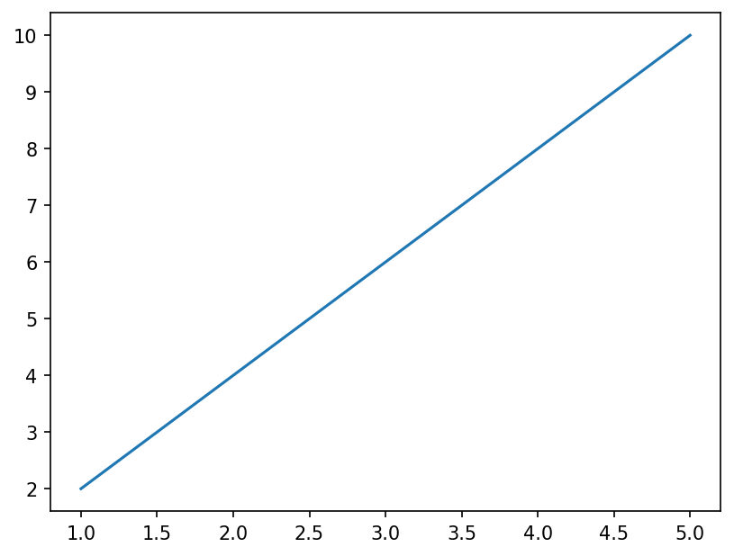

> **說明：** 這是 Matplotlib 最精簡的繪圖示範。以 `plt.plot(x, y)` 搭配 `plt.show()` 即可產生一張折線圖，不需要任何額外設定。圖中呈現 X 軸（1–5）與 Y 軸（2–10）之間的線性遞增關係（斜率 = 2），所有樣式均使用預設值（藍色實線）。這是學習 Matplotlib 的最小可用範例，後續章節將逐步加入標題、標籤、圖例等元素，使圖表更專業完整。

### 3.2 完整的繪圖流程

```python
import matplotlib.pyplot as plt
import numpy as np

# 1. 準備數據
x = np.linspace(0, 10, 100)
y = np.sin(x)

# 2. 建立圖表
plt.figure(figsize=(10, 6))

# 3. 繪製數據
plt.plot(x, y, label='sin(x)', color='blue', linewidth=2)

# 4. 添加標題與標籤（必須使用英文）
plt.title('Sine Wave Function', fontsize=14, fontweight='bold')
plt.xlabel('X-axis', fontsize=12)
plt.ylabel('Y-axis', fontsize=12)

# 5. 添加圖例與網格
plt.legend()
plt.grid(True, linestyle='--', alpha=0.6)

# 6. 顯示圖表
plt.tight_layout()
plt.show()
```

**▌ 範例演練結果**

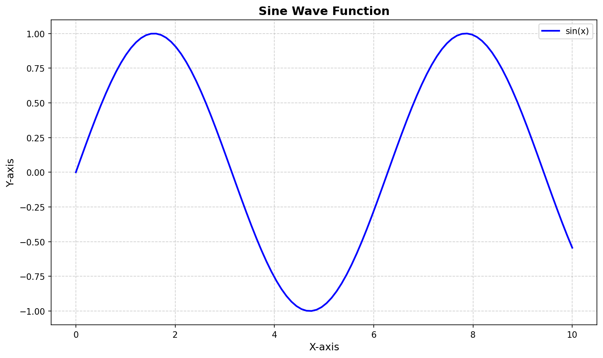

> **說明：** 此圖示範完整的六步驟繪圖流程。圖中繪製正弦函數 $y = \sin(x)$ ，X 軸範圍 0 至 10（使用 `np.linspace` 產生 100 個等間距點）。可觀察到：(1) 標題 `Sine Wave Function` 以粗體顯示於頂端；(2) X/Y 軸標籤清楚標示（英文）；(3) 圖例位於右上方；(4) 虛線網格輔助讀取數值；(5) 線條以藍色寬度 2 呈現，整體美觀度明顯優於 3.1 的最簡範例。此六步驟流程是所有後續 Matplotlib 繪圖的標準框架。

**重要提醒：** 根據專案規範，所有圖表的標題、軸標籤必須使用英文，以確保相容性與清晰度。

---

## 4. 常用圖表類型

### 4.1 折線圖 (Line Plot)

折線圖適用於顯示數據隨時間或連續變數的變化趨勢。

**基本用法：**

```python
import matplotlib.pyplot as plt
import numpy as np

# 準備數據
time = np.linspace(0, 24, 100)
temperature = 25 + 5 * np.sin(2 * np.pi * time / 24)

# 繪製折線圖
plt.figure(figsize=(10, 5))
plt.plot(time, temperature, color='red', linewidth=2, linestyle='-', marker='o', markersize=3)

plt.title('Temperature Variation Over 24 Hours', fontsize=14)
plt.xlabel('Time (hours)', fontsize=12)
plt.ylabel('Temperature (°C)', fontsize=12)
plt.grid(True, alpha=0.3)
plt.tight_layout()
plt.show()
```

**▌ 範例演練結果**

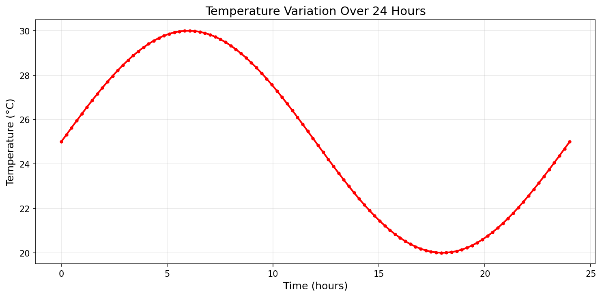

> **說明：** 此圖展示 24 小時溫度變化趨勢。溫度以一日（24 小時）的正弦週期循環，最高值為 30°C、最低值為 20°C，日平均 25°C。圖中重點示範多種折線圖樣式自訂能力：`color='red'` 設定紅色線條、`linewidth=2` 加寬線條、`linestyle='-'` 指定實線、`marker='o'` 在每個數據點添加圓點標記、`markersize=3` 設定標記大小。X 軸標籤為 `Time (hours)`，Y 軸標籤為 `Temperature (°C)`，均使用英文。此類折線圖適用於化工製程中感測器數據的時序視覺化。

**線條樣式參數：**
- `color`：顏色（'red', 'blue', '#FF5733' 等）
- `linewidth` 或 `lw`：線寬
- `linestyle` 或 `ls`：線型（'-', '--', '-.', ':' 等）
- `marker`：標記樣式（'o', 's', '^', 'D' 等）
- `markersize` 或 `ms`：標記大小

**化工應用範例：反應器溫度監控**

```python
import matplotlib.pyplot as plt
import numpy as np

# 模擬反應器溫度數據
time = np.linspace(0, 8, 100)  # 8 hours
reactor_temp = 80 + 20 * np.exp(-0.5 * time) + np.random.normal(0, 1, 100)

plt.figure(figsize=(10, 6))
plt.plot(time, reactor_temp, color='orangered', linewidth=1.5, label='Reactor Temperature')
plt.axhline(y=80, color='green', linestyle='--', linewidth=2, label='Target Temperature')
plt.fill_between(time, 75, 85, color='green', alpha=0.1, label='Safe Range')

plt.title('Reactor Temperature Monitoring', fontsize=14, fontweight='bold')
plt.xlabel('Time (hours)', fontsize=12)
plt.ylabel('Temperature (°C)', fontsize=12)
plt.legend(loc='best')
plt.grid(True, linestyle=':', alpha=0.5)
plt.tight_layout()
plt.show()
```

**▌ 範例演練結果**

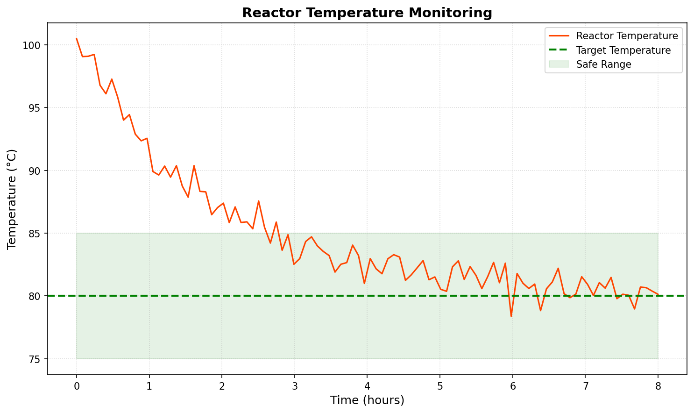

> **說明：** 此圖模擬化工領域常見的反應器溫度監控情境。可觀察到：
> - **橙紅色線條**：反應器溫度從啟動時約 100°C（遵循指數衰減 $e^{-0.5t}$ ）逐漸趨近目標溫度 80°C。
> - **綠色虛線**：目標溫度 80°C，以 `axhline` 水平參考線標示。
> - **淡綠色帶狀區域**：75–85°C 的安全操作範圍以 `fill_between` + 半透明帶狀陰影明確標示。
> - **隨機擾動**：加入 `np.random.normal(0, 1, 100)` 使曲線更接近真實訊號。
> 
> 此圖綜合展示三個圖層：實際溫度線、目標溫度線、安全帶狀區域，是化工製程監控的典型範例。

### 4.2 散佈圖 (Scatter Plot)

散佈圖用於顯示兩個變數之間的關係，適合探索相關性。

**基本用法：**

```python
import matplotlib.pyplot as plt
import numpy as np

# 準備數據
x = np.random.randn(100)
y = 2 * x + np.random.randn(100) * 0.5

# 繪製散佈圖
plt.figure(figsize=(8, 6))
plt.scatter(x, y, c='blue', s=50, alpha=0.6, edgecolors='black', linewidth=0.5)

plt.title('Scatter Plot Example', fontsize=14)
plt.xlabel('Variable X', fontsize=12)
plt.ylabel('Variable Y', fontsize=12)
plt.grid(True, alpha=0.3)
plt.tight_layout()
plt.show()
```

**▌ 範例演練結果**

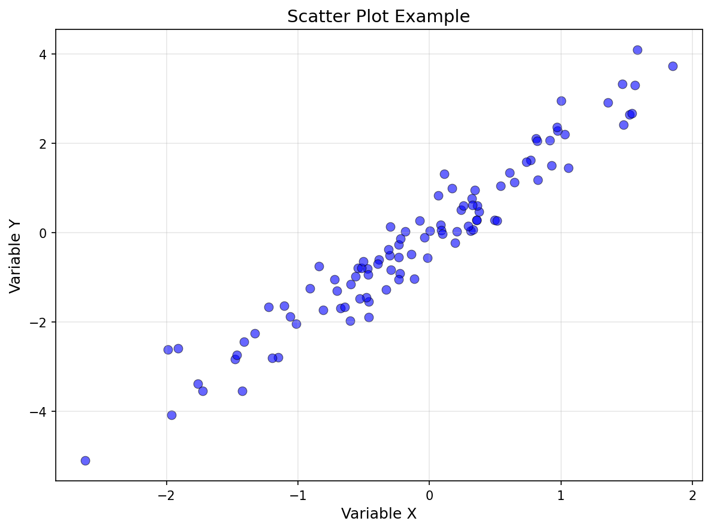

> **說明：** 此基本散佈圖展示 100 個樣本點的分布相關性。資料以 $Y = 2X + \epsilon$ 產生，其中 $\epsilon \sim \mathcal{N}(0, 0.5^2)$ ，因此兩變數具有強正相關性（皮爾遜相關係數 $r \approx 0.97$ ）。圖中點小、藍色填充、黑色邊框，透明度 0.6 避免點點重疊時失去資訊。

**參數說明：**
- `c`：顏色（可以是單一顏色或數組）
- `s`：點的大小
- `alpha`：透明度（0-1）
- `edgecolors`：邊框顏色
- `linewidth`：邊框寬度

**化工應用範例：產品品質與製程參數關係**

```python
import matplotlib.pyplot as plt
import matplotlib.patches as mpatches
import numpy as np

# 模擬數據：反應溫度 vs 產率
np.random.seed(42)
temperature = np.random.uniform(60, 100, 50)
yield_rate = 40 + 0.5 * temperature + np.random.normal(0, 3, 50)

# 根據產率分組著色
colors = ['red' if y < 70 else 'yellow' if y < 85 else 'green' for y in yield_rate]

plt.figure(figsize=(10, 6))
plt.scatter(temperature, yield_rate, c=colors, s=100, alpha=0.7, edgecolors='black', linewidth=1)

# 添加趨勢線（排序 x 值確保連線正確）
sorted_temp = np.sort(temperature)
z = np.polyfit(temperature, yield_rate, 1)
p = np.poly1d(z)
plt.plot(sorted_temp, p(sorted_temp), "b--", linewidth=2)

plt.ylim(60, 100)
plt.title('Reaction Temperature vs Yield Rate', fontsize=14, fontweight='bold')
plt.xlabel('Temperature (°C)', fontsize=12)
plt.ylabel('Yield Rate (%)', fontsize=12)

# 自訂圖例
patch_red = mpatches.Patch(color='red', label='Low Yield (<70%)')
patch_yellow = mpatches.Patch(color='yellow', label='Medium Yield (70-85%)')
patch_green = mpatches.Patch(color='green', label='High Yield (>85%)')
line_blue = plt.Line2D([0], [0], color='blue', linestyle='--', linewidth=2, label='Trend Line')
plt.legend(handles=[line_blue, patch_red, patch_yellow, patch_green], loc='upper left')

plt.grid(True, linestyle=':', alpha=0.5)
plt.tight_layout()
plt.show()
```

**▌ 範例演練結果**

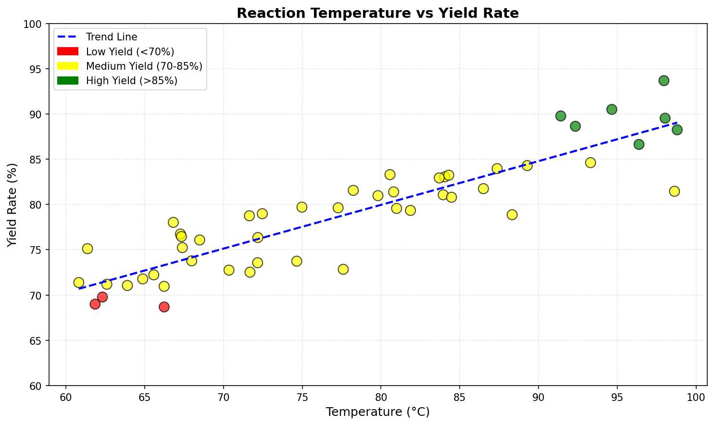

> **說明：** 此圖展示反應溫度（60–100°C）對產率的影響，共 50 個模擬資料點。資料以 $\text{Yield} = 40 + 0.5 \times T + \mathcal{N}(0, 3^2)$ 產生，對應產率 60–100\% 的物理合理範圍。圖中重點分析：
> - **點的顏色分組**：紅色（產率 < 70\%）、黃色（70–85\%）、綠色（> 85\%），直覺呈現製程性能分布。
> - **藍色虛線趨勢線**：以一階多項式擬合，顯示溫度越高則產率趨勢越高的正相關趨勢。
> - **圖例包含 4 個項目**：趨勢線 + 三種顏色分組標籤，使用 `matplotlib.patches.Patch` 自訂圖例。
> - **Y 軸限定 60–100\%**：確保產率數據在物理合理範圍內，避免超過 100\% 的不合理數值。

### 4.3 長條圖 (Bar Chart)

長條圖用於比較不同類別的數值。

**基本用法：**

```python
import matplotlib.pyplot as plt

# 準備數據
categories = ['A', 'B', 'C', 'D', 'E']
values = [23, 45, 56, 78, 32]

# 繪製長條圖
plt.figure(figsize=(8, 6))
plt.bar(categories, values, color='steelblue', alpha=0.8, edgecolor='black')

plt.title('Bar Chart Example', fontsize=14)
plt.xlabel('Categories', fontsize=12)
plt.ylabel('Values', fontsize=12)
plt.grid(axis='y', linestyle='--', alpha=0.5)
plt.tight_layout()
plt.show()
```

**▌ 範例演練結果**

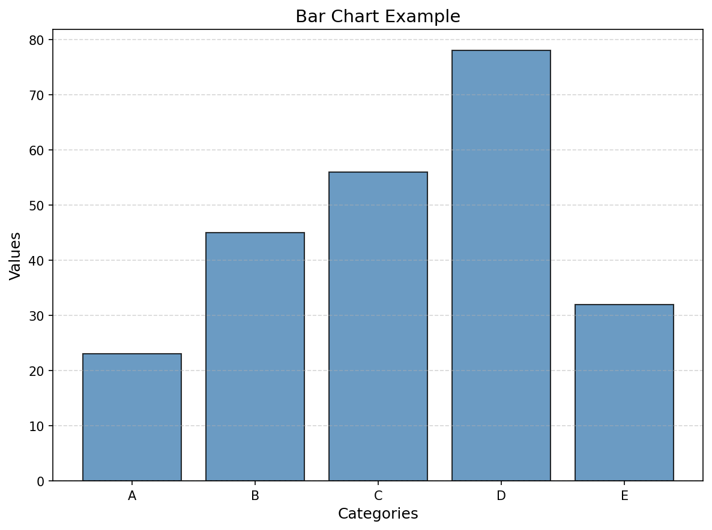

> **說明：** 最基本的長條圖，展示 A–E 五個類別的數值比較（分別為 23、45、56、78、32）。所有長條以鋼藍色（steelblue）填充、黑色邊框，Y 軸沿虛線輔助讀取。D 類別數值最高（78），A 最低（23）。

**水平長條圖：**

```python
plt.barh(categories, values, color='coral', alpha=0.8, edgecolor='black')
```

**化工應用範例：不同催化劑效能比較**

```python
import matplotlib.pyplot as plt
import numpy as np

# 催化劑效能數據
catalysts = ['Cat-A', 'Cat-B', 'Cat-C', 'Cat-D', 'Cat-E']
conversion_rate = [78, 85, 92, 88, 81]
selectivity = [82, 88, 90, 85, 83]

x = np.arange(len(catalysts))
width = 0.35

fig, ax = plt.subplots(figsize=(10, 6))
bars1 = ax.bar(x - width/2, conversion_rate, width, label='Conversion Rate', color='skyblue', edgecolor='black')
bars2 = ax.bar(x + width/2, selectivity, width, label='Selectivity', color='lightcoral', edgecolor='black')

# 在長條上添加數值標籤
for bars in [bars1, bars2]:
    for bar in bars:
        height = bar.get_height()
        ax.text(bar.get_x() + bar.get_width()/2., height,
                f'{height:.0f}%', ha='center', va='bottom', fontsize=9)

ax.set_title('Catalyst Performance Comparison', fontsize=14, fontweight='bold')
ax.set_xlabel('Catalyst Type', fontsize=12)
ax.set_ylabel('Performance (%)', fontsize=12)
ax.set_xticks(x)
ax.set_xticklabels(catalysts)
ax.legend()
ax.grid(axis='y', linestyle=':', alpha=0.5)

plt.tight_layout()
plt.show()
```

**▌ 範例演練結果**

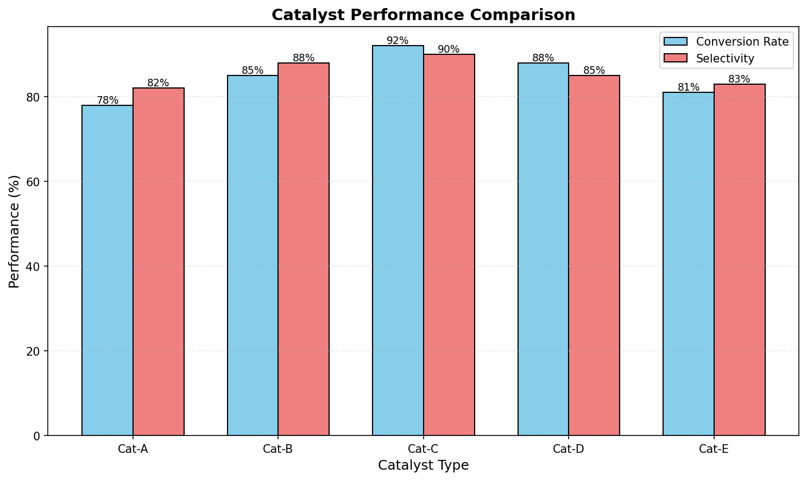

> **說明：** 此分組長條圖對 Cat-A 至 Cat-E 五種催化劑進行轉化率與選擇性的雙屬性比較。圖中視覺化分析：
> - **Cat-C 綜合表現最優**：轉化率 92% + 選擇性 90%，兩項指標為五種催化劑中最高；其轉化率（92%）略高於選擇性（90%），顯示極高的原料轉化效率。
> - **Cat-A 表現最差**：轉化率僅 78%，選擇性 82%，需改進或替換。
> - **轉化率 vs 選擇性 差異**：Cat-A、Cat-B、Cat-E 的選擇性高於轉化率，暗示這些催化劑在減少副產物上表現良好；Cat-C 與 Cat-D 的轉化率則高於選擇性（Cat-D：轉化率 88% vs 選擇性 85%）。
> - **長條頂端數值標籤**：每條數字清楚呈現各催化劑性能，方便比較評估。

### 4.4 直方圖 (Histogram)

直方圖用於顯示數據的分布情況。

**基本用法：**

```python
import matplotlib.pyplot as plt
import numpy as np

# 生成隨機數據
data = np.random.randn(1000)

# 繪製直方圖
plt.figure(figsize=(8, 6))
plt.hist(data, bins=30, color='teal', alpha=0.7, edgecolor='black')

plt.title('Histogram Example', fontsize=14)
plt.xlabel('Value', fontsize=12)
plt.ylabel('Frequency', fontsize=12)
plt.grid(axis='y', linestyle='--', alpha=0.5)
plt.tight_layout()
plt.show()
```

**化工應用範例：產品粒徑分布**

```python
import matplotlib.pyplot as plt
import numpy as np

# 模擬產品粒徑數據（微米）
np.random.seed(42)
particle_size = np.random.lognormal(3, 0.5, 1000)

plt.figure(figsize=(10, 6))
n, bins, patches = plt.hist(particle_size, bins=50, color='gold', alpha=0.7, edgecolor='black')

# 添加統計線
mean_size = np.mean(particle_size)
median_size = np.median(particle_size)
plt.axvline(mean_size, color='red', linestyle='--', linewidth=2, label=f'Mean = {mean_size:.1f} μm')
plt.axvline(median_size, color='blue', linestyle='--', linewidth=2, label=f'Median = {median_size:.1f} μm')

plt.title('Product Particle Size Distribution', fontsize=14, fontweight='bold')
plt.xlabel('Particle Size (μm)', fontsize=12)
plt.ylabel('Frequency', fontsize=12)
plt.legend()
plt.grid(axis='y', linestyle=':', alpha=0.5)
plt.tight_layout()
plt.show()
```

**▌ 範例演練結果**

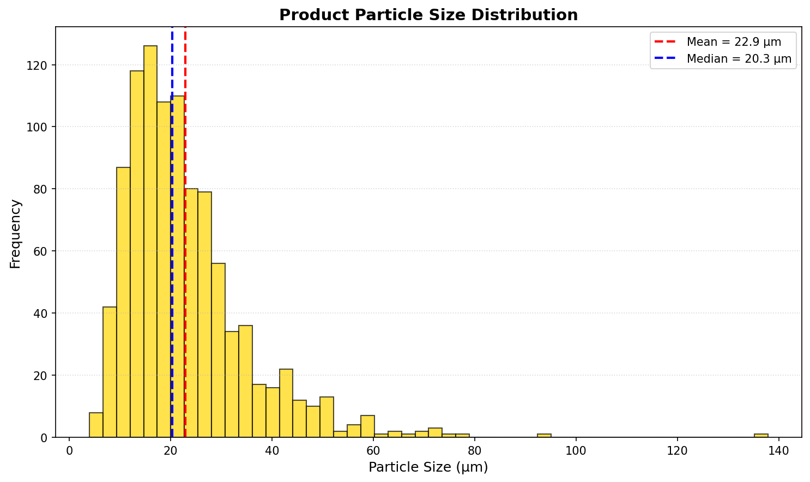

> **說明：** 此圖展示以對數常態分布（`np.random.lognormal(3, 0.5, 1000)`）模擬的產品粒徑分布，共 1000 個樣本。從圖中可觀察到：
> - **右偏分布（Right-skewed）**：大量粒子集中在 10–30 μm，少數大粒子分布至 140 μm 以上，符合真實粉體製程的典型分布特徵。
> - **均值 > 中位數**（22.9 μm > 20.3 μm）：右偏統計特性在圖中清楚呈現，以紅色虛線（Mean）和藍色虛線（Median）標示。
> - **50 個等寬 bins**：足夠的分組數量使分布曲線平滑，不會因分組過少而遺失細節。
> - **化工意義**：粒徑分布是粉體製程品質控制的關鍵指標，此類圖可快速識別產品規格是否符合標準（如 D50、D90 等）。

### 4.5 圓餅圖 (Pie Chart)

圓餅圖用於顯示各部分佔整體的比例。

**基本用法：**

```python
import matplotlib.pyplot as plt

# 準備數據
labels = ['Category A', 'Category B', 'Category C', 'Category D']
sizes = [30, 25, 20, 25]
colors = ['gold', 'lightblue', 'lightcoral', 'lightgreen']
explode = (0.1, 0, 0, 0)  # 突出第一塊

# 繪製圓餅圖
plt.figure(figsize=(8, 8))
plt.pie(sizes, explode=explode, labels=labels, colors=colors, autopct='%1.1f%%',
        shadow=True, startangle=90)

plt.title('Pie Chart Example', fontsize=14)
plt.axis('equal')  # 確保圓形
plt.tight_layout()
plt.show()
```

**化工應用範例：原料成本結構**

```python
import matplotlib.pyplot as plt

# 原料成本數據
materials = ['Raw Material A', 'Raw Material B', 'Catalyst', 'Solvent', 'Others']
costs = [35, 28, 15, 12, 10]
colors = ['#ff9999', '#66b3ff', '#99ff99', '#ffcc99', '#ff99cc']

plt.figure(figsize=(10, 8))
wedges, texts, autotexts = plt.pie(costs, labels=materials, colors=colors, autopct='%1.1f%%',
                                     startangle=140, pctdistance=0.85)

# 美化文字
for text in texts:
    text.set_fontsize(11)
for autotext in autotexts:
    autotext.set_color('white')
    autotext.set_fontsize(10)
    autotext.set_fontweight('bold')

plt.title('Production Cost Structure', fontsize=14, fontweight='bold')
plt.axis('equal')
plt.tight_layout()
plt.show()
```

**▌ 範例演練結果**

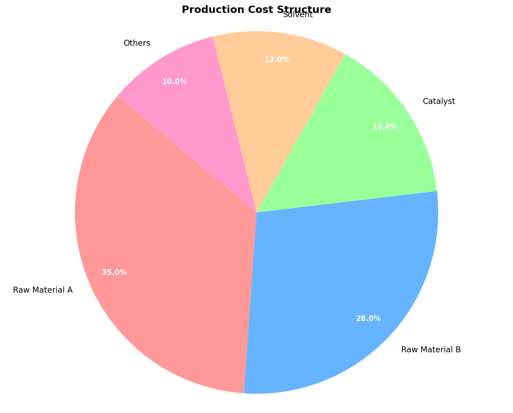

> **說明：** 此圓餅圖呈現化工生產成本五大構成比例。從圖中可清楚看出：
> - **原料 A（35%）+ 原料 B（28%）= 63%**：兩種原料佔總成本超過六成，是降低生產成本的優先目標。
> - **催化劑（15%）**：雖比例居中，但催化劑性能對產率影響大，替換更高效催化劑可帶來更大經濟效益。
> - **溶劑（12%）與其他（10%）**：比例較小，但溶劑回收再利用可進一步降低此部分成本。
> - **白色百分比標籤**：使用 `set_color('white')` + 粗體字，在彩色扇形上清楚可讀。
> - **圖例外標籤**：各項目名稱標示於圓餅外側，避免圓餅過小時標籤擁擠。

---

## 5. 圖表自訂與美化

### 5.1 標題、標籤與圖例

```python
import matplotlib.pyplot as plt
import numpy as np

x = np.linspace(0, 10, 100)
y1 = np.sin(x)
y2 = np.cos(x)

plt.figure(figsize=(10, 6))
plt.plot(x, y1, label='sin(x)', linewidth=2, color='blue')
plt.plot(x, y2, label='cos(x)', linewidth=2, color='red')

# 標題設定
plt.title('Trigonometric Functions', fontsize=16, fontweight='bold', pad=20)

# 軸標籤設定
plt.xlabel('X-axis (radians)', fontsize=13, fontweight='bold')
plt.ylabel('Y-axis (amplitude)', fontsize=13, fontweight='bold')

# 圖例設定
plt.legend(loc='upper right', fontsize=11, frameon=True, shadow=True, fancybox=True)

# 網格設定
plt.grid(True, linestyle='--', alpha=0.5)

plt.tight_layout()
plt.show()
```

**圖例位置參數：**
- `'upper right'`, `'upper left'`, `'lower right'`, `'lower left'`
- `'center'`, `'center left'`, `'center right'`
- `'best'`（自動選擇最佳位置）

### 5.2 顏色與樣式

**常用顏色表示法：**

```python
# 1. 顏色名稱
plt.plot(x, y, color='red')

# 2. 簡寫代碼
plt.plot(x, y, color='r')  # r, g, b, c, m, y, k, w

# 3. 十六進位碼
plt.plot(x, y, color='#FF5733')

# 4. RGB 元組
plt.plot(x, y, color=(0.1, 0.2, 0.5))

# 5. 內建色彩映射
plt.plot(x, y, color='tab:blue')  # tab:blue, tab:orange, tab:green 等
```

**線條樣式：**

```python
plt.plot(x, y, linestyle='-')   # 實線
plt.plot(x, y, linestyle='--')  # 虛線
plt.plot(x, y, linestyle='-.')  # 點劃線
plt.plot(x, y, linestyle=':')   # 點線
```

### 5.3 軸範圍與刻度

```python
import matplotlib.pyplot as plt
import numpy as np

x = np.linspace(0, 10, 100)
y = np.sin(x)

plt.figure(figsize=(10, 6))
plt.plot(x, y, linewidth=2)

# 設定軸範圍
plt.xlim(0, 10)
plt.ylim(-1.5, 1.5)

# 設定刻度
plt.xticks(np.arange(0, 11, 1))
plt.yticks(np.arange(-1.5, 2, 0.5))

# 自訂刻度標籤
plt.xticks([0, np.pi, 2*np.pi, 3*np.pi], ['0', 'π', '2π', '3π'])

plt.title('Customized Axis Range and Ticks', fontsize=14)
plt.xlabel('X-axis', fontsize=12)
plt.ylabel('Y-axis', fontsize=12)
plt.grid(True, alpha=0.3)
plt.tight_layout()
plt.show()
```

### 5.4 圖表尺寸與解析度

```python
# 設定圖表尺寸（單位：英吋）
plt.figure(figsize=(12, 6))

# 儲存高解析度圖片
plt.savefig('output.png', dpi=300, bbox_inches='tight')
```

**儲存格式：**
- PNG：`plt.savefig('figure.png')`
- PDF：`plt.savefig('figure.pdf')`
- SVG：`plt.savefig('figure.svg')`
- JPG：`plt.savefig('figure.jpg')`

---

## 6. 多圖表佈局

### 6.1 使用 subplot

**基本用法：**

```python
import matplotlib.pyplot as plt
import numpy as np

x = np.linspace(0, 10, 100)

fig, axes = plt.subplots(2, 2, figsize=(12, 10))

# 第一個子圖
axes[0, 0].plot(x, np.sin(x), 'r-')
axes[0, 0].set_title('sin(x)')
axes[0, 0].grid(True, alpha=0.3)

# 第二個子圖
axes[0, 1].plot(x, np.cos(x), 'b-')
axes[0, 1].set_title('cos(x)')
axes[0, 1].grid(True, alpha=0.3)

# 第三個子圖
axes[1, 0].plot(x, np.tan(x), 'g-')
axes[1, 0].set_title('tan(x)')
axes[1, 0].set_ylim(-5, 5)
axes[1, 0].grid(True, alpha=0.3)

# 第四個子圖
axes[1, 1].plot(x, np.exp(-x/5), 'm-')
axes[1, 1].set_title('exp(-x/5)')
axes[1, 1].grid(True, alpha=0.3)

plt.tight_layout()
plt.show()
```

**▌ 範例演練結果**

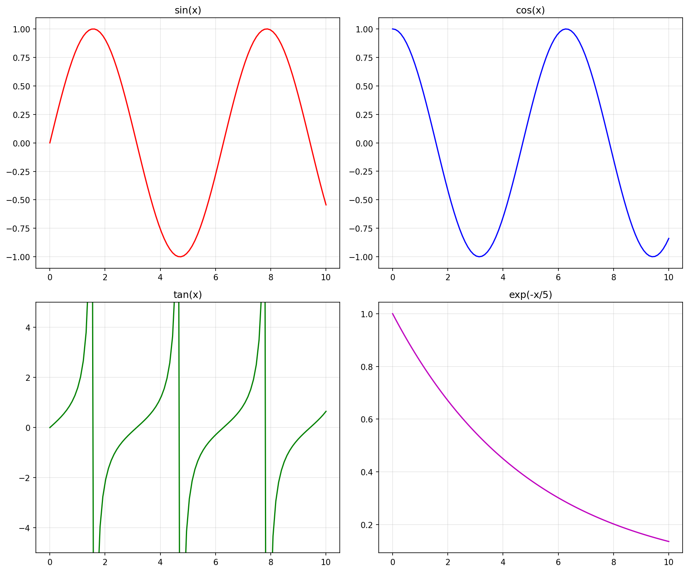

> **說明：** 此圖展示 `plt.subplots(2, 2)` 建立的 2×2 子圖排版，同一畫布上同時顯示四種數學函數（X 軸 0–10）：
> - **sin(x)**（左上，紅色）：週期性正弦波，振幅 ±1，週期 $2\pi \approx 6.28$ 。
> - **cos(x)**（右上，藍色）：餘弦波，與 sin(x) 相位差 $\pi/2$ 。
> - **tan(x)**（左下，綠色）：具有無窮大的不連續性（在 $\pi/2, 3\pi/2, 5\pi/2$ 等處，即 x ≈ 1.57, 4.71, 7.85），Y 軸限制於 ±5 以利顯示。
> - **exp(-x/5)**（右下，洋紅色）：指數衰減函數，從 x=0 時 y=1 衰減至 x=10 時 y≈0.13。
>
> 此排版技術廣泛用於化工製程監控中同步顯示多個製程變數。

### 6.2 化工應用範例：反應器多參數監控

```python
import matplotlib.pyplot as plt
import numpy as np

# 生成模擬數據
time = np.linspace(0, 24, 200)
temperature = 80 + 5 * np.sin(2 * np.pi * time / 12) + np.random.normal(0, 0.5, 200)
pressure = 2.5 + 0.3 * np.sin(2 * np.pi * time / 12 + 1) + np.random.normal(0, 0.05, 200)
flow_rate = 100 + 10 * np.sin(2 * np.pi * time / 8) + np.random.normal(0, 1, 200)
concentration = 0.8 + 0.1 * np.exp(-time/10) + np.random.normal(0, 0.01, 200)

fig, axes = plt.subplots(2, 2, figsize=(14, 10))

# 溫度
axes[0, 0].plot(time, temperature, color='orangered', linewidth=1.5, label='Temperature')
axes[0, 0].axhline(y=80, color='green', linestyle='--', linewidth=2, alpha=0.7, label='Target (80°C)')
axes[0, 0].fill_between(time, 75, 85, color='green', alpha=0.1, label='Safe Range (75-85°C)')
axes[0, 0].set_title('Temperature Monitoring', fontsize=13, fontweight='bold')
axes[0, 0].set_xlabel('Time (hours)', fontsize=11)
axes[0, 0].set_ylabel('Temperature (°C)', fontsize=11)
axes[0, 0].legend(loc='upper right', fontsize=9)
axes[0, 0].grid(True, linestyle=':', alpha=0.5)

# 壓力
axes[0, 1].plot(time, pressure, color='steelblue', linewidth=1.5, label='Pressure')
axes[0, 1].axhline(y=2.5, color='green', linestyle='--', linewidth=2, alpha=0.7, label='Target (2.5 bar)')
axes[0, 1].fill_between(time, 2.2, 2.8, color='green', alpha=0.1, label='Safe Range (2.2-2.8 bar)')
axes[0, 1].set_title('Pressure Monitoring', fontsize=13, fontweight='bold')
axes[0, 1].set_xlabel('Time (hours)', fontsize=11)
axes[0, 1].set_ylabel('Pressure (bar)', fontsize=11)
axes[0, 1].legend(loc='upper right', fontsize=9)
axes[0, 1].grid(True, linestyle=':', alpha=0.5)

# 流量
axes[1, 0].plot(time, flow_rate, color='forestgreen', linewidth=1.5, label='Flow Rate')
axes[1, 0].axhline(y=100, color='red', linestyle='--', linewidth=2, alpha=0.7, label='Target (100 L/min)')
axes[1, 0].fill_between(time, 90, 110, color='yellow', alpha=0.1, label='Safe Range (90-110 L/min)')
axes[1, 0].set_title('Flow Rate Monitoring', fontsize=13, fontweight='bold')
axes[1, 0].set_xlabel('Time (hours)', fontsize=11)
axes[1, 0].set_ylabel('Flow Rate (L/min)', fontsize=11)
axes[1, 0].legend(loc='upper right', fontsize=9)
axes[1, 0].grid(True, linestyle=':', alpha=0.5)

# 濃度
axes[1, 1].plot(time, concentration, color='purple', linewidth=1.5, label='Concentration')
axes[1, 1].axhline(y=0.8, color='orange', linestyle='--', linewidth=2, alpha=0.7, label='Target (0.8 mol/L)')
axes[1, 1].set_title('Concentration Monitoring', fontsize=13, fontweight='bold')
axes[1, 1].set_xlabel('Time (hours)', fontsize=11)
axes[1, 1].set_ylabel('Concentration (mol/L)', fontsize=11)
axes[1, 1].legend(loc='upper right', fontsize=9)
axes[1, 1].grid(True, linestyle=':', alpha=0.5)

fig.suptitle('Reactor Multi-Parameter Monitoring Dashboard', fontsize=16, fontweight='bold', y=0.995)
plt.tight_layout()
plt.show()
```

**▌ 範例演練結果**

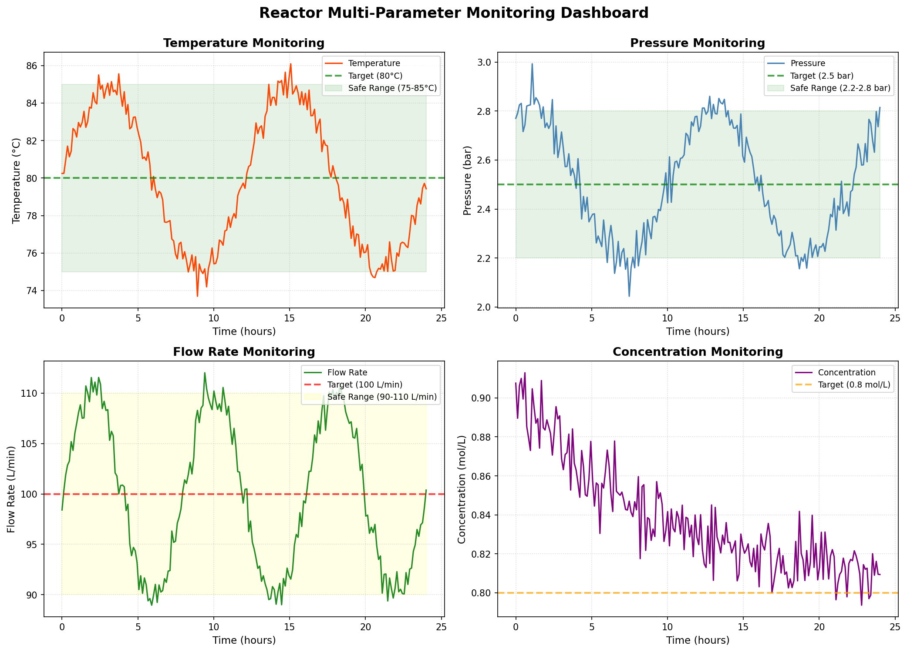

> **說明：** 此四象限監控儀表板同時顯示反應器 24 小時的四個關鍵製程參數（200 個數據點）：
>
> | 子圖 | 參數 | 範圍 | 目標值 | 安全帶 |
> |------|------|------|--------|--------|
> | 左上 | 溫度 | 74–86°C | 80°C | 75–85°C（綠色帶） |
> | 右上 | 壓力 | 2.0–3.0 bar | 2.5 bar | 2.2–2.8 bar（綠色帶） |
> | 左下 | 流量 | 88–112 L/min | 100 L/min | 90–110 L/min（黃色帶） |
> | 右下 | 濃度 | 0.79–0.91 mol/L | 0.8 mol/L | — |
>
> **重要觀察：**
> - 溫度與壓力呈現以 12 小時為週期的正弦振盪，代表反應器的週期性操作特性。
> - 流量以 8 小時為週期振盪，與溫度/壓力週期不同步，模擬多個控制系統的獨立作動。
> - 濃度呈現指數衰減趨勢（從約 0.91 → 0.80 mol/L），代表批次操作末期原料消耗。
> - 每個子圖均設置圖例，明確標示各線條含義，符合化工製程監控儀表板的標準設計。

### 6.3 不規則佈局

```python
import matplotlib.pyplot as plt
import numpy as np

fig = plt.figure(figsize=(12, 8))

# 使用 subplot2grid 建立不規則佈局
ax1 = plt.subplot2grid((3, 3), (0, 0), colspan=3)
ax2 = plt.subplot2grid((3, 3), (1, 0), colspan=2)
ax3 = plt.subplot2grid((3, 3), (1, 2), rowspan=2)
ax4 = plt.subplot2grid((3, 3), (2, 0))
ax5 = plt.subplot2grid((3, 3), (2, 1))

x = np.linspace(0, 10, 100)

ax1.plot(x, np.sin(x), 'b-')
ax1.set_title('Main Plot', fontsize=12)
ax1.grid(True, alpha=0.3)

ax2.plot(x, np.cos(x), 'r-')
ax2.set_title('Secondary Plot', fontsize=12)
ax2.grid(True, alpha=0.3)

ax3.plot(x, np.exp(-x/5), 'g-')
ax3.set_title('Side Plot', fontsize=12)
ax3.grid(True, alpha=0.3)

ax4.hist(np.random.randn(1000), bins=30, color='orange', alpha=0.7)
ax4.set_title('Histogram', fontsize=12)

ax5.scatter(np.random.randn(100), np.random.randn(100), alpha=0.6)
ax5.set_title('Scatter', fontsize=12)
ax5.grid(True, alpha=0.3)

plt.tight_layout()
plt.show()
```

---

## 7. 進階應用：雙 Y 軸圖表

在化工製程中，常需要在同一時間軸上顯示不同單位或數量級的參數，這時雙 Y 軸圖表非常有用。

```python
import matplotlib.pyplot as plt
import numpy as np

# 生成模擬數據
time = np.linspace(0, 24, 100)
temperature = 80 + 10 * np.sin(2 * np.pi * time / 12)
conversion = 50 + 30 * (1 - np.exp(-time/5))

fig, ax1 = plt.subplots(figsize=(12, 6))

# 第一個 Y 軸（溫度）
color = 'tab:red'
ax1.set_xlabel('Time (hours)', fontsize=12, fontweight='bold')
ax1.set_ylabel('Temperature (°C)', color=color, fontsize=12, fontweight='bold')
ax1.plot(time, temperature, color=color, linewidth=2, label='Temperature')
ax1.tick_params(axis='y', labelcolor=color)
ax1.grid(True, linestyle=':', alpha=0.5)

# 第二個 Y 軸（轉化率）
ax2 = ax1.twinx()
color = 'tab:blue'
ax2.set_ylabel('Conversion Rate (%)', color=color, fontsize=12, fontweight='bold')
ax2.plot(time, conversion, color=color, linewidth=2, linestyle='--', label='Conversion')
ax2.tick_params(axis='y', labelcolor=color)

# 標題與圖例
fig.suptitle('Reactor Temperature and Conversion Rate', fontsize=14, fontweight='bold')

# 合併圖例
lines1, labels1 = ax1.get_legend_handles_labels()
lines2, labels2 = ax2.get_legend_handles_labels()
ax1.legend(lines1 + lines2, labels1 + labels2, loc='upper left')

plt.tight_layout()
plt.show()
```

**▌ 範例演練結果**

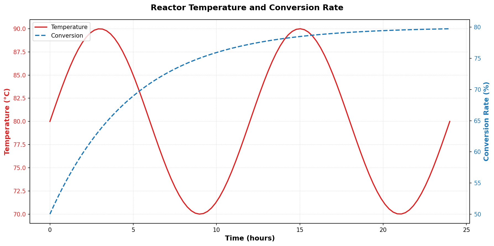

> **說明：** 此雙 Y 軸圖同時展示反應器溫度（左軸，紅色實線）與轉化率（右軸，藍色虛線）在 24 小時內的動態關係。
> - **左 Y 軸（溫度，紅色）**：以 12 小時為週期在 70–90°C 之間振盪，模擬週期性加熱冷卻製程。
> - **右 Y 軸（轉化率，藍色虛線）**：從 50% 逐漸趨近上限約 80%，遵循 $\text{Conversion} = 50 + 30(1 - e^{-t/5})$ 的一階動力學關係。
> - **雙 Y 軸設計**：兩個 Y 軸使用對應顏色（`labelcolor`），直覺對應各線條，避免混淆。
> - **合併圖例**：透過 `ax1.get_legend_handles_labels()` + `ax2.get_legend_handles_labels()` 將兩軸圖例合併至左上角，是標準的雙軸圖例處理方式。
> - **化工意義**：此類圖在化工製程分析中用於探索「操作條件（溫度）」與「製程結果（轉化率）」之間的動態相關性。

---

## 8. 圖表儲存與輸出

### 8.1 基本儲存

```python
import matplotlib.pyplot as plt
import numpy as np

x = np.linspace(0, 10, 100)
y = np.sin(x)

plt.figure(figsize=(10, 6))
plt.plot(x, y, linewidth=2)
plt.title('Sample Plot', fontsize=14)
plt.xlabel('X-axis', fontsize=12)
plt.ylabel('Y-axis', fontsize=12)
plt.grid(True, alpha=0.3)

# 儲存圖表
plt.savefig('sample_plot.png', dpi=300, bbox_inches='tight')
plt.show()
```

**▌ 範例演練結果**

```
✓ 圖表已儲存至: d:\MyGit\ChemE-3590\Part_1\Unit04\outputs\P1_Unit04_Matplotlib\figs\sample_plot.png
```

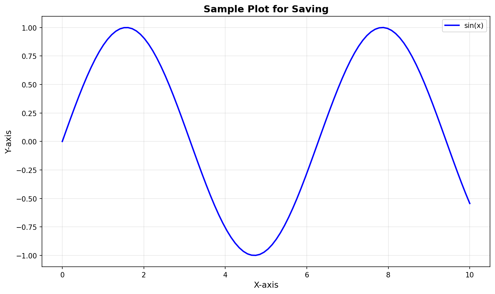

> **說明：** 此範例展示完整的圖表儲存流程。以 sin(x) 正弦波（X 軸 0–10）作為示範圖表，執行 `plt.savefig()` 後圖檔以 300 DPI 高解析度儲存至指定路徑。主要重點：
> - **`dpi=300`**：論文/報告級解析度，圖片清晰銳利，zoom in 後不模糊。
> - **`bbox_inches='tight'`**：自動裁切圖表周圍多餘空白，使輸出圖片更緊湊專業。
> - **路徑使用 `Path` 物件**：`FIG_DIR / 'sample_plot.png'` 自動處理 Windows/Linux 路徑分隔符問題。
> - 儲存後圖檔位於 `outputs/P1_Unit04_Matplotlib/figs/sample_plot.png`，可直接用於報告或簡報。

### 8.2 儲存參數說明

```python
plt.savefig('output.png',
            dpi=300,                    # 解析度（每英吋點數）
            bbox_inches='tight',        # 自動裁切空白邊距
            pad_inches=0.1,             # 邊距大小
            transparent=False,          # 透明背景
            facecolor='white',          # 背景顏色
            edgecolor='none')           # 邊框顏色
```

**建議設定：**
- **螢幕顯示**：dpi=100
- **簡報投影**：dpi=150
- **論文發表**：dpi=300
- **印刷品質**：dpi=600

### 8.3 儲存多種格式（範例演練結果）

```python
# 儲存為多種格式
formats = ['png', 'pdf', 'svg']
for fmt in formats:
    save_path = FIG_DIR / f'multi_format_plot.{fmt}'
    plt.savefig(save_path, dpi=300, bbox_inches='tight')
    print(f"✓ 已儲存 {fmt.upper()} 格式: {save_path}")
```

**▌ 範例演練結果**

```
✓ 已儲存 PNG 格式: d:\MyGit\ChemE-3590\Part_1\Unit04\outputs\P1_Unit04_Matplotlib\figs\multi_format_plot.png
✓ 已儲存 PDF 格式: d:\MyGit\ChemE-3590\Part_1\Unit04\outputs\P1_Unit04_Matplotlib\figs\multi_format_plot.pdf
✓ 已儲存 SVG 格式: d:\MyGit\ChemE-3590\Part_1\Unit04\outputs\P1_Unit04_Matplotlib\figs\multi_format_plot.svg
```

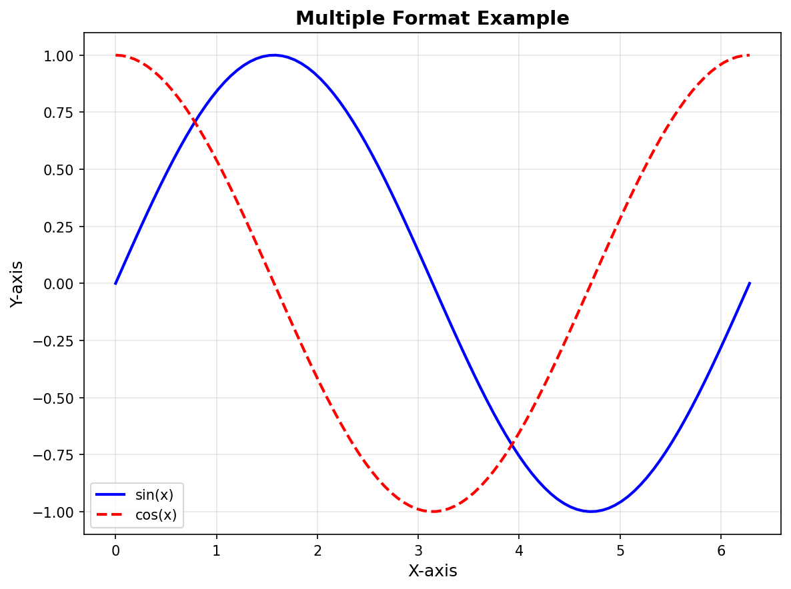

> **說明：** 此圖展示同一張圖表（sin(x) 藍色實線 vs cos(x) 紅色虛線）以三種格式輸出的完整示範。執行後三個檔案均已成功儲存至 `outputs/P1_Unit04_Matplotlib/figs/`：
>
> | 格式 | 適用場合 | 特點 |
> |------|---------|------|
> | **PNG** | 報告、簡報、網頁 | 點陣格式（300 DPI），壓縮小、相容性高 |
> | **PDF** | 論文附圖、正式文件 | 向量格式，可無損縮放，可嵌入 LaTeX |
> | **SVG** | 網頁、互動式應用 | 向量格式，可用程式碼編輯，縮放不失真 |
>
> **最佳實踐：** 學術論文建議使用 PDF 或 SVG（向量格式），報告簡報建議 PNG（dpi=300）。同時儲存多種格式是專業工作流程的標準做法。

---

## 9. 常見錯誤與除錯

### 9.1 中文顯示問題

**問題：** Matplotlib 預設不支援中文字體，會顯示方框。

**解決方案（僅供理解，本課程使用英文標籤）：**

```python
import matplotlib.pyplot as plt
import matplotlib as mpl

# 設定中文字體（僅作範例說明）
mpl.rcParams['font.sans-serif'] = ['Microsoft JhengHei']  # 微軟正黑體
mpl.rcParams['axes.unicode_minus'] = False  # 解決負號顯示問題
```

**本課程規範：** 所有圖表標題、軸標籤必須使用英文，無需處理中文顯示問題。

### 9.2 圖表重疊問題

**問題：** 多個子圖或標籤重疊。

**解決方案：**

```python
# 使用 tight_layout 自動調整
plt.tight_layout()

# 或手動調整
plt.subplots_adjust(left=0.1, right=0.9, top=0.9, bottom=0.1, wspace=0.3, hspace=0.3)
```

### 9.3 圖表不顯示

**問題：** 程式執行後沒有顯示圖表。

**解決方案：**

```python
# 確保加上 show()
plt.show()

# 在 Jupyter Notebook 中使用
%matplotlib inline
```

### 9.4 記憶體問題

**問題：** 繪製大量圖表後記憶體不足。

**解決方案：**

```python
# 關閉圖表釋放記憶體
plt.close()

# 關閉所有圖表
plt.close('all')
```

---

## 10. 最佳實踐建議

### 10.1 圖表設計原則

1. **簡潔明瞭**：避免過多裝飾，突出重點數據
2. **適當配色**：使用對比明顯但不刺眼的顏色
3. **清晰標註**：確保標題、標籤、圖例完整且易讀
4. **合理比例**：選擇適當的圖表尺寸與軸範圍
5. **資訊完整**：包含必要的單位、標籤與說明

### 10.2 化工領域圖表規範

1. **單位標示**：必須標註所有物理量的單位
2. **安全範圍**：標示操作安全範圍或目標值
3. **時間軸**：製程數據通常使用時間為 X 軸
4. **數據品質**：標示數據來源與測量精度
5. **趨勢線**：適時添加趨勢線或參考線

### 10.3 程式碼組織建議

```python
import matplotlib.pyplot as plt
import numpy as np

def plot_reactor_temperature(time, temperature, save_path=None):
    """
    繪製反應器溫度監控圖
    
    Parameters:
    -----------
    time : array-like
        時間數據（小時）
    temperature : array-like
        溫度數據（攝氏度）
    save_path : str, optional
        圖表儲存路徑
    """
    plt.figure(figsize=(10, 6))
    plt.plot(time, temperature, color='orangered', linewidth=2, label='Reactor Temp')
    plt.axhline(y=80, color='green', linestyle='--', linewidth=2, label='Target Temp')
    plt.fill_between(time, 75, 85, color='green', alpha=0.1, label='Safe Range')
    
    plt.title('Reactor Temperature Monitoring', fontsize=14, fontweight='bold')
    plt.xlabel('Time (hours)', fontsize=12)
    plt.ylabel('Temperature (°C)', fontsize=12)
    plt.legend(loc='best')
    plt.grid(True, linestyle=':', alpha=0.5)
    plt.tight_layout()
    
    if save_path:
        plt.savefig(save_path, dpi=300, bbox_inches='tight')
    
    plt.show()

# 使用函數
time = np.linspace(0, 8, 100)
temp = 80 + 10 * np.exp(-0.5 * time) + np.random.normal(0, 1, 100)
plot_reactor_temperature(time, temp, save_path='reactor_temp.png')
```

---

## 11. 小結

本單元介紹了 Matplotlib 的基本概念與常用功能：

1. **基本架構**：理解 Matplotlib 的層次結構與繪圖邏輯
2. **常用圖表**：掌握折線圖、散佈圖、長條圖、直方圖、圓餅圖等基本圖表
3. **圖表自訂**：學習標題、標籤、圖例、顏色、樣式等自訂方法
4. **多圖佈局**：能夠使用 subplot 建立多圖表佈局
5. **進階應用**：掌握雙 Y 軸、不規則佈局等進階技巧
6. **化工應用**：了解如何將 Matplotlib 應用於化工領域的數據視覺化

### 學習要點

- **所有標籤必須使用英文**：遵循專案規範，確保相容性
- **適當選擇圖表類型**：根據數據特性選擇最合適的圖表
- **重視圖表美化**：專業的圖表能更有效傳達資訊
- **實際應用練習**：多練習化工領域的實際案例

### 下一步

- 完成 Unit04_Matplotlib.ipynb 程式演練
- 練習 Unit04_Matplotlib_Homework.ipynb 作業
- 學習 Unit04_Seaborn 統計視覺化進階內容

---

## 12. 參考資源

### 官方文件
- [Matplotlib 官方文件](https://matplotlib.org/stable/contents.html)
- [Matplotlib 圖表範例庫](https://matplotlib.org/stable/gallery/index.html)
- [Matplotlib 教學](https://matplotlib.org/stable/tutorials/index.html)

### 推薦閱讀
- *Python Data Science Handbook* by Jake VanderPlas
- *Matplotlib for Python Developers* by Sandro Tosi

### 線上資源
- [Real Python - Matplotlib Guide](https://realpython.com/python-matplotlib-guide/)
- [DataCamp - Matplotlib Tutorial](https://www.datacamp.com/tutorial/matplotlib-tutorial-python)

---

**課程資訊**
- 課程名稱：AI在化工上之應用
- 課程單元：Unit 04 Matplotlib 基本圖表繪製與應用
- 課程製作：逢甲大學 化工系 智慧程序系統工程實驗室
- 授課教師：莊曜禎 助理教授
- 更新日期：2026-03-11

**課程授權 [CC BY-NC-SA 4.0]**
 - 本教材遵循 [創用CC 姓名標示-非商業性-相同方式分享 4.0 國際 (CC BY-NC-SA 4.0)](https://creativecommons.org/licenses/by-nc-sa/4.0/deed.zh) 授權。

---
