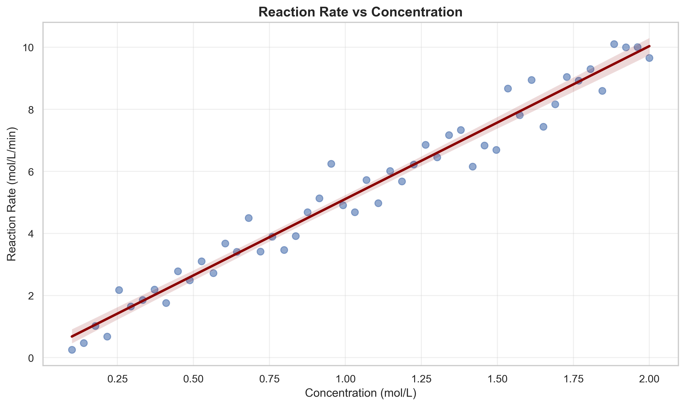
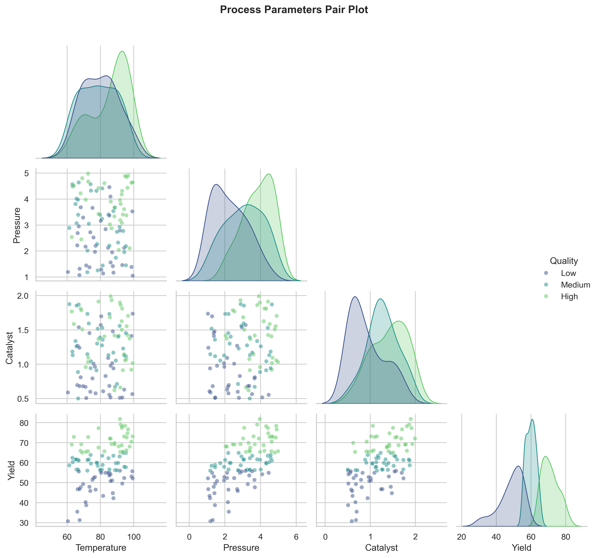
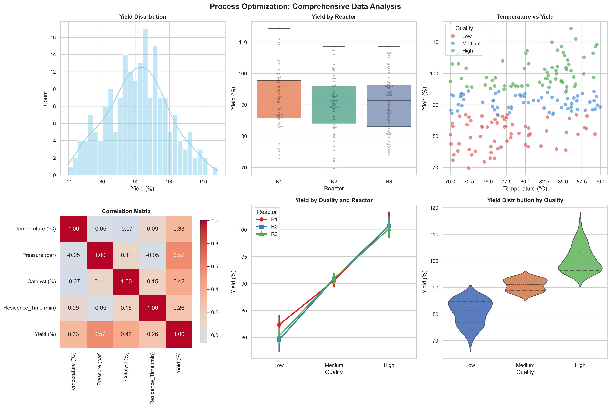

# Unit04 Seaborn 統計資料視覺化

## 學習目標

完成本單元後，學生將能夠：
- 理解 Seaborn 的設計理念與優勢
- 掌握 Seaborn 與 Matplotlib 的關係與整合
- 熟悉常用的統計視覺化圖表（分佈圖、類別圖、關係圖、熱力圖等）
- 學會使用主題樣式與調色盤美化圖表
- 應用 Seaborn 於化工領域的統計分析與視覺化

---

## 1. Seaborn 簡介

### 1.1 什麼是 Seaborn？

Seaborn 是基於 Matplotlib 建立的高階統計視覺化套件，由 Michael Waskom 開發。它提供了更簡潔的語法和更美觀的預設樣式，特別適合探索性數據分析和統計視覺化。

**主要特點：**
- **高階介面**：用更少的程式碼建立複雜的統計圖表
- **美觀設計**：內建多種精美主題與調色盤
- **統計整合**：自動進行統計計算與視覺化（如迴歸線、信賴區間等）
- **Pandas 整合**：直接支援 DataFrame，語法更直觀
- **分面繪圖**：輕鬆建立多維度數據的子圖矩陣

### 1.2 Seaborn vs Matplotlib

| 特性 | Matplotlib | Seaborn |
|------|-----------|---------|
| **抽象層次** | 低階，需要更多程式碼 | 高階，語法簡潔 |
| **預設樣式** | 較基本 | 現代化、美觀 |
| **統計功能** | 需手動計算 | 內建統計視覺化 |
| **數據格式** | 主要使用陣列 | 原生支援 DataFrame |
| **適用場景** | 精細控制、客製化 | 快速探索、統計分析 |

**關係：** Seaborn 是建立在 Matplotlib 之上的，所有 Matplotlib 的功能都可以在 Seaborn 圖表中使用。

### 1.3 在化工領域的應用

Seaborn 在化工領域的統計分析中非常實用：
- **實驗數據分布分析**：快速檢視數據分布、離群值
- **製程參數關係探索**：視覺化多變數之間的相關性
- **品質控制統計**：批次數據的統計比較
- **實驗設計結果分析**：多因子實驗的視覺化
- **製程優化探索**：操作條件與產出的統計關係

---

## 2. 安裝與基本設定

### 2.1 安裝 Seaborn

```bash
# 使用 pip 安裝
pip install seaborn

# 使用 conda 安裝
conda install seaborn
```

### 2.2 基本匯入與設定

```python
import seaborn as sns
import matplotlib.pyplot as plt
import numpy as np
import pandas as pd

# 設定 Seaborn 樣式
sns.set_theme()  # 使用預設主題

# 或指定特定樣式
sns.set_style("whitegrid")  # 白色網格背景

# 設定圖表大小
sns.set_context("notebook")  # 適合 Jupyter Notebook

# 在 Jupyter Notebook 中顯示圖表
%matplotlib inline
```

### 2.3 Seaborn 樣式系統

**五種內建樣式：**
1. **darkgrid**：深色網格（預設）
2. **whitegrid**：白色網格
3. **dark**：深色背景無網格
4. **white**：白色背景無網格
5. **ticks**：有刻度標記的白色背景

**四種繪圖環境：**
1. **paper**：適合論文發表
2. **notebook**：適合 Jupyter Notebook（預設）
3. **talk**：適合演講投影片
4. **poster**：適合海報展示

```python
# 組合使用
sns.set_style("whitegrid")
sns.set_context("talk", font_scale=1.2)
```

---

## 3. Seaborn 圖表分類

Seaborn 的圖表可以分為以下幾大類：

### 3.1 關係圖 (Relational Plots)
- `scatterplot()`：散佈圖
- `lineplot()`：折線圖
- `relplot()`：關係圖的通用介面

### 3.2 分佈圖 (Distribution Plots)
- `histplot()`：直方圖
- `kdeplot()`：核密度估計圖
- `ecdfplot()`：經驗累積分佈圖
- `rugplot()`：地毯圖
- `displot()`：分佈圖的通用介面

### 3.3 類別圖 (Categorical Plots)
- `stripplot()`：散點分類圖
- `swarmplot()`：蜂群圖
- `boxplot()`：箱型圖
- `violinplot()`：小提琴圖
- `barplot()`：長條圖
- `pointplot()`：點圖
- `catplot()`：類別圖的通用介面

### 3.4 回歸圖 (Regression Plots)
- `regplot()`：回歸圖
- `lmplot()`：線性模型圖

### 3.5 矩陣圖 (Matrix Plots)
- `heatmap()`：熱力圖
- `clustermap()`：階層式聚類熱力圖

### 3.6 多圖網格 (Multi-plot Grids)
- `FacetGrid`：分面網格
- `PairGrid`：配對網格
- `JointGrid`：聯合分佈網格

---

## 4. 分佈圖 (Distribution Plots)

本章介紹直方圖與 KDE 圖（Seaborn 分佈圖）以及箱型圖與小提琴圖。需注意：`boxplot()` 與 `violinplot()` 在 Seaborn 官方 API 中歸屬於**類別圖 (Categorical Plots)**（見第 3.3 節），但因這兩種圖表非常適合呈現與比較各組數據的分佈形狀，教學上通常與直方圖、KDE 圖一併介紹。

### 4.1 直方圖 (Histogram)

直方圖顯示數據在不同區間的頻率分佈。

**基本用法：**

```python
import seaborn as sns
import numpy as np
import matplotlib.pyplot as plt

# 產生模擬數據
np.random.seed(42)
data = np.random.normal(100, 15, 1000)

# 繪製直方圖
plt.figure(figsize=(10, 6))
sns.histplot(data, bins=30, kde=True, color='steelblue')

plt.title('Distribution of Data', fontsize=14, fontweight='bold')
plt.xlabel('Value', fontsize=12)
plt.ylabel('Frequency', fontsize=12)
plt.tight_layout()
plt.show()
```

**參數說明：**
- `bins`：區間數量
- `kde`：是否顯示核密度估計曲線
- `color`：顏色
- `stat`：統計類型（'count', 'frequency', 'density', 'probability'）

**化工應用範例：產品純度分佈分析**

```python
import seaborn as sns
import numpy as np
import matplotlib.pyplot as plt

# 模擬產品純度數據（百分比）
np.random.seed(42)
purity_batch1 = np.random.normal(98.5, 0.8, 150)
purity_batch2 = np.random.normal(97.8, 1.2, 150)

plt.figure(figsize=(12, 6))

# 繪製雙直方圖比較
sns.histplot(purity_batch1, bins=25, kde=True, color='skyblue', label='Batch 1', alpha=0.6)
sns.histplot(purity_batch2, bins=25, kde=True, color='salmon', label='Batch 2', alpha=0.6)

plt.axvline(x=98.0, color='green', linestyle='--', linewidth=2, label='Specification Limit')
plt.title('Product Purity Distribution Comparison', fontsize=14, fontweight='bold')
plt.xlabel('Purity (%)', fontsize=12)
plt.ylabel('Frequency', fontsize=12)
plt.legend()
plt.tight_layout()
plt.show()
```

**執行結果：**

```
✓ 圖表已儲存
```


**討論與分析：**

| 批次 | 平均純度 | 標準差 | 規格通過率 (≥98%) |
|------|---------|--------|-----------------|
| Batch 1 | 98.434% | 0.751% | 111/150 (74.0%) |
| Batch 2 | 97.885% | 1.222% | 74/150 (49.3%) |

- **Batch 1** 的平均純度 (98.434%) 高於規格下限 (98.0%)，標準差較小 (0.751%)，分佈集中，74.0% 的樣本符合規格。
- **Batch 2** 的平均純度 (97.885%) 略低於規格下限，且標準差較大 (1.222%)，代表批次控制穩定性較差，僅 49.3% 的樣本符合規格。
- KDE 曲線清楚呈現 Batch 1 的分佈較窄（製程穩定），Batch 2 的分佈較寬且中心偏低，兩者的規格通過率差異相差 24.7 個百分點。
- **改善建議**：針對 Batch 2，應檢查原料品質、操作溫度控制及純化步驟，以提升批次一致性。

---

### 4.2 核密度估計圖 (KDE Plot)

KDE 圖顯示數據的平滑機率密度估計。

**基本用法：**

```python
import seaborn as sns
import numpy as np
import matplotlib.pyplot as plt

# 產生模擬數據
np.random.seed(42)
data = np.random.gamma(2, 2, 1000)

# 繪製 KDE 圖
plt.figure(figsize=(10, 6))
sns.kdeplot(data, fill=True, color='purple', alpha=0.6)

plt.title('Kernel Density Estimation', fontsize=14, fontweight='bold')
plt.xlabel('Value', fontsize=12)
plt.ylabel('Density', fontsize=12)
plt.tight_layout()
plt.show()
```

**多維度 KDE：**

```python
# 二維 KDE
x = np.random.normal(0, 1, 1000)
y = np.random.normal(0, 1, 1000)

plt.figure(figsize=(10, 8))
sns.kdeplot(x=x, y=y, cmap='Blues', fill=True, levels=10)

plt.title('2D Kernel Density Estimation', fontsize=14, fontweight='bold')
plt.xlabel('X Variable', fontsize=12)
plt.ylabel('Y Variable', fontsize=12)
plt.tight_layout()
plt.show()
```

### 4.3 箱型圖 (Box Plot)

箱型圖顯示數據的五數概括（最小值、第一四分位數、中位數、第三四分位數、最大值）。

**基本用法：**

```python
import seaborn as sns
import pandas as pd
import numpy as np
import matplotlib.pyplot as plt

# 產生模擬數據
np.random.seed(42)
data = pd.DataFrame({
    'Category': ['A']*50 + ['B']*50 + ['C']*50,
    'Value': np.concatenate([
        np.random.normal(100, 10, 50),
        np.random.normal(110, 15, 50),
        np.random.normal(95, 8, 50)
    ])
})

# 繪製箱型圖
plt.figure(figsize=(10, 6))
sns.boxplot(data=data, x='Category', y='Value', palette='Set2')

plt.title('Box Plot by Category', fontsize=14, fontweight='bold')
plt.xlabel('Category', fontsize=12)
plt.ylabel('Value', fontsize=12)
plt.tight_layout()
plt.show()
```

**化工應用範例：不同反應器批次產率比較**

```python
import seaborn as sns
import pandas as pd
import numpy as np
import matplotlib.pyplot as plt

# 模擬四個反應器的產率數據（延續 Notebook 的全域種子設定）
n_samples = 30

data = pd.DataFrame({
    'Reactor': ['R1']*n_samples + ['R2']*n_samples + ['R3']*n_samples + ['R4']*n_samples,
    'Yield (%)': np.concatenate([
        np.random.normal(85, 3, n_samples),
        np.random.normal(88, 4, n_samples),
        np.random.normal(82, 5, n_samples),
        np.random.normal(90, 2.5, n_samples)
    ])
})

plt.figure(figsize=(12, 7))
sns.boxplot(data=data, x='Reactor', y='Yield (%)', hue='Reactor', palette='pastel', linewidth=2, legend=False)
sns.swarmplot(data=data, x='Reactor', y='Yield (%)', color='black', alpha=0.5, size=3)

plt.axhline(y=85, color='red', linestyle='--', linewidth=2, label='Target Yield')
plt.title('Yield Comparison Across Reactors', fontsize=14, fontweight='bold')
plt.xlabel('Reactor ID', fontsize=12)
plt.ylabel('Yield (%)', fontsize=12)
plt.legend()
plt.tight_layout()
plt.show()
```

**執行結果：**

```
✓ 圖表已儲存
```


**討論與分析：**

| 反應器 | 平均產率 | 標準差 | 達到目標 (≥85%) 比例 |
|--------|---------|--------|---------------------|
| R1 | 85.85% | 2.33% | 19/30 (63.3%) |
| R2 | 87.17% | 2.69% | 23/30 (76.7%) |
| R3 | 83.14% | 4.96% | 9/30 (30.0%) |
| R4 | 90.07% | 2.51% | 30/30 (100.0%) |

- **R4** 表現最佳，平均產率達 90.07%，標準差僅 2.51%，所有樣本均達目標，代表製程高度穩定且高效。
- **R2** 次之，平均 87.17%，76.7% 的批次達標，但變異度略高於 R4，顯示仍有進一步穩定化空間。
- **R1** 的平均產率 85.85% 剛超過目標值 85%，63.3% 的批次達標；整體偏移不大，但中位數接近目標線，存在下偏風險。
- **R3** 的平均產率 83.14% 低於目標，僅 30.0% 的批次達標，且標準差最大 (4.96%)，製程波動最為明顯，需要優先改善。
- 箱型圖的鬚線長度和蜂群點的分散程度直觀呈現各反應器的離散度；R3 的箱體最寬、散點最分散，而 R4 的分佈最集中。
- **建議**：可參考 R4 的操作條件，優先對 R3 進行根本原因分析，並同步提升 R1 的平均產率水準。

### 4.4 小提琴圖 (Violin Plot)

小提琴圖結合了箱型圖和核密度估計圖的特點。

**基本用法：**

```python
import seaborn as sns
import pandas as pd
import numpy as np
import matplotlib.pyplot as plt

# 使用上面的數據
plt.figure(figsize=(10, 6))
sns.violinplot(data=data, x='Category', y='Value', palette='muted')

plt.title('Violin Plot by Category', fontsize=14, fontweight='bold')
plt.xlabel('Category', fontsize=12)
plt.ylabel('Value', fontsize=12)
plt.tight_layout()
plt.show()
```

**化工應用範例：不同操作條件下的產品品質分布**

```python
import seaborn as sns
import pandas as pd
import numpy as np
import matplotlib.pyplot as plt

# 模擬不同溫度條件下的產品品質數據（延續 Notebook 的全域種子設定）
n = 100
temp_order = ['Low', 'Medium', 'High']

data = pd.DataFrame({
    'Temperature': ['Low']*n + ['Medium']*n + ['High']*n,
    'Quality Score': np.concatenate([
        np.random.normal(75, 8, n),
        np.random.normal(85, 5, n),
        np.random.normal(80, 10, n)
    ])
})

plt.figure(figsize=(12, 7))
sns.violinplot(data=data, x='Temperature', y='Quality Score', hue='Temperature',
               palette='Set3', inner='quartile', linewidth=2, legend=False,
               order=temp_order)

plt.title('Product Quality Distribution by Temperature', fontsize=14, fontweight='bold')
plt.xlabel('Operating Temperature', fontsize=12)
plt.ylabel('Quality Score', fontsize=12)
plt.tight_layout()
plt.show()
```

**執行結果：**

```
✓ 圖表已儲存
```


**討論與分析：**

| 操作溫度 | 平均品質分數 | 標準差 |
|---------|------------|--------|
| Low | 74.47 | 8.42 |
| Medium | 84.81 | 4.94 |
| High | 79.49 | 10.50 |

- **Medium 溫度**條件下的產品品質最高（均值 84.81），且標準差最小（4.94），小提琴圖呈現較集中且對稱的形狀，代表製程在此溫度下最穩定。
- **High 溫度**的均值（79.49）高於 Low 但低於 Medium，且標準差最大（10.50），小提琴圖最寬，代表品質波動最大，可能出現過反應或副產物形成。
- **Low 溫度**品質最差（均值 74.47），可能因反應不完全導致轉化率低。
- 小提琴圖中的四分位線（inner='quartile'）清楚顯示各溫度條件下的 Q1、Q2（中位數）、Q3，可快速比較分佈的對稱性與偏態。
- **建議**：操作溫度應優先選用 Medium 條件，以獲得品質最高且最穩定的產品。

---

## 5. 類別圖 (Categorical Plots)

類別圖用於比較不同類別的數據分佈或統計量。

### 5.1 長條圖 (Bar Plot)

Seaborn 的長條圖會自動計算並顯示平均值和信賴區間。

**基本用法：**

```python
import seaborn as sns
import pandas as pd
import numpy as np
import matplotlib.pyplot as plt

# 產生模擬數據
np.random.seed(42)
data = pd.DataFrame({
    'Method': ['A']*30 + ['B']*30 + ['C']*30,
    'Efficiency': np.concatenate([
        np.random.normal(85, 5, 30),
        np.random.normal(90, 4, 30),
        np.random.normal(80, 6, 30)
    ])
})

# 繪製長條圖（自動計算平均值）
plt.figure(figsize=(10, 6))
sns.barplot(data=data, x='Method', y='Efficiency', palette='viridis', 
            errorbar='sd', capsize=0.1)

plt.title('Average Efficiency by Method', fontsize=14, fontweight='bold')
plt.xlabel('Method', fontsize=12)
plt.ylabel('Efficiency (%)', fontsize=12)
plt.tight_layout()
plt.show()
```

**參數說明：**
- `errorbar`：誤差線類型（'sd', 'se', 'ci', None）
- `capsize`：誤差線端點寬度
- `estimator`：統計函數（預設為 mean）

### 5.2 點圖 (Point Plot)

點圖用點和線顯示不同類別的統計估計值。

**化工應用範例：不同催化劑在不同溫度下的效能**

```python
import seaborn as sns
import pandas as pd
import numpy as np
import matplotlib.pyplot as plt

# 模擬催化劑效能數據
np.random.seed(42)
n = 20

data = pd.DataFrame({
    'Catalyst': ['Cat-A']*60 + ['Cat-B']*60 + ['Cat-C']*60,
    'Temperature': (['Low']*n + ['Medium']*n + ['High']*n) * 3,
    'Conversion (%)': np.concatenate([
        # Cat-A
        np.random.normal(70, 3, n), np.random.normal(85, 3, n), np.random.normal(78, 4, n),
        # Cat-B
        np.random.normal(65, 4, n), np.random.normal(88, 2, n), np.random.normal(92, 3, n),
        # Cat-C
        np.random.normal(75, 2, n), np.random.normal(82, 3, n), np.random.normal(85, 4, n)
    ])
})

plt.figure(figsize=(12, 7))
sns.pointplot(data=data, x='Temperature', y='Conversion (%)', hue='Catalyst',
              palette='Set2', markers=['o', 's', '^'], linestyles=['-', '--', '-.'],
              errorbar='ci', capsize=0.1)

plt.title('Catalyst Performance vs Temperature', fontsize=14, fontweight='bold')
plt.xlabel('Operating Temperature', fontsize=12)
plt.ylabel('Conversion Rate (%)', fontsize=12)
plt.legend(title='Catalyst Type')
plt.tight_layout()
plt.show()
```

### 5.3 蜂群圖 (Swarm Plot)

蜂群圖顯示所有數據點，避免重疊，適合中小規模數據。

**基本用法：**

```python
import seaborn as sns
import pandas as pd
import numpy as np
import matplotlib.pyplot as plt

# 產生模擬數據
np.random.seed(42)
data = pd.DataFrame({
    'Process': ['A']*25 + ['B']*25 + ['C']*25,
    'Yield': np.concatenate([
        np.random.normal(80, 5, 25),
        np.random.normal(85, 4, 25),
        np.random.normal(78, 6, 25)
    ])
})

# 繪製蜂群圖
plt.figure(figsize=(10, 6))
sns.swarmplot(data=data, x='Process', y='Yield', palette='Set1', size=6)

plt.title('Yield Distribution by Process', fontsize=14, fontweight='bold')
plt.xlabel('Process Type', fontsize=12)
plt.ylabel('Yield (%)', fontsize=12)
plt.tight_layout()
plt.show()
```

### 5.4 組合圖表

將不同類型的圖表組合，提供更豐富的資訊。

**範例：箱型圖 + 蜂群圖**

```python
import seaborn as sns
import pandas as pd
import numpy as np
import matplotlib.pyplot as plt

# 化工應用：反應時間對產率的影響
np.random.seed(42)
n = 30

data = pd.DataFrame({
    'Reaction Time (h)': ['2h']*n + ['4h']*n + ['6h']*n + ['8h']*n,
    'Yield (%)': np.concatenate([
        np.random.normal(65, 5, n),
        np.random.normal(80, 4, n),
        np.random.normal(88, 3, n),
        np.random.normal(87, 4, n)
    ])
})

plt.figure(figsize=(12, 7))

# 繪製箱型圖作為底層
sns.boxplot(data=data, x='Reaction Time (h)', y='Yield (%)', 
            palette='pastel', linewidth=2)

# 疊加蜂群圖顯示所有數據點
sns.swarmplot(data=data, x='Reaction Time (h)', y='Yield (%)', 
              color='black', alpha=0.5, size=4)

plt.title('Yield vs Reaction Time', fontsize=14, fontweight='bold')
plt.xlabel('Reaction Time', fontsize=12)
plt.ylabel('Yield (%)', fontsize=12)
plt.tight_layout()
plt.show()
```

---

## 6. 關係圖 (Relational Plots)

本章介紹散佈圖與折線圖（Seaborn 關係圖）以及回歸圖。需注意：`regplot()` 在 Seaborn 官方 API 中歸屬於**回歸圖 (Regression Plots)**（見第 3.4 節），但因回歸圖與散佈圖在探索變數間關係上的目的高度相似，教學上通常一併介紹。

### 6.1 散佈圖 (Scatter Plot)

Seaborn 的散佈圖可以輕鬆加入第三、第四維度的資訊。

**基本用法：**

```python
import seaborn as sns
import pandas as pd
import numpy as np
import matplotlib.pyplot as plt

# 產生模擬數據
np.random.seed(42)
n = 100

data = pd.DataFrame({
    'Temperature': np.random.uniform(60, 100, n),
    'Pressure': np.random.uniform(1, 5, n),
    'Yield': np.random.uniform(70, 95, n),
    'Catalyst': np.random.choice(['A', 'B', 'C'], n)
})

# 繪製散佈圖
plt.figure(figsize=(12, 7))
sns.scatterplot(data=data, x='Temperature', y='Yield', 
                hue='Catalyst', size='Pressure',
                palette='deep', sizes=(50, 300), alpha=0.7)

plt.title('Process Parameters Relationship', fontsize=14, fontweight='bold')
plt.xlabel('Temperature (°C)', fontsize=12)
plt.ylabel('Yield (%)', fontsize=12)
plt.legend(bbox_to_anchor=(1.05, 1), loc='upper left')
plt.tight_layout()
plt.show()
```

**執行結果：**

```
✓ 圖表已儲存
```


**討論與分析：**

- 散佈圖同時呈現四個維度的資訊：**溫度** (橫軸)、**產率** (縱軸)、**催化劑 A/B/C** (顏色) 和**壓力** (點的大小)。
- 此類多維散佈圖可用於觀察：在相同溫度下，不同催化劑類型是否對產率呈現系統性差異，進而評估催化劑配方的影響程度。
- 點的大小代表壓力大小，可藉此檢視高壓力樣本的產率分佈，評估壓力是否為顯著的影響因子。
- 該圖表是探索性分析 (EDA) 的高效工具，可快速識別多個影響因素之間的交互作用。
- **建議**：若實際數據中發現特定催化劑（如催化劑 C）的產率明顯劣於其他組，應進一步分析其配方並尋找改善方向。

**參數說明：**
- `hue`：用顏色區分類別
- `size`：用大小表示數值
- `style`：用標記形狀區分類別
- `alpha`：透明度

### 6.2 折線圖 (Line Plot)

Seaborn 的折線圖會自動計算並顯示信賴區間。

**化工應用範例：批次反應動力學監控**

```python
import seaborn as sns
import pandas as pd
import numpy as np
import matplotlib.pyplot as plt

# 模擬批次反應數據（3 次重複實驗）
np.random.seed(42)
time = np.linspace(0, 10, 50)
batches = []

for batch in range(3):
    for t in time:
        conversion = 95 * (1 - np.exp(-0.5 * t)) + np.random.normal(0, 2)
        batches.append({
            'Time (h)': t,
            'Conversion (%)': max(0, min(100, conversion)),
            'Batch': f'Batch {batch+1}'
        })

data = pd.DataFrame(batches)

plt.figure(figsize=(12, 7))
sns.lineplot(data=data, x='Time (h)', y='Conversion (%)', 
             hue='Batch', style='Batch',
             markers=True, dashes=False, palette='tab10')

plt.title('Batch Reaction Kinetics', fontsize=14, fontweight='bold')
plt.xlabel('Time (h)', fontsize=12)
plt.ylabel('Conversion (%)', fontsize=12)
plt.legend(title='Batch ID')
plt.grid(True, alpha=0.3)
plt.tight_layout()
plt.show()
```

### 6.3 回歸圖 (Regression Plot)

回歸圖自動擬合線性回歸線並顯示信賴區間。

**基本用法：**

```python
import seaborn as sns
import numpy as np
import matplotlib.pyplot as plt

# 產生模擬數據
np.random.seed(42)
x = np.random.uniform(0, 100, 100)
y = 2 * x + 10 + np.random.normal(0, 15, 100)

# 繪製回歸圖
plt.figure(figsize=(10, 6))
sns.regplot(x=x, y=y, scatter_kws={'alpha':0.5}, 
            line_kws={'color':'red', 'linewidth':2})

plt.title('Linear Regression Plot', fontsize=14, fontweight='bold')
plt.xlabel('X Variable', fontsize=12)
plt.ylabel('Y Variable', fontsize=12)
plt.tight_layout()
plt.show()
```

**化工應用範例：濃度與反應速率關係**

```python
import seaborn as sns
import pandas as pd
import numpy as np
import matplotlib.pyplot as plt

# 模擬濃度與反應速率數據（延續 Notebook 的全域種子設定）
concentration = np.linspace(0.1, 2.0, 50)
rate = 5 * concentration + np.random.normal(0, 0.5, 50)

data = pd.DataFrame({
    'Concentration (mol/L)': concentration,
    'Reaction Rate (mol/L/min)': rate
})

plt.figure(figsize=(10, 6))
sns.regplot(data=data, x='Concentration (mol/L)', y='Reaction Rate (mol/L/min)',
            scatter_kws={'alpha':0.6, 's':50}, 
            line_kws={'color':'darkred', 'linewidth':2.5})

plt.title('Reaction Rate vs Concentration', fontsize=14, fontweight='bold')
plt.xlabel('Concentration (mol/L)', fontsize=12)
plt.ylabel('Reaction Rate (mol/L/min)', fontsize=12)
plt.grid(True, alpha=0.3)
plt.tight_layout()
plt.show()
```

**執行結果：**

```
✓ 圖表已儲存
```



**討論與分析：**

| 回歸參數 | 數值 |
|---------|------|
| 斜率 (slope) | $4.9241\ \mathrm{min}^{-1}$ |
| 截距 (intercept) | 0.1895 mol/L/min |
| 決定係數 $R^2$ | **0.9667** |

- $R^2 = 0.9667$ 表示濃度可解釋反應速率 96.67% 的變異，線性關係就此實驗而言非常顯著。
- 回歸方程式： $\mathrm{Rate} = 4.924 \times \mathrm{Concentration} + 0.190$ 與理論一階反應動力學 $r = k[A]$ 大致一致，估計速率常數 $k \approx 4.924\ \mathrm{min}^{-1}$ 。
- 散點分佈隨機均勻分佈在回歸線兩側，無明顯殘差趨勢，模型適配良好。
- 陰影區域代表 95% 信賴區間，可為實驗設計提供不確定性評估。
- **建議**：可進一步進行非線性擬合（如 Michaelis-Menten 動力學），以評估是否存在飽和效應。

---

## 7. 熱力圖與相關性矩陣

熱力圖是視覺化矩陣數據的強大工具，特別適合顯示相關性矩陣。

### 7.1 基本熱力圖

**基本用法：**

```python
import seaborn as sns
import numpy as np
import matplotlib.pyplot as plt

# 產生隨機矩陣數據
np.random.seed(42)
data = np.random.rand(10, 12)

# 繪製熱力圖
plt.figure(figsize=(12, 8))
sns.heatmap(data, annot=True, fmt='.2f', cmap='YlOrRd', 
            linewidths=0.5, linecolor='gray')

plt.title('Basic Heatmap', fontsize=14, fontweight='bold')
plt.tight_layout()
plt.show()
```

**參數說明：**
- `annot`：是否在格子中顯示數值
- `fmt`：數值格式
- `cmap`：色彩映射
- `linewidths`：格子之間的線寬
- `vmin`, `vmax`：色彩範圍
- `cbar`：是否顯示色彩條

### 7.2 相關性矩陣熱力圖

相關性矩陣熱力圖是探索多變數關係的重要工具。

**化工應用範例：製程參數相關性分析**

```python
import seaborn as sns
import pandas as pd
import numpy as np
import matplotlib.pyplot as plt

# 模擬製程數據（延續 Notebook 的全域種子設定）
n = 100

data = pd.DataFrame({
    'Temperature (°C)': np.random.uniform(60, 100, n),
    'Pressure (bar)': np.random.uniform(1, 5, n),
    'Flow Rate (L/min)': np.random.uniform(10, 50, n),
    'Catalyst Conc (%)': np.random.uniform(0.5, 2, n),
    'Residence Time (min)': np.random.uniform(5, 30, n),
    'Yield (%)': np.random.uniform(70, 95, n)
})

# 加入一些相關性
data['Yield (%)'] = (0.3 * data['Temperature (°C)'] + 
                      0.2 * data['Pressure (bar)'] + 
                      0.15 * data['Catalyst Conc (%)'] + 
                      np.random.normal(0, 5, n))

# 計算相關性矩陣
corr_matrix = data.corr()

# 繪製相關性熱力圖
plt.figure(figsize=(12, 10))
sns.heatmap(corr_matrix, annot=True, fmt='.2f', cmap='coolwarm', 
            center=0, square=True, linewidths=1, 
            cbar_kws={'shrink': 0.8})

plt.title('Process Parameters Correlation Matrix', fontsize=14, fontweight='bold')
plt.tight_layout()
plt.show()
```

**執行結果：**

```
✓ 圖表已儲存
```


**討論與分析：**

相關係數矩陣（以產率 Yield (%) 為目標變數）：

| 變數 | 與產率之相關係數 |
|------|--------------|
| Temperature (°C) | **+0.63** |
| Pressure (bar) | +0.16 |
| Flow Rate (L/min) | +0.13 |
| Catalyst Conc (%) | +0.11 |
| Residence Time (min) | +0.06 |

- **溫度**是影響產率最強的單一因子（ $r = +0.63$ ），正相關顯示提高溫度有助於提升產率，這與大多數動力學活化能理論一致。
- **壓力**（ $r = +0.16$ ）與**催化劑濃度**（ $r = +0.11$ ）雖已納入產率公式（係數分別為 0.2 與 0.15），但其數值範圍（壓力 1–5 bar、催化劑 0.5–2%）遠小於溫度（60–100°C），對產率方差的實際貢獻量較小，故相關係數偏低；**流量**（ $r = +0.13$ ）未納入此產率模型，其弱相關主要來自有限樣本下的隨機波動。
- **滯留時間**（Residence Time） $r = +0.06$ 亦未納入此產率模型，與產率的關聯最弱，接近零相關，不宜過度解讀。
- coolwarm 色彩方案（正值紅色、負值藍色）直觀呈現相關方向，中心 = 0 的設定確保顏色對稱；本例所有非對角元素均呈弱相關，顯示各製程變數的獨立性良好。
- **建議**：可進一步進行多元回歸分析，量化各製程變數對產率的獨立貢獻量，並探索是否存在交互作用效應。

### 7.3 遮罩三角熱力圖

由於相關性矩陣是對稱的，可以只顯示一半。

```python
import seaborn as sns
import pandas as pd
import numpy as np
import matplotlib.pyplot as plt

# 使用上面的數據和相關性矩陣
# 建立遮罩（上三角）
mask = np.triu(np.ones_like(corr_matrix, dtype=bool))

# 繪製遮罩熱力圖
plt.figure(figsize=(12, 10))
sns.heatmap(corr_matrix, mask=mask, annot=True, fmt='.2f', 
            cmap='RdBu_r', center=0, square=True, 
            linewidths=1, cbar_kws={'shrink': 0.8})

plt.title('Correlation Matrix (Lower Triangle)', fontsize=14, fontweight='bold')
plt.tight_layout()
plt.show()
```

### 7.4 階層式聚類熱力圖

階層式聚類熱力圖自動對數據進行聚類並重新排序。

**化工應用範例：批次數據相似性分析**

```python
import seaborn as sns
import pandas as pd
import numpy as np
import matplotlib.pyplot as plt

# 模擬不同批次的製程數據
np.random.seed(42)
batches = [f'Batch_{i:02d}' for i in range(1, 21)]
variables = ['Temp', 'Press', 'Flow', 'pH', 'Conc', 'Yield']

data = pd.DataFrame(
    np.random.randn(20, 6) * 10 + [80, 3, 25, 7, 1.5, 85],
    index=batches,
    columns=variables
)

# 繪製階層式聚類熱力圖
plt.figure(figsize=(12, 10))
sns.clustermap(data, cmap='viridis', standard_scale=1, 
               figsize=(12, 10), linewidths=0.5,
               cbar_kws={'label': 'Standardized Value'})

plt.suptitle('Hierarchical Clustering of Batch Data', 
             fontsize=14, fontweight='bold', y=0.98)
plt.tight_layout()
plt.show()
```

**參數說明：**
- `standard_scale`：標準化方式（0=行, 1=列）
- `method`：聚類方法（'average', 'single', 'complete' 等）
- `metric`：距離度量（'euclidean', 'correlation' 等）

---

## 8. 配對圖與多變數探索

### 8.1 配對圖 (Pair Plot)

配對圖顯示多個變數兩兩之間的關係，對角線顯示單變數分佈。

**基本用法：**

```python
import seaborn as sns
import pandas as pd
import numpy as np
import matplotlib.pyplot as plt

# 產生模擬數據
np.random.seed(42)
n = 100

data = pd.DataFrame({
    'Var1': np.random.normal(100, 15, n),
    'Var2': np.random.normal(50, 10, n),
    'Var3': np.random.normal(75, 12, n),
    'Category': np.random.choice(['A', 'B', 'C'], n)
})

# 繪製配對圖
sns.pairplot(data, hue='Category', palette='Set2', 
             diag_kind='kde', plot_kws={'alpha':0.6})

plt.suptitle('Pair Plot with Categories', fontsize=14, fontweight='bold', y=1.02)
plt.tight_layout()
plt.show()
```

**化工應用範例：反應條件多參數探索**

```python
import seaborn as sns
import pandas as pd
import numpy as np
import matplotlib.pyplot as plt

# 模擬反應條件數據（延續 Notebook 的全域種子設定）
n = 100
quality_order = ['Low', 'Medium', 'High']

data = pd.DataFrame({
    'Temperature': np.random.uniform(60, 100, n),
    'Pressure': np.random.uniform(1, 5, n),
    'Catalyst': np.random.uniform(0.5, 2, n),
})

# 加入變數間的關聯
data['Yield'] = (0.4 * data['Temperature'] + 
                 5 * data['Pressure'] + 
                 10 * data['Catalyst'] + 
                 np.random.normal(0, 5, n))

# 品質分類（以三分位數為基準，確保每類均有足夠資料且與 Yield 有意義的對應關係）
data['Quality'] = pd.qcut(data['Yield'], q=3, labels=quality_order)

# 繪製配對圖
sns.pairplot(data, hue='Quality', hue_order=quality_order, palette='viridis',
             diag_kind='kde', plot_kws={'alpha':0.5, 's':30},
             corner=True)

plt.suptitle('Process Parameters Pair Plot', fontsize=14, fontweight='bold', y=1.02)
plt.tight_layout()
plt.show()
```

**執行結果：**

```
✓ 圖表已儲存
```



**討論與分析：**

| 品質等級 | 平均產率 | 樣本數 |
|---------|---------|--------|
| Low | 48.64 | 34 |
| Medium | 59.97 | 33 |
| High | 71.12 | 33 |

- 配對圖（下三角）一次呈現 **Temperature、Pressure、Catalyst、Yield** 四個變數兩兩之間的散佈關係，對角線則顯示各自的 KDE 分佈。
- **Yield vs Temperature** 散佈圖呈現明顯正斜率，再次確認溫度是影響產率的主要因子（模型方程式中溫度係數為 +0.4）。
- **Yield vs Catalyst** 散佈圖顯示正相關，與設計方程式一致（催化劑係數為 +10）。
- 三種品質等級 (Low / Medium / High) 以 `pd.qcut()` 依產率三分位數決定，樣本數各約 33–34 筆，呈均衡分配。從配對圖中可觀察到 High 組（高產率）在 Yield 軸上集中於較高區域，Low 組則集中於較低區域，對角線 KDE 曲線亦呈現明顯的三組分離，印證品質分類具有統計意義。
- **建議**：搭配 `corner=True` 避免上三角重複，節省視覺空間；若需要雙向檢視，可設定 `corner=False`。

**參數說明：**
- `hue`：用顏色區分類別
- `diag_kind`：對角線圖表類型（'hist', 'kde'）
- `corner`：只顯示下三角（避免重複）
- `vars`：選擇特定變數

### 8.2 聯合分佈圖 (Joint Plot)

聯合分佈圖同時顯示兩個變數的散佈圖和各自的邊際分佈。

**基本用法：**

```python
import seaborn as sns
import numpy as np
import matplotlib.pyplot as plt

# 產生相關數據
np.random.seed(42)
x = np.random.normal(100, 15, 200)
y = x + np.random.normal(0, 20, 200)

# 繪製聯合分佈圖
sns.jointplot(x=x, y=y, kind='scatter', color='steelblue', alpha=0.6)

plt.suptitle('Joint Distribution Plot', fontsize=14, fontweight='bold', y=1.02)
plt.tight_layout()
plt.show()
```

**不同類型的聯合圖：**

```python
# kind='hex': 六邊形密度圖
sns.jointplot(x=x, y=y, kind='hex', color='purple')

# kind='kde': 核密度估計圖
sns.jointplot(x=x, y=y, kind='kde', cmap='Blues')

# kind='reg': 回歸圖
sns.jointplot(x=x, y=y, kind='reg', color='darkred')
```

**化工應用範例：溫度與產率的聯合分析**

```python
import seaborn as sns
import pandas as pd
import numpy as np
import matplotlib.pyplot as plt

# 模擬數據
np.random.seed(42)
temperature = np.random.uniform(60, 100, 200)
yield_rate = 30 + 0.6 * temperature + np.random.normal(0, 8, 200)

data = pd.DataFrame({
    'Temperature (°C)': temperature,
    'Yield (%)': yield_rate
})

# 繪製聯合分佈圖
g = sns.jointplot(data=data, x='Temperature (°C)', y='Yield (%)',
                  kind='scatter', color='orangered', alpha=0.6,
                  marginal_kws={'bins':20, 'fill':True})

# 添加回歸線
g.plot_joint(sns.regplot, scatter=False, color='blue', line_kws={'linewidth':2})

plt.suptitle('Temperature vs Yield Joint Distribution', 
             fontsize=14, fontweight='bold', y=1.02)
plt.tight_layout()
plt.show()
```

---

## 9. 樣式與調色盤

### 9.1 調色盤類型

Seaborn 提供多種調色盤：

**1. 類別調色盤（Qualitative）：**
```python
import seaborn as sns
import matplotlib.pyplot as plt

# 內建類別調色盤
palettes = ['deep', 'muted', 'bright', 'pastel', 'dark', 'colorblind']

fig, axes = plt.subplots(3, 2, figsize=(12, 8))
axes = axes.flatten()

for i, pal in enumerate(palettes):
    colors = sns.color_palette(pal)
    axes[i].barh(range(len(colors)), [1]*len(colors), color=colors)
    axes[i].set_title(f'{pal}', fontsize=12)
    axes[i].axis('off')

plt.suptitle('Categorical Color Palettes', fontsize=14, fontweight='bold')
plt.tight_layout()
plt.show()
```

**2. 連續調色盤（Sequential）：**
```python
# 適合表示連續數值
sequential_palettes = ['Blues', 'Greens', 'Reds', 'viridis', 'plasma', 'rocket']

fig, axes = plt.subplots(3, 2, figsize=(12, 8))
axes = axes.flatten()

for i, pal in enumerate(sequential_palettes):
    colors = sns.color_palette(pal, 10)
    axes[i].barh(range(len(colors)), [1]*len(colors), color=colors)
    axes[i].set_title(f'{pal}', fontsize=12)
    axes[i].axis('off')

plt.suptitle('Sequential Color Palettes', fontsize=14, fontweight='bold')
plt.tight_layout()
plt.show()
```

**3. 發散調色盤（Diverging）：**
```python
# 適合表示有中心點的數據（如相關性）
diverging_palettes = ['coolwarm', 'RdBu', 'RdYlGn', 'Spectral', 'vlag', 'icefire']

fig, axes = plt.subplots(3, 2, figsize=(12, 8))
axes = axes.flatten()

for i, pal in enumerate(diverging_palettes):
    colors = sns.color_palette(pal, 11)
    axes[i].barh(range(len(colors)), [1]*len(colors), color=colors)
    axes[i].set_title(f'{pal}', fontsize=12)
    axes[i].axis('off')

plt.suptitle('Diverging Color Palettes', fontsize=14, fontweight='bold')
plt.tight_layout()
plt.show()
```

### 9.2 自訂調色盤

```python
import seaborn as sns
import matplotlib.pyplot as plt

# 從特定顏色建立調色盤
custom_palette = sns.color_palette(['#FF6B6B', '#4ECDC4', '#45B7D1', '#FFA07A'])

# 使用調色盤
sns.set_palette(custom_palette)

# 或在繪圖時指定
sns.boxplot(data=data, x='Category', y='Value', palette=custom_palette)
```

### 9.3 化工領域常用色彩方案

```python
import seaborn as sns
import matplotlib.pyplot as plt

# 製程安全相關：紅-黃-綠
safety_palette = sns.color_palette(['#d62728', '#ff7f0e', '#2ca02c'])

# 溫度梯度：藍-白-紅
temperature_palette = sns.diverging_palette(240, 10, as_cmap=True)

# 產品品質等級：淺-深
quality_palette = sns.light_palette("seagreen", as_cmap=True)
```

---

## 10. 進階技巧與最佳實踐

### 10.1 圖表尺寸與解析度

```python
import seaborn as sns
import matplotlib.pyplot as plt

# 設定預設圖表大小
sns.set(rc={'figure.figsize':(12, 8)})

# 或在繪圖時指定
plt.figure(figsize=(14, 10), dpi=150)

# 儲存高解析度圖片
plt.savefig('high_res_plot.png', dpi=300, bbox_inches='tight')
```

### 10.2 字體與文字設定

```python
import seaborn as sns
import matplotlib.pyplot as plt

# 設定字體
sns.set(font='Arial', font_scale=1.2)

# 或使用 Matplotlib 設定
plt.rcParams['font.family'] = 'Arial'
plt.rcParams['font.size'] = 12

# 設定軸標籤字體
plt.xlabel('X Label', fontsize=14, fontweight='bold')
plt.ylabel('Y Label', fontsize=14, fontweight='bold')
```

### 10.3 子圖佈局

**使用 FacetGrid：**

```python
import seaborn as sns
import pandas as pd
import numpy as np
import matplotlib.pyplot as plt

# 模擬數據
np.random.seed(42)
data = pd.DataFrame({
    'Time': np.tile(np.arange(24), 12),
    'Temperature': np.random.normal(25, 5, 288),
    'Month': np.repeat(['Jan', 'Feb', 'Mar', 'Apr', 'May', 'Jun',
                        'Jul', 'Aug', 'Sep', 'Oct', 'Nov', 'Dec'], 24)
})

# 建立 FacetGrid
g = sns.FacetGrid(data, col='Month', col_wrap=4, height=3, aspect=1.2)
g.map(sns.lineplot, 'Time', 'Temperature')
g.set_axis_labels('Hour of Day', 'Temperature (°C)')
g.set_titles(col_template='{col_name}')

plt.suptitle('Temperature Variation by Month', fontsize=14, fontweight='bold', y=1.02)
plt.tight_layout()
plt.show()
```

### 10.4 儲存圖表

```python
import matplotlib.pyplot as plt

# 儲存為不同格式
plt.savefig('plot.png', dpi=300, bbox_inches='tight')
plt.savefig('plot.pdf', bbox_inches='tight')
plt.savefig('plot.svg', bbox_inches='tight')

# 透明背景
plt.savefig('plot.png', transparent=True, dpi=300, bbox_inches='tight')
```

---

## 11. 綜合化工應用案例

### 案例：製程優化數據視覺化分析

整合多種 Seaborn 圖表，進行完整的製程數據分析。

```python
import seaborn as sns
import pandas as pd
import numpy as np
import matplotlib.pyplot as plt

# 模擬完整的製程數據
np.random.seed(42)
n = 200

data = pd.DataFrame({
    'Batch_ID': [f'B{i:03d}' for i in range(1, n+1)],
    'Temperature (°C)': np.random.uniform(70, 90, n),
    'Pressure (bar)': np.random.uniform(2, 4, n),
    'Catalyst (%)': np.random.uniform(0.8, 1.5, n),
    'Residence_Time (min)': np.random.uniform(20, 40, n),
    'Yield (%)': 0,
    'Quality': '',
    'Reactor': np.random.choice(['R1', 'R2', 'R3'], n)
})

# 建立變數關係
data['Yield (%)'] = (0.5 * data['Temperature (°C)'] + 
                     8 * data['Pressure (bar)'] + 
                     15 * data['Catalyst (%)'] + 
                     0.3 * data['Residence_Time (min)'] + 
                     np.random.normal(0, 5, n))

# 品質分類（以三分位數為基準，確保每類均有足夠資料）
data['Quality'] = pd.qcut(data['Yield (%)'], q=3, labels=['Low', 'Medium', 'High'])

# 品質順序與顏色設定
quality_order = ['Low', 'Medium', 'High']
reactor_order = ['R1', 'R2', 'R3']
quality_palette = {'Low': '#e05c5c', 'Medium': '#4a90d9', 'High': '#4caf50'}

# 建立綜合分析圖表
fig = plt.figure(figsize=(18, 12))

# 1. 產率分佈直方圖
ax1 = plt.subplot(2, 3, 1)
sns.histplot(data=data, x='Yield (%)', bins=30, kde=True, 
             color='skyblue', ax=ax1)
ax1.set_title('Yield Distribution', fontsize=12, fontweight='bold')

# 2. 不同反應器的產率比較
ax2 = plt.subplot(2, 3, 2)
sns.boxplot(data=data, x='Reactor', y='Yield (%)', 
            hue='Reactor', palette='Set2', legend=False, ax=ax2,
            order=reactor_order)
sns.swarmplot(data=data, x='Reactor', y='Yield (%)', 
              color='black', alpha=0.3, size=3, ax=ax2,
              order=reactor_order)
ax2.set_title('Yield by Reactor', fontsize=12, fontweight='bold')

# 3. 溫度與產率關係
ax3 = plt.subplot(2, 3, 3)
sns.scatterplot(data=data, x='Temperature (°C)', y='Yield (%)', 
                hue='Quality', hue_order=quality_order,
                palette=quality_palette, s=60, alpha=0.7, ax=ax3)
ax3.set_title('Temperature vs Yield', fontsize=12, fontweight='bold')
ax3.legend(title='Quality', loc='upper left')

# 4. 相關性矩陣
ax4 = plt.subplot(2, 3, 4)
corr_cols = ['Temperature (°C)', 'Pressure (bar)', 
             'Catalyst (%)', 'Residence_Time (min)', 'Yield (%)']
corr_matrix = data[corr_cols].corr()
sns.heatmap(corr_matrix, annot=True, fmt='.2f', cmap='coolwarm', 
            center=0, square=True, ax=ax4, cbar_kws={'shrink': 0.8})
ax4.set_title('Correlation Matrix', fontsize=12, fontweight='bold')

# 5. 多參數點圖
ax5 = plt.subplot(2, 3, 5)
sns.pointplot(data=data, x='Quality', y='Yield (%)', hue='Reactor',
              palette='Set1', markers=['o', 's', '^'], ax=ax5,
              order=quality_order, hue_order=reactor_order)
ax5.set_title('Yield by Quality and Reactor', fontsize=12, fontweight='bold')

# 6. 小提琴圖
ax6 = plt.subplot(2, 3, 6)
sns.violinplot(data=data, x='Quality', y='Yield (%)', hue='Quality',
               palette='muted', inner='quartile', legend=False, ax=ax6,
               order=quality_order)
ax6.set_title('Yield Distribution by Quality', fontsize=12, fontweight='bold')

plt.suptitle('Process Optimization: Comprehensive Data Analysis', 
             fontsize=16, fontweight='bold')
plt.tight_layout()
plt.show()
```

**執行結果：**

```
✓ 綜合分析圖表已儲存
```



**討論與分析：**

本綜合分析圖表包含 6 個子圖，完整呈現 200 筆製程批次數據的多面向分析：

**① Yield Distribution（左上）**

產率分佈直方圖顯示整體產率介於 71.34% ～ 113.17%，均值為 90.84%，標準差 8.86%，大致呈常態分佈。右尾延伸較明顯，表示部分批次在高效操作條件下可達到超過 100% 的模擬產率值。

**② Yield by Reactor（中上）**

| 反應器 | 平均產率 | 標準差 | 批次數 |
|--------|---------|--------|--------|
| R1 | 91.62% | 8.31% | 65 |
| R2 | 90.59% | 8.73% | 64 |
| R3 | 90.36% | 9.51% | 71 |

三台反應器的產率均值相近（差距約 1.3%），R3 批次數最多但均值最低，R2 批次數最少，R1 均值最高。箱型圖疊加蜂群圖顯示三台反應器的分佈高度重疊，代表反應器型號並非主導產率差異的關鍵因子。

**③ Temperature vs Yield（右上）**

散佈圖以 Low/Medium/High 品質等級著色（品質等級由 `pd.qcut` 依產率三分位數決定），High 組樣本呈現於高產率區域，Low 組集中於低產率區域，顏色分層清晰；點雲仍有明顯垂直散布，代表壓力、催化劑與停留時間也同時影響結果。

**④ Correlation Matrix（左下）**

製程參數相關性矩陣顯示 **Pressure (bar)** 與 Yield (%) 呈最強正相關（ $r=+0.57$ ），其次為 **Catalyst (%)** ( $r=+0.42$ ) 與 **Temperature (°C)** ( $r=+0.33$ )；Residence_Time (min) 亦有正相關（ $r=+0.26$ ）。各操作因子相互間的相關係數整體不高，表示這組模擬資料保有良好的獨立性。

**⑤ Yield by Quality and Reactor（中下）**

點圖 (pointplot) 顯示三台反應器在不同品質等級下皆呈現 Low < Medium < High 的一致趨勢，且三台反應器的符號線段高度重合，代表品質等級（產率三分位數）是主要的分層因子，反應器類型對均值無系統性差異。

**⑥ Yield Distribution by Quality（右下）**

小提琴圖顯示三個品質等級的產率分佈形狀：Low 組 (81.01 ± 3.39%)、Medium 組 (90.66 ± 2.62%)、High 組 (100.85 ± 4.30%)，各組各約 67、66、67 筆，分佈均勻。Medium 組的標準差最小，分佈最集中，而 High 組雖均值最高但其標準差大於 Low 組，顯示高產率區間仍具一定操作變異。

**總結建議：**
1. 優先控制壓力與催化劑濃度，關鍵製程變數與產率的相關係數為 Pressure $r=+0.57$ 、Catalyst $r=+0.42$ 、Temperature $r=+0.33$ ，可作為品質管制的優先監控項目
2. 三台反應器表現接近，可依產能需求調度；應持續監控各反應器的波動幅度是否出現下降趨勢
3. 品質分級採用 `pd.qcut()` 可確保各等級樣本數均衡，適合教學展示；實際工程應用中應依物性規格設定固定閾值

---

## 12. 總結

### 12.1 Seaborn 的主要優勢

1. **簡潔的語法**：用更少的程式碼建立複雜的統計圖表
2. **美觀的預設樣式**：專業的視覺效果
3. **統計功能整合**：自動計算統計量與信賴區間
4. **Pandas 整合**：直接處理 DataFrame，語法更直觀
5. **豐富的圖表類型**：涵蓋大部分統計視覺化需求

### 12.2 何時使用 Seaborn vs Matplotlib

**使用 Seaborn 的情境：**
- 探索性數據分析（EDA）
- 統計視覺化（分佈、相關性、比較等）
- 快速原型與報告
- 需要美觀的預設樣式

**使用 Matplotlib 的情境：**
- 需要精細控制每個圖表元素
- 客製化的複雜佈局
- 動態或互動式圖表
- 特殊的科學圖表（如等高線圖、3D 圖等）

**最佳實踐：** 結合兩者使用，用 Seaborn 快速建立圖表，用 Matplotlib 進行精細調整。

### 12.3 化工領域應用建議

1. **實驗數據探索**：使用配對圖、分佈圖快速檢視數據特性
2. **製程比較分析**：使用箱型圖、小提琴圖比較不同條件
3. **相關性分析**：使用熱力圖視覺化多變數相關性
4. **優化結果呈現**：使用回歸圖、散佈圖展示參數-產出關係
5. **品質監控**：使用時序圖、控制圖追蹤製程穩定性

### 12.4 學習資源

- **官方文件**：https://seaborn.pydata.org/
- **官方教學**：https://seaborn.pydata.org/tutorial.html
- **圖庫範例**：https://seaborn.pydata.org/examples/index.html

---

## 練習題

1. **基礎練習**：使用 Seaborn 繪製直方圖和 KDE 圖，比較兩批產品的品質分佈。

2. **進階練習**：建立一個配對圖，探索溫度、壓力、催化劑濃度與產率之間的關係。

3. **綜合應用**：使用熱力圖視覺化製程參數的相關性矩陣，並找出與產率最相關的三個參數。

4. **實戰演練**：整合多種 Seaborn 圖表，建立一個完整的製程數據分析儀表板。

---

**延伸閱讀**：
- Matplotlib 官方文件：https://matplotlib.org/
- Seaborn 官方文件：https://seaborn.pydata.org/
- Python Data Visualization Cookbook (書籍)
- Effective Data Visualization (書籍)

---

**課程資訊**
- 課程名稱：AI在化工上之應用 (ChemE 3590)
- 課程單元：Unit04 - Seaborn 統計資料視覺化
- 課程製作：逢甲大學 化工系 智慧程序系統工程實驗室
- 授課教師：莊曜禎 助理教授
- 更新日期：2026-03-11

**課程授權 [CC BY-NC-SA 4.0]**
 - 本教材遵循 [創用CC 姓名標示-非商業性-相同方式分享 4.0 國際 (CC BY-NC-SA 4.0)](https://creativecommons.org/licenses/by-nc-sa/4.0/deed.zh) 授權。

---