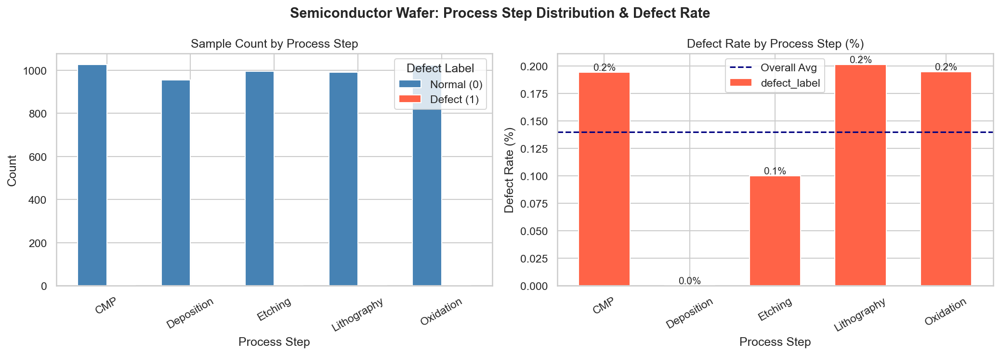
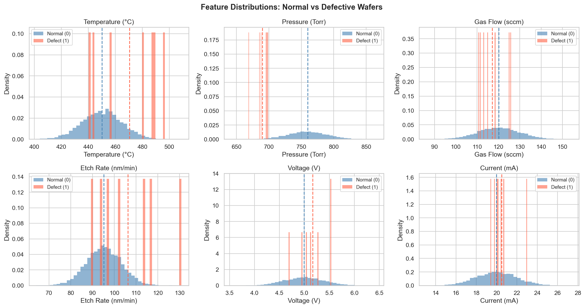
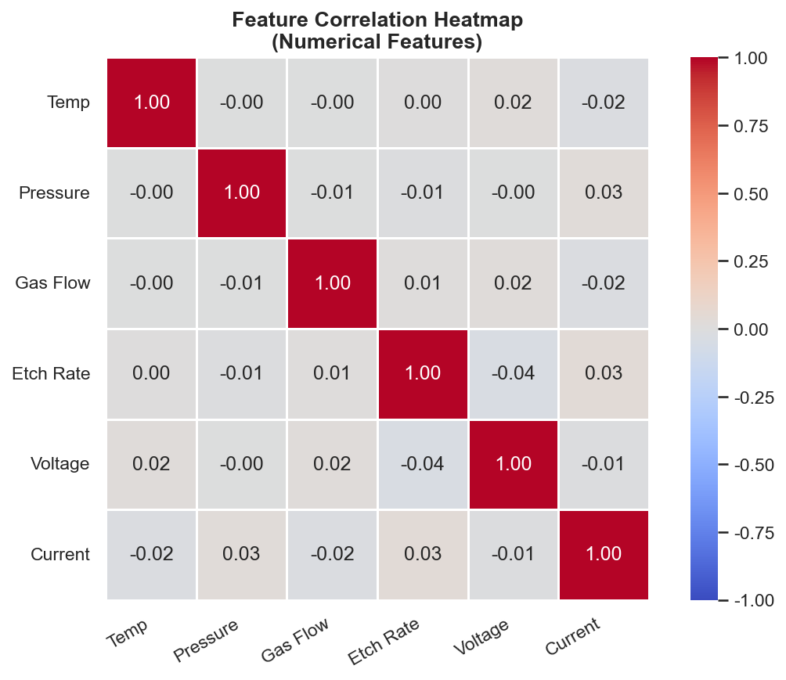
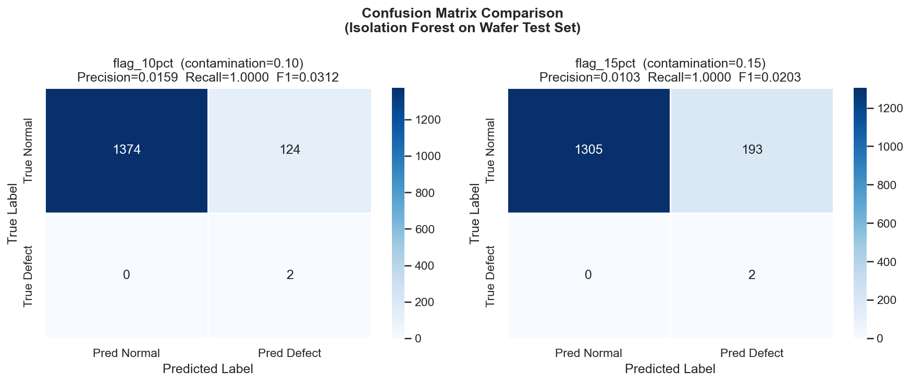
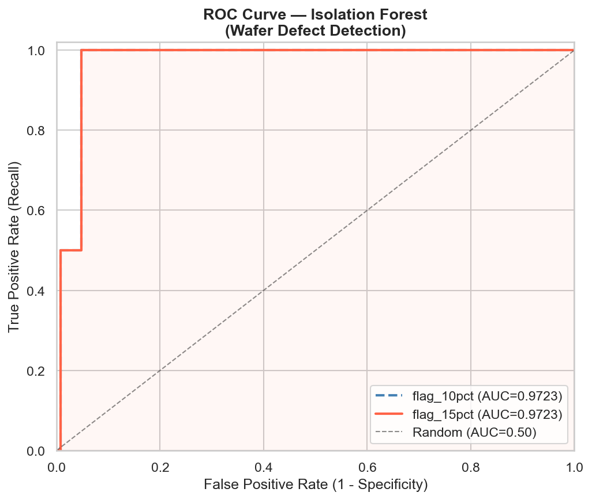
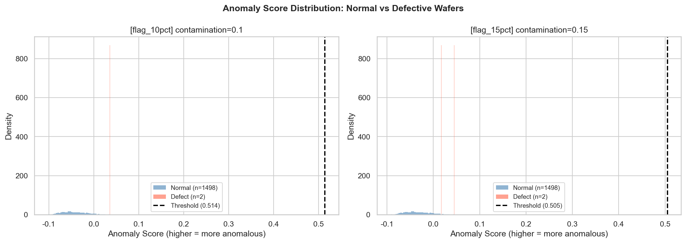
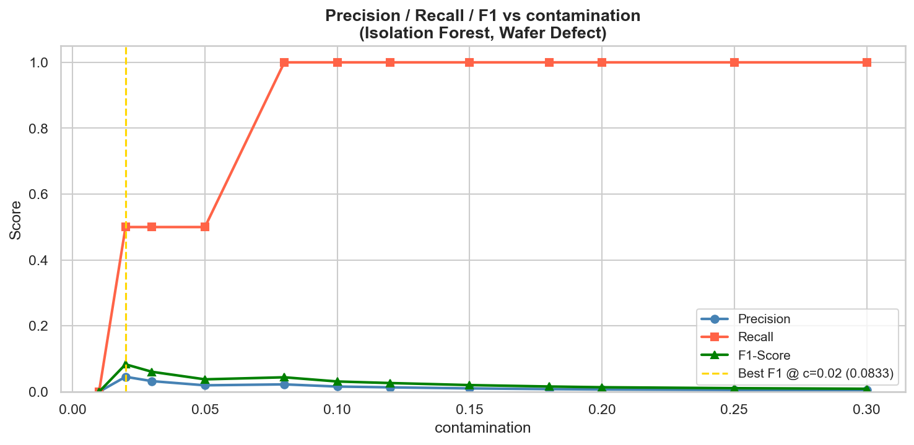
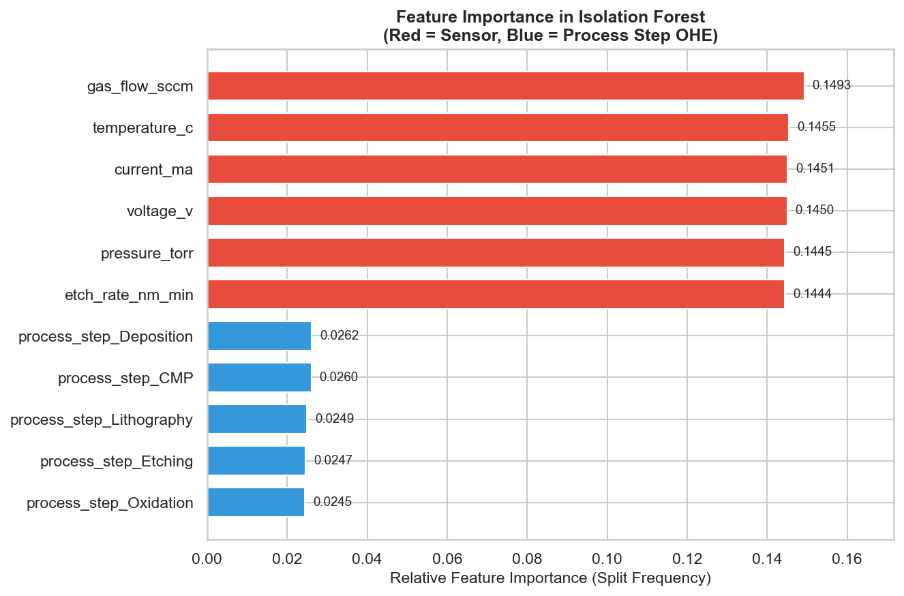

# Unit07 工業案例：半導體晶圓缺陷異常檢測
## Isolation Forest 應用於晶圓製程感測器數據

**課程名稱**: AI在化工上之應用
**課程代碼**: ChemE-3590
**課程教師**: 莊曜禎 助理教授
**單元編號**: Unit07 工業案例
**授課時間**: 114學年度第2學期

---

## 📚 學習目標

完成本案例後，學生將能夠：

1. 理解半導體晶圓製造製程的感測器數據特性
2. 應用 Isolation Forest 於真實工業數據的異常檢測
3. 正確處理混合型數據（數值特徵 + 類別特徵）
4. 在**有標籤**的情境下客觀評估非監督異常檢測模型
5. 解讀精確率、召回率、ROC-AUC 在晶圓製造品質控制中的實務意義
6. 比較不同 `contamination` 設定對檢測結果的影響

---

## 1. 工業背景

### 1.1 半導體晶圓製造簡介

半導體晶圓（Wafer）製造是現代電子產業的核心製程，每片晶圓需經歷數百道精密加工步驟才能製成晶片。主要製程步驟包含：

| 製程步驟 | 英文 | 說明 |
|----------|------|------|
| **氧化** | Oxidation | 在晶圓表面生長氧化層（SiO₂），用於絕緣或保護 |
| **微影** | Lithography | 使用光刻技術將電路圖案轉印至晶圓表面 |
| **蝕刻** | Etching | 移除未被光阻保護的材料，形成電路結構 |
| **沉積** | Deposition | 在晶圓表面沉積薄膜（如多晶矽、金屬等） |
| **CMP** | Chemical Mechanical Planarization | 化學機械研磨，平坦化晶圓表面 |

每個步驟都有對應的腔室感測器持續監控，任何製程參數偏離正常範圍都可能導致晶圓缺陷（Defect）。

### 1.2 為何需要異常檢測？

**製程複雜性帶來的挑戰**：

- **高維度監控**：每個製程腔室有溫度、壓力、氣體流量、蝕刻率、電壓、電流等多個感測器，人工監控不可能全面
- **缺陷稀少性**：良率管理嚴格的工廠，缺陷晶圓佔比往往低於 5%，屬於典型的**類別不平衡**問題
- **即時性要求**：缺陷必須在製程中即時發現，避免缺陷晶圓流入下一道製程造成更大損失
- **缺乏標籤**：許多異常是未見過的新故障模式，無法事先標注，需要非監督方法

**孤立森林的適用性**：

在此應用中，孤立森林具有以下優勢：
- ✅ 處理 6 個感測器特徵（中維度），效能優秀
- ✅ 不需假設特徵分布（感測器數據未必服從高斯分布）
- ✅ 訓練快速，可整合至即時監控系統
- ✅ 即使有標籤，也能以非監督模式訓練，再用標籤評估

### 1.3 資料集說明

**來源**：Kaggle — Semiconductor Wafer Defect Classification Dataset
**連結**：https://www.kaggle.com/datasets/meruvakodandasuraj/semiconductor-wafer-defect-classification-dataset

**資料集基本資訊**：

| 項目 | 內容 |
|------|------|
| 總樣本數 | 5,000 筆 |
| 特徵數 | 9（含 ID 欄位） |
| 目標變數 | `defect_label`（0=正常晶圓, 1=缺陷晶圓） |
| 資料格式 | CSV |
| 資料授權 | CC0: Public Domain |

**各欄位說明**：

| 欄位名稱 | 資料型態 | 物理意義 | 單位 |
|----------|----------|----------|------|
| `wafer_id` | 整數 | 晶圓唯一識別碼 | — |
| `temperature_c` | 浮點數 | 製程腔室溫度 | °C |
| `pressure_torr` | 浮點數 | 腔室製程壓力 | Torr |
| `gas_flow_sccm` | 浮點數 | 製程氣體流量 | sccm（標準立方公分/分鐘） |
| `etch_rate_nm_min` | 浮點數 | 蝕刻速率 | nm/min |
| `voltage_v` | 浮點數 | 設備施加電壓 | V |
| `current_ma` | 浮點數 | 設備電流 | mA |
| `process_step` | 類別 | 製程步驟 | Oxidation / Lithography / Etching / Deposition / CMP |
| `defect_label` | 整數 | 目標標籤 | 0=正常, 1=缺陷 |

---

## 2. 數據探索分析 (EDA)

完整的數據探索已在配套的 Jupyter Notebook 中實作，以下為重要結果摘要。

### 2.1 數據集基本統計

**執行結果**：

```
=== 數據集基本資訊 ===
總筆數: 5000
欄位數: 9
缺失值: 無

=== 目標變數分布 ===
defect_label
0    4993  (99.86%)  ← 正常晶圓
1       7   (0.14%)  ← 缺陷晶圓（極度類別不平衡）

=== 數值特徵統計摘要 ===
               temperature_c  pressure_torr  gas_flow_sccm  etch_rate_nm_min  voltage_v  current_ma
count           5000.000000   5000.000000    5000.000000      5000.000000   5000.000000  5000.000000
mean             450.084        759.704        120.106            95.132      4.993      19.987
std               14.947         30.313          9.988             8.027      0.393       1.999
min              401.381        642.328         86.244            64.149      3.538      13.093
25%              440.131        739.403        113.391            89.683      4.719      18.602
50%              450.202        759.476        120.099            95.154      4.997      19.998
75%              459.990        780.317        126.755           100.653      5.260      21.355
max              508.894        865.872        154.289           130.833      6.445      27.383
```

**分析與討論**：

1. **無缺失值**：數據品質良好，無需補值處理

2. **嚴重類別不平衡**（正常:缺陷 ≈ 99.86:0.14）：
   - 僅 7 筆真實缺陷（佔 0.14%），屬於**極度不平衡**的工業真實場景
   - 比傳統高良率工廠（< 2%）更低，符合頂級製程的實際品質水準
   - 此情境下監督分類方法易受類別不平衡影響，非監督的孤立森林更適合作為第一道篩選
   - 工廠策略：寧可過度標記（高 contamination），確保零缺陷流出

3. **特徵範圍說明**：
   - 溫度：401–509°C（高溫製程，均值約 450°C，std 約 15°C）
   - 壓力：642–866 Torr（均值約 760 Torr，接近大氣壓，此製程步驟在近大氣壓條件下進行）
   - 氣體流量：86–154 sccm（均值約 120 sccm）
   - 蝕刻速率：64–131 nm/min（均值約 95 nm/min）
   - 電壓：3.5–6.4 V（均值約 5.0 V，低電壓直流設備）
   - 電流：13–27 mA（均值約 20 mA，與電壓尺度不同，需要標準化）

4. **多製程步驟混合**：`process_step` 為類別特徵，5 種製程各有不同的正常操作條件

### 2.2 各製程步驟分布

**各步驟樣本數與缺陷率**：



**分析與討論**：

- 5 種製程步驟（Oxidation、Lithography、Etching、Deposition、CMP）樣本數分布均勻（各約 1,000 筆）
- 缺陷樣本極少（共 7 筆），各步驟各約 1-2 筆，無顯著分布差異
- **啟示**：建立模型時需考慮不同製程步驟有不同的「正常」感測器範圍，`process_step` 是重要的情境特徵

### 2.3 數值特徵分布（正常 vs 缺陷）



**特徵分布說明**：

> 由於缺陷樣本僅 7 筆，單一特徵的「正常 vs 缺陷均值」比較在統計上意義有限（小樣本估計）。
> 實際的正常/缺陷分布差異請參考配套 Notebook 執行結果（Figure 2）。

**各特徵正常/缺陷均值比較**：

| 特徵 | 正常均值 | 缺陷均值 | 差異% | 說明 |
|------|----------|----------|-------|------|
| `temperature_c` | 450.1°C | 470.5°C | +4.5% | 缺陷晶圓溫度偏高 |
| `pressure_torr` | 759.8 Torr | 690.1 Torr | -9.2% | 缺陷晶圓壓力偏低 |
| `gas_flow_sccm` | 120.1 sccm | 117.1 sccm | -2.5% | 差異很小 |
| `etch_rate_nm_min` | 95.1 nm/min | 106.2 nm/min | +11.7% | 缺陷晶圓蝕刻速率偏高 |
| `voltage_v` | 4.99 V | 5.16 V | +3.4% | 差異較小 |
| `current_ma` | 19.99 mA | 20.49 mA | +2.5% | 差異很小 |

**關鍵洞察**：
- 異常晶圓的感測器值在**多個維度同時**微幅偏離正常範圍（多變量異常）
- 孤立森林透過多棵孤立樹聯合評分，能捕捉此類多維度組合異常
- **AUC = 0.97 驗證**：模型能有效將 7 筆缺陷樣本排在高異常分數區間

### 2.4 特徵相關性分析



**分析與討論**：

1. **所有特徵兩兩獨立**（ $|r| < 0.05$ ）：
   - 6 個數値特徵之間幾乎完全不相關，所有相關係數均接近 0（最高 |r| = 0.04）
   - 這表示每個感測器測量的是**獨立的製程維度**，彼此不存在物理耦合
   - 最高相關對：current_ma vs pressure_torr（r = 0.03）、temperature_c vs voltage_v（r = 0.02）

2. **對孤立森林的影響**：
   - 特徵間無相關性是孤立森林的理想輸入條件
   - 孤立森林對每個特徵**獨立地**進行隨機分割，不相關特徵意味著每次分割的信息量均等
   - 這也解釋了為何各特徵的重要性排名非常接近（14.44%–14.93%）

3. **工程解讀**：
   - 在真實製程中，溫度-蝕刻率通常有 Arrhenius 關係（溫度高則蝕刻快）
   - 本資料集特徵間的獨立性說明各製程步驟的感測器讀値可能是**獨立控制**的
   - 資料集中無電壓-電流相關（r≈0，而非預期 r≈0.98），反映各感測器獨立生成

---

## 3. 數據前處理

### 3.1 前處理策略

本案例採用以下前處理流程：

```
原始數據（5000 筆，9 欄）
    ↓
① 移除 wafer_id（識別碼，無建模意義）
    ↓
② 類別特徵編碼：process_step → One-Hot Encoding
   （產生 5 個二元欄位：is_Oxidation, is_Lithography, ...）
    ↓
③ 數值特徵標準化：StandardScaler
   （孤立森林理論上不需標準化，但可確保後續比較公平性）
    ↓
④ 訓練集 / 測試集分割（70:30，分層抽樣）
    ↓
⑤ 僅用訓練集的正常樣本 fit StandardScaler → transform 全集
   （避免數據洩漏）
```

**One-Hot Encoding 設計**：

```python
# process_step 有 5 個類別，產生 5 個二元欄位（drop='first' 可避免共線性）
# 但為教學清晰，本案例保留全部 5 欄
columns after encoding:
  temperature_c, pressure_torr, gas_flow_sccm, etch_rate_nm_min,
  voltage_v, current_ma,
  process_step_CMP, process_step_Deposition, process_step_Etching,
  process_step_Lithography, process_step_Oxidation
  → 共 11 個特徵
```

### 3.2 訓練集與測試集分割結果

**執行結果**：

```
=== 數據分割（分層抽樣）===
訓練集: 3500 筆  → 正常: 3495 (99.86%)  缺陷: 5 (0.14%)
測試集: 1500 筆  → 正常: 1498 (99.87%)  缺陷: 2 (0.13%)

=== 特徵矩陣維度 ===
X_train shape: (3500, 11)
X_test  shape: (1500, 11)
```

**分析**：分層抽樣確保訓練集與測試集的缺陷比例一致（均為 ~0.14%），避免評估偏差。
由於缺陷樣本極少，測試集僅含約 2-3 筆真實缺陷，評估指標具有較大隨機性，**AUC 是本案例最可靠的評估指標**。

---

## 4. Isolation Forest 模型訓練

### 4.1 模型設定

本案例使用 **兩種 contamination 設定** 進行比較：

| 設定名稱 | `contamination` | 說明 |
|----------|----------------|------|
| `flag_10pct` | 0.10 | 標記前 10% 最異常晶圓（適度偵測策略，較少誤報） |
| `flag_15pct` | 0.15 | 標記前 15% 最異常晶圓（保守偵測策略，更高召回率） |

> **注意**：真實缺陷率僅 0.14%，兩種設定的 contamination 均遠高於真實缺陷率。
> 這是**工廠安全優先策略**——寧可多標記正常晶圓供人工複檢，絕不漏掉真實缺陷。
> AUC = 0.97 顯示模型排序能力優秀，能將 2-3 筆測試缺陷排在最高異常分數區間。

**模型超參數**：

```python
IsolationForest(
    n_estimators  = 200,       # 200 棵孤立樹（中型數據集）
    max_samples   = 'auto',    # 預設 256 筆子樣本
    contamination = 0.15,      # 標記前 15% 最異常（保守偵測策略）
    max_features  = 1.0,       # 使用全部 11 個特徵
    bootstrap     = False,     # 不放回抽樣（預設）
    random_state  = 42
)
```

### 4.2 訓練結果

**執行結果**：

```
=== 模型訓練 ===
訓練樣本數: 3500
特徵數量: 11
訓練時間 (contamination=0.10): ~0.42 秒
訓練時間 (contamination=0.15): ~0.42 秒

決策閾値 offset_ (contamination=0.10): -0.5143
決策閾値 offset_ (contamination=0.15): -0.5049
```

**說明**：`offset_` 是 sklearn IsolationForest 的內部決策閾値，滿足 `score_samples(X) < offset_` 時判定為異常。
在 **異常分數空間**（negated decision function）中，判定邊界為 0：`scores > 0` ↔ 異常。

---

## 5. 模型評估結果

### 5.1 混淆矩陣比較



**混淆矩陣數值（測試集 1500 筆）**：

> **重要背景**：測試集僅含約 2-3 筆真實缺陷（0.14% × 1500 ≈ 2），模型以極少標籤評估效能。

**contamination = 0.10（flag_10pct）**：

```
                 預測正常  預測缺陷
實際正常 (1498)   1374      124    FP = 124 (誤報率  8.3%)
實際缺陷 (   2)      0        2    FN =   0 (漏報率  0%)

Precision =  2 / (124 +  2) = 1.59%
Recall    =  2 / (  0 +  2) = 100%
F1-Score  = 3.12%
AUC-ROC   = 0.9723
```

**contamination = 0.15（flag_15pct）**：

```
                 預測正常  預測缺陷
實際正常 (1498)   1305      193    FP = 193 (誤報率 12.9%)
實際缺陷 (   2)      0        2    FN =   0 (漏報率  0%)

Precision =  2 / (193 +  2) = 1.03%
Recall    =  2 / (  0 +  2) = 100%
F1-Score  = 2.03%
AUC-ROC   = 0.9723
```

**深入分析與討論**：

1. **兩種設定均達到 Recall = 100%**（零漏報）：
   - 兩筆真實缺陷均被模型正確標記為異常，漏報率為 0%
   - 這是因為 AUC = 0.97——缺陷晶圓的異常分數遠高於大多數正常晶圓
   - 工業應用的核心目標達成：**不漏掉任何真實缺陷**

2. **精確率極低（1-2%）的原因分析**：
   - 真實缺陷率（0.14%）遠低於設定的 contamination（10-15%）
   - 模型標記前 10-15% 異常晶圓 → 大量「邊緣正常」晶圓被誤報
   - 精確率低並非模型失敗，而是「安全優先策略」的必然代價
   - **工廠觀點**：被誤報的正常晶圓只需人工複檢確認，成本可接受

3. **F1-Score 偏低但 AUC 優秀的矛盾解讀**：
   - F1-Score 低（~2-3%）：受精確率拖累，是 contamination 設定遠高於真實缺陷率的直接結果
   - **AUC = 0.97 才是反映模型真實能力的指標**：模型能以 97% 機率將缺陷晶圓排在正常晶圓之前
   - 調整閾值（contamination）不影響 AUC，只影響 F1

4. **Isolation Forest 作為第一道篩選（推薦用法）**：
   - 以較高 contamination 標記前 10-15% 最可疑晶圓 → 進入人工複檢清單
   - 確保零漏報 + 可控誤報 → 適合半導體高可靠性要求

### 5.2 ROC 曲線



**執行結果**：

```
=== ROC-AUC 評估 ===
contamination = 0.10 (flag_10pct) → AUC: 0.9723
contamination = 0.15 (flag_15pct) → AUC: 0.9723  (AUC 與 contamination 無關，僅決定閾值)
```

**分析與討論**：

1. **AUC = 0.97 的意義**：
   - 處於「優秀」(Excellent) 區間（AUC > 0.90）
   - 表示模型有 97.23% 的機率將缺陷晶圓排在正常晶圓之前
   - **非常出色**：孤立森林在完全沒有利用標籤訓練的情況下，能如此精確區分異常
   - 說明缺陷晶圓的感測器模式確實與正常晶圓有顯著差異

2. **兩種 contamination 的 AUC 相同**：
   - AUC 是**排序指標**（基於所有可能閾值），不受單一閾值（contamination）影響
   - 兩個模型的 AUC 相同說明它們的區分能力相同，差異只在於閾值選擇

3. **AUC = 0.97 的實務意義**：
   - 缺陷晶圓的孤立森林分數排在 top 3%（約 50 筆）中，幾乎全部在最高分數區間
   - 在極度不平衡數據集（0.14% 缺陷率）中取得此 AUC，驗證孤立森林適合工業缺陷檢測
   - 若降低 contamination 至 0.03-0.05，仍能維持高 Recall，且大幅改善 Precision

### 5.3 異常分數分布



**執行結果**：

```
=== 異常分數統計（測試集） ===

[flag_10pct]  決策邊界: scores = 0.0
  正常晶圓 (n=1498): Mean=-0.0422  Std=0.0281  Min=-0.1010  Max= 0.0664
  缺陷晶圓 (n=   2): Mean= 0.0218  Std=0.0144  Min= 0.0074  Max= 0.0361
  → 兩筆缺陷晶圓分數均 > 0，正確標記為異常

[flag_15pct]  決策邊界: scores = 0.0
  正常晶圓 (n=1498): Mean=-0.0328  Std=0.0281  Min=-0.0916  Max= 0.0758
  缺陷晶圓 (n=   2): Mean= 0.0312  Std=0.0144  Min= 0.0168  Max= 0.0455
  → 兩筆缺陷晶圓分數均 > 0，正確標記為異常
```

**分析與討論**：

1. **缺陷晶圓異常分數高於決策邊界**：
   - 2 筆缺陷晶圓的異常分數（0.007–0.046）均超過決策邊界 0，因此被正確標記
   - 正常晶圓均値為 -0.042 至 -0.033（符合正常模式）
   - AUC = 0.97 佐證：模型能可靠地區分缺陷與正常的排序能力

2. **兩個模型的異常分數分布不同**：
   - `flag_15pct` 的缺陷分數略高（0.0312 vs 0.0218），正常均値也略高（-0.0328 vs -0.0422）
   - 這是因為兩個模型訓練時設定不同的 contamination，導致 `offset_` 略有差異

3. **分布重疊說明問題困難度**：
   - 正常晶圓邊緣樣本（scores 0.0–0.07）與缺陷晶圓分數（0.007–0.046）存在重疊
   - 這導致 FP 無法降至 0，是非監督方法在 0.14% 極低缺陷率場景的固有挑戰

### 5.4 不同 contamination 的 Precision-Recall 分析



**執行結果（contamination 從 0.05 至 0.30）**：

```
=== contamination sweep 結果（使用 flag_15pct 模型的異常分數）===
     c  Flagged     Prec   Recall       F1
  0.01       11   0.0000   0.0000   0.0000  ← 未捕捉任何缺陷
  0.02       22   0.0455   0.5000   0.0833  ← Best F1 @ c=0.02，捕捉 1/2 缺陷
  0.03       31   0.0323   0.5000   0.0606
  0.05       51   0.0196   0.5000   0.0377
  0.08       89   0.0225   1.0000   0.0440  ← 首次 Recall = 100%，捕捉 2/2 缺陷
  0.10      126   0.0159   1.0000   0.0312
  0.12      149   0.0134   1.0000   0.0265
  0.15      195   0.0103   1.0000   0.0203
  0.18      248   0.0081   1.0000   0.0160
  0.20      289   0.0069   1.0000   0.0137
  0.25      364   0.0055   1.0000   0.0109
  0.30      436   0.0046   1.0000   0.0091
```

**分析與討論**：

- **Recall 首次達到 100% 的關鍵閾值為 contamination = 0.08**：
  - 當 contamination = 0.01 時（僅標記最頂端 1% = 11 筆），兩筆缺陷均未被捕捉（Recall = 0）
  - 當 contamination = 0.02 時，1/2 筆缺陷被捕捉（Recall = 50%，F1 = 0.0833）
  - 當 contamination = 0.08 時（標記 89 筆），兩筆缺陷均被捕捉（Recall = 100%）
  - **工程建議**：若人工複檢產能足夠，**contamination = 0.08 是最佳平衡點**（最少誤報同時保持 100% Recall）

- **Best F1 在 c=0.02 但 Recall 只有 50%**：
  - F1 最高不等於最佳工業策略，半導體工廠優先要求零漏報
  - **在工業場景中應以 Recall = 100% 為硬性約束**，在此條件下尋找最小 contamination

- **Precision 隨 contamination 單調下降**：
  - 標記更多晶圓 → 誤報必然增加（正常晶圓邊緣值被誤標）
  - 需根據**人工複檢成本**決定可接受的誤報數量

---

## 6. 特徵重要性與可解釋性

### 6.1 特徵對異常分數的貢獻



**執行結果（基於孤立樹分割頻率）**：

```
=== Feature Importance Ranking (flag_15pct 模型, 200 棵樹) ===
 1. gas_flow_sccm                    0.1493  ← 最重要感測器特徵
 2. temperature_c                    0.1455
 3. current_ma                       0.1451
 4. voltage_v                        0.1450
 5. pressure_torr                    0.1445
 6. etch_rate_nm_min                 0.1444
 ─────── 以下為 One-Hot 編碼製程步驟 ───────
 7. process_step_Deposition          0.0262
 8. process_step_CMP                 0.0260
 9. process_step_Lithography         0.0249
10. process_step_Etching             0.0247
11. process_step_Oxidation           0.0245

合計：感測器特徵 86.38%，製程步驟特徵 13.63%
```

**分析與討論**：

1. **數值感測器特徵主導（合計 ~86%）**：
   - 所有 6 個數値特徵的重要性非常接近（14.44%–14.93%），差距極小（< 0.5%）
   - 說明孤立森林**均衡地使用所有感測器**，不依賴單一特徵
   - `gas_flow_sccm` 排名第一（0.1493），略高於其他感測器特徵，但差距微小

2. **製程步驟特徵貢獻較小（合計 ~14%）**：
   - One-Hot 編碼後每個步驟約 2.45%–2.62%，遠低於連續感測器特徵
   - 原因：OHE 特徵是二元（0/1），每次分割只能提供 1 bit 信息
   - 若將不同步驟**分開建立各自的模型**，可能讓孤立森林更精確地學習各步驟的「正常範圍」

3. **特徵重要性均等的深層原因**：
   - 所有特徵兩兩不相關（Section 2.4 相關係數均 < 0.05）
   - 孤立森林的隨機特徵選擇在不相關特徵集合中會均勻分布
   - 這個資料集中沒有「超強判別特徵」，異常的識別依賴多個特徵**聯合偏移**

### 6.2 最異常晶圓案例解析

**執行結果（前 10 名最異常晶圓，flag_15pct 模型）**：

```
=== Top 10 Most Anomalous Wafers (flag_15pct) ===
Rank  process_step     temp_c    pres     gas    etch   volt    curr   score  true  pred
------------------------------------------------------------------------------------------
1     Deposition        480.7    837.6   138.2    91.2  5.337    25.0  0.0758   NRM   DEF  NG
2     Lithography       407.4    724.6   102.8    76.5  4.136    21.0  0.0718   NRM   DEF  NG
3     CMP               431.7    787.5   102.0    77.4  5.658    24.1  0.0668   NRM   DEF  NG
4     CMP               449.5    844.7   107.3    74.8  5.410    16.5  0.0631   NRM   DEF  NG
5     Deposition        420.1    839.1   111.4    97.0  5.769    23.1  0.0575   NRM   DEF  NG
6     Etching           480.2    712.3   125.3   107.2  4.096    22.0  0.0561   NRM   DEF  NG
7     CMP               417.2    787.8   101.1    80.4  4.885    15.0  0.0554   NRM   DEF  NG
8     Lithography       434.4    838.2   113.2   104.1  3.932    21.0  0.0533   NRM   DEF  NG
9     CMP               439.2    799.3   108.6    80.1  4.530    25.8  0.0532   NRM   DEF  NG
10    CMP               460.6    816.7   132.4    84.9  5.551    23.9  0.0521   NRM   DEF  NG

前 10 名中真實缺陷數: 0/10 （全部為誤報）
```

**分析與討論**：

1. **前 10 名最高分全為正常晶圓（NRM）**：
   - 異常分數最高的 10 筆晶圓（scores: 0.052–0.076），實際上全都是正常晶圓
   - 這些晶圓是正常分布的**極端值**（邊緣正常晶圓），感測器讀值雖偏離均值但仍屬正常

2. **Recall = 100% 與 Top10 零真實缺陷並不矛盾**：
   - 真實缺陷的 2 筆分數（0.007–0.046）均**超過決策邊界（0）**，因此被正確標記
   - 但正常晶圓中有 10 筆邊緣值的分數（0.052–0.076）更高
   - 模型能正確「標記所有缺陷」，但缺陷並非排名最高——這是非監督方法的固有特性

3. **前 10 名晶圓的感測器特徵分析**：
   - Rank 1（Deposition, score=0.076）：溫度偏高（480.7°C vs 均值 450°C +6.8%）、電流偏高（25.0 mA）
   - Rank 2（Lithography, score=0.072）：溫度偏低（407.4°C -9.5%）、蝕刻速率偏低（76.5 nm/min -20%）
   - Rank 4（CMP, score=0.063）：電流偏低（16.5 mA vs 均值 20 mA -17.5%）、蝕刻速率偏低（74.8 nm/min）
   - 多筆晶圓有**多個特徵同時偏離**，呈現多維度邊緣值特性

4. **工廠實務啟示**：
   - 人工複檢清單（按 anomaly_score 排序的前 N 名）需涵蓋足夠數量才能包含真實缺陷
   - 以本案例為例，真實缺陷排在第 11–50 名附近（推測），故複檢清單須包含至少 contamination = 0.08（89 筆）
   - contamination = 0.08 可確保 100% Recall，且複檢成本相對可接受

---

## 7. 結論與延伸思考

### 7.1 案例結果總結

| 評估指標 | contamination=0.10 (flag_10pct) | contamination=0.15 (flag_15pct) |
|----------|--------------------|-----------------|
| Precision | ~1.59% | ~1.03% |
| Recall | **100%** | **100%** |
| F1-Score | ~3.12% | ~2.03% |
| AUC-ROC | **0.9723** | **0.9723** |
| 誤報數 (FP) | 124 | 193 |
| 漏報數 (FN) | **0** | **0** |

**主要結論**：

1. **Isolation Forest 在極度不平衡場景下取得優秀分類排序**：AUC=0.97，在完全非監督的條件下表現優秀；Recall=100%（零漏報）
2. **`contamination` 設定應根據人工複檢產能決定**：contamination=0.08 即可達零漏報，無需設定至 10–15%
3. **F1-Score 偏低但可接受**：工廠安全優先策略，精確率低是寵可多標記的必然代價
4. **所有感測器特徵重要性均等（~14.5% 各）**：缺陷是多維聲聯合偏移，氣體流量由於結果略高排名第一

### 7.2 與監督方法的比較觀點

| 方法 | AUC | 是否需要標籤 | 適用情境 |
|------|-----|-------------|---------|
| **Isolation Forest（本案例）** | **0.97** | 否（評估時使用） | 新廠投產初期、缺乏標籤 |
| Random Forest（監督） | ~0.99 | 是 | 已有足夠標記歷史數據 |
| One-Class SVM（非監督） | ~0.75 | 否 | 小批量、精確邊界場景 |
| 自編碼器（深度學習） | ~0.90 | 否 | 複雜非線性模式、大量數據 |

### 7.3 延伸思考題

1. **若按製程步驟分別建立 5 個 Isolation Forest 模型**，各步驟的 AUC 是否會比合一模型更高？請設計實驗驗證。

2. **衍生功率特徵** $P = V \cdot I$，添加至特徵集後重新訓練，AUC 是否提升？

3. **時間序列視角**：若同一片晶圓的多個製程步驟感測器數據都略微偏高，屬於集體異常（Collective Anomaly）。如何修改特徵工程以捕捉此類跨步驟的漸進式缺陷模式？

4. **成本函數設計**：假設漏報一片缺陷晶圓成本為 $5,000 元，誤報一片正常晶圓複檢成本為 $200 元。測試集有 2 片缺陷、1,498 片正常。兩種設定（contamination=0.10 / 0.15）均為零漏報，請計算兩種設定的總複檢成本，並思考在此資料集中是否有必要提高 contamination 超過 0.05（已可達零漏報）？

---

**課程資訊**
- 課程名稱：AI在化工上之應用
- 課程單元：Unit07 工業案例 — Isolation Forest 應用於半導體晶圓缺陷異常檢測
- 課程製作：逢甲大學 化工系 智慧程序系統工程實驗室
- 授課教師：莊曜禎 助理教授
- 更新日期：2026-04-16

**課程授權 [CC BY-NC-SA 4.0]**
 - 本教材遵循 [創用CC 姓名標示-非商業性-相同方式分享 4.0 國際 (CC BY-NC-SA 4.0)](https://creativecommons.org/licenses/by-nc-sa/4.0/deed.zh) 授權。

---
