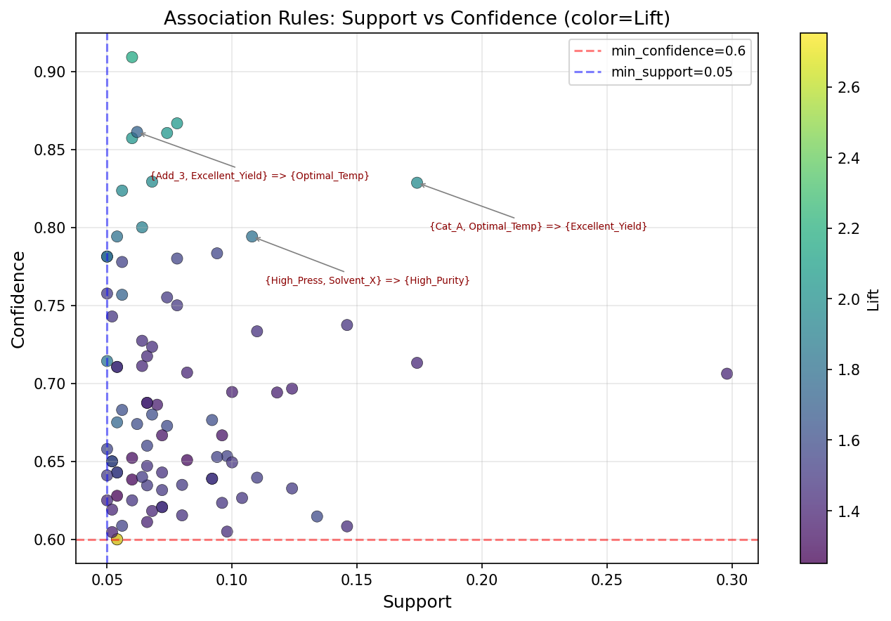
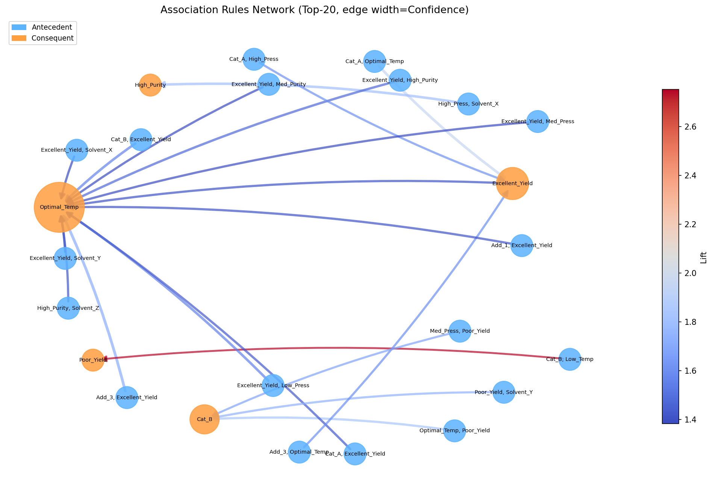
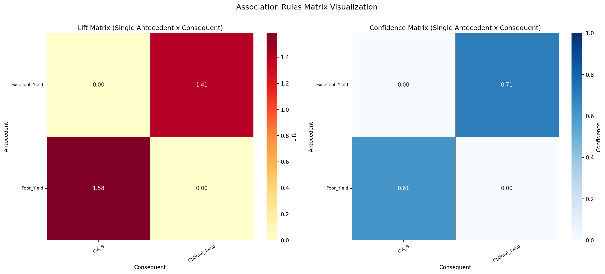
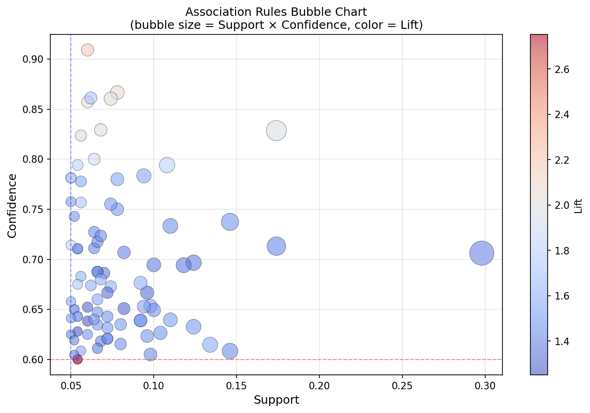
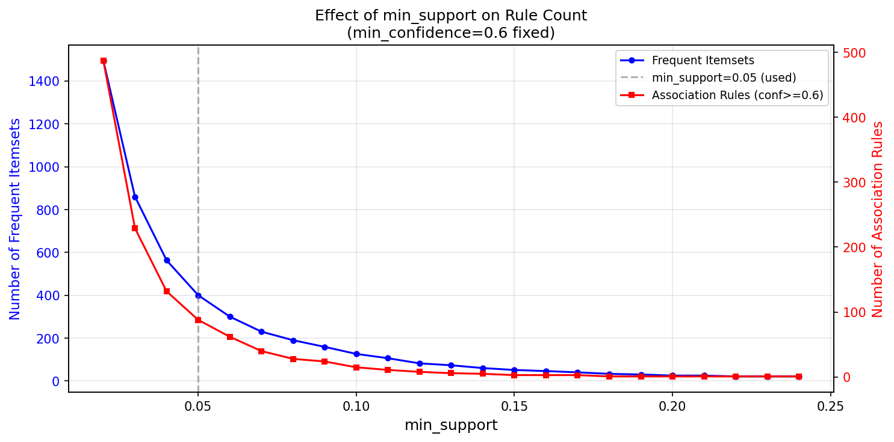

# Unit08 關聯規則學習總覽 (Association Rule Learning Overview)

## 1. 關聯規則學習簡介

### 1.1 什麼是關聯規則學習？

關聯規則學習 (Association Rule Learning) 是一種非監督式學習方法，旨在發現數據集中項目 (items) 之間的有趣關聯或相關模式。這種方法最早應用於市場購物籃分析 (Market Basket Analysis)，用於發現顧客購買行為中的關聯規則，例如「購買牛奶的顧客也傾向購買麵包」。

在化學工程領域，關聯規則學習可以幫助我們發現製程變數之間的關聯性、配方成分之間的協同效應、操作條件與產品品質之間的關係等，為製程優化和配方設計提供有價值的洞察。

### 1.2 關聯規則的基本概念

**項目集 (Itemset) 與交易 (Transaction)**

- **項目 (Item)**：數據集中的基本元素，例如產品、操作條件、原料成分等
- **項目集 (Itemset)**：一組項目的集合，例如 {溫度高, 壓力高}
- **交易 (Transaction)**：一筆記錄或一次觀察，包含多個項目

**關聯規則的形式**

關聯規則表示為 $X \Rightarrow Y$ 的形式，其中 $X$ 和 $Y$ 是項目集，且 $X \cap Y = \emptyset$ 。

- **前項 (Antecedent)**： $X$ ，規則的條件部分
- **後項 (Consequent)**： $Y$ ，規則的結果部分

**範例**

在化工製程中，關聯規則可能是：
- {反應溫度 ≥ 180°C, 催化劑A} $\Rightarrow$ {產率 ≥ 95%}
- {溶劑 = 甲苯, pH < 7} $\Rightarrow$ {副產物低}

### 1.3 關聯規則的三大評估指標

為了評估關聯規則的強度和可信度，我們使用三個主要指標：

**1. 支持度 (Support)**

支持度衡量項目集在數據集中出現的頻率，定義為包含該項目集的交易數占總交易數的比例。

$$
\text{Support}(X) = \frac{\text{包含 } X \text{ 的交易數}}{\text{總交易數}}
$$

對於規則 $X \Rightarrow Y$ ：

$$
\text{Support}(X \Rightarrow Y) = \text{Support}(X \cup Y) = \frac{\text{同時包含 } X \text{ 和 } Y \text{ 的交易數}}{\text{總交易數}}
$$

**意義**：支持度反映規則的普遍性。高支持度表示該規則在數據中經常出現，但不一定表示規則有用。

**2. 置信度 (Confidence)**

置信度衡量規則的可靠性，定義為在包含 $X$ 的交易中，同時包含 $Y$ 的比例。

$$
\text{Confidence}(X \Rightarrow Y) = \frac{\text{Support}(X \cup Y)}{\text{Support}(X)} = P(Y|X)
$$

**意義**：置信度反映規則的準確性。高置信度表示當 $X$ 出現時， $Y$ 很可能也會出現。

**3. 提升度 (Lift)**

提升度衡量規則中 $X$ 和 $Y$ 的關聯強度，定義為置信度與 $Y$ 在數據集中出現機率的比值。

$$
\text{Lift}(X \Rightarrow Y) = \frac{\text{Confidence}(X \Rightarrow Y)}{\text{Support}(Y)} = \frac{P(Y|X)}{P(Y)}
$$

**意義**：
- Lift = 1：表示 $X$ 和 $Y$ 獨立，沒有關聯
- Lift > 1：表示 $X$ 和 $Y$ 正相關， $X$ 出現會增加 $Y$ 出現的機率
- Lift < 1：表示 $X$ 和 $Y$ 負相關， $X$ 出現會降低 $Y$ 出現的機率

**綜合範例**

假設我們有 1000 筆化工配方記錄：
- 500 筆包含「催化劑A」
- 300 筆同時包含「催化劑A」和「高產率」
- 400 筆包含「高產率」

規則：{催化劑A} $\Rightarrow$ {高產率}

- Support = 300/1000 = 0.3 (30%)
- Confidence = 300/500 = 0.6 (60%)
- Lift = 0.6 / (400/1000) = 1.5

解釋：30%的配方同時使用催化劑A且達到高產率；在使用催化劑A的配方中，60%達到高產率；使用催化劑A使高產率的機率提升50%。

### 1.4 關聯規則學習的目標

在化學工程領域中，關聯規則學習的主要目標包括：

1. **配方優化**：發現原料、添加劑、操作條件之間的協同效應
2. **製程知識挖掘**：從歷史數據中提取有價值的製程規則和經驗
3. **品質預測**：識別影響產品品質的關鍵因素組合
4. **故障診斷**：發現導致設備故障或製程異常的條件組合
5. **決策支持**：為製程優化和新產品開發提供數據驅動的建議

---

## 2. 化工領域應用場景

### 2.1 配方設計與優化

**應用背景**

在化工產品開發中，配方通常包含多種原料、添加劑、溶劑等成分，且各成分之間可能存在協同或拮抗效應。關聯規則學習可以從大量配方實驗數據中發現成分之間的關聯模式，幫助化學工程師快速找到最佳配方組合。

**實際案例**

- **聚合物配方設計**
  - 問題：在聚合反應中，單體、引發劑、鏈轉移劑、溶劑的選擇會影響產物的分子量、分子量分布、轉化率等性質
  - 應用：透過關聯規則分析歷史配方數據，發現「單體A + 引發劑B $\Rightarrow$ 窄分子量分布」的規則
  - 效益：縮短配方開發時間，減少實驗次數

- **塗料配方優化**
  - 問題：塗料配方包含樹脂、顏料、溶劑、添加劑等多種成分，需要平衡黏度、乾燥時間、光澤度等多項性能
  - 應用：分析成功配方的成分組合，發現「樹脂X + 顏料Y + 流平劑Z $\Rightarrow$ 高光澤度」的規則
  - 效益：提高配方成功率，降低開發成本

- **藥物製劑開發**
  - 問題：藥物製劑需要選擇合適的賦形劑、崩解劑、潤滑劑等，確保藥物穩定性和生物利用度
  - 應用：從配方數據庫中挖掘「API + 賦形劑A + 崩解劑B $\Rightarrow$ 高溶出率」的規則
  - 效益：加速製劑研發，提高產品品質

### 2.2 製程操作條件關聯

**應用背景**

化工製程涉及溫度、壓力、流量、濃度等多個操作變數，這些變數之間存在複雜的相互作用。關聯規則學習可以發現導致高產率、高品質、低能耗的操作條件組合。

**實際案例**

- **反應器操作優化**
  - 問題：反應溫度、壓力、進料比例、停留時間等變數的組合影響反應產率和選擇性
  - 應用：分析歷史操作數據，發現「溫度 180-190°C + 壓力 15-20 bar + 進料比 2:1 $\Rightarrow$ 產率 > 95%」的規則
  - 效益：建立操作知識庫，指導日常操作

- **分離製程優化**
  - 問題：蒸餾塔、萃取塔的操作條件（回流比、進料位置、溶劑比例）影響分離效率
  - 應用：挖掘「回流比 > 3 + 進料在第10層 $\Rightarrow$ 產品純度 > 99%」的規則
  - 效益：優化操作窗口，提高產品品質

- **批次製程控制**
  - 問題：批次製程的加料順序、溫度程序、攪拌速度等影響最終產品品質
  - 應用：分析成功批次的操作記錄，發現關鍵操作步驟的組合規則
  - 效益：降低批次失敗率，提高製程穩定性

### 2.3 品質控制與故障診斷

**應用背景**

在製程監控中，品質指標異常或設備故障往往是多個因素共同作用的結果。關聯規則學習可以幫助識別導致品質問題或故障的條件組合。

**實際案例**

- **產品品質偏差分析**
  - 問題：產品品質受到原料品質、製程條件、設備狀態等多個因素影響
  - 應用：分析品質不良批次，發現「原料批次A + 反應溫度偏低 + 攪拌器轉速異常 $\Rightarrow$ 品質不合格」的規則
  - 效益：快速定位品質問題根因，採取糾正措施

- **設備故障預警**
  - 問題：設備故障前通常會出現多個異常信號（振動、溫度、壓力等）
  - 應用：挖掘「泵浦振動異常 + 軸承溫度上升 + 流量波動 $\Rightarrow$ 24小時內故障」的規則
  - 效益：提前預警，安排維護，避免非計劃停機

- **製程異常檢測**
  - 問題：製程異常可能由多個變數的異常組合引起
  - 應用：建立正常操作的關聯規則基線，當出現不符合規則的組合時發出警報
  - 效益：提高異常檢測的準確性，減少誤報

### 2.4 溶劑與催化劑篩選

**應用背景**

在化學合成和製程設計中，溶劑和催化劑的選擇對反應效率和產物品質有重大影響。關聯規則學習可以從大量篩選實驗數據中發現有效的溶劑-催化劑組合。

**實際案例**

- **綠色溶劑篩選**
  - 問題：需要從數百種候選溶劑中選擇環境友善、性能優異的溶劑
  - 應用：分析溶劑性質（極性、沸點、毒性）與反應效果的關聯，發現「極性溶劑 + 中等沸點 $\Rightarrow$ 高產率且低毒性」的規則
  - 效益：快速縮小候選範圍，加速溶劑選擇

- **催化劑組合優化**
  - 問題：催化反應中，主催化劑、助催化劑、載體的組合影響催化性能
  - 應用：挖掘「催化劑M + 助催化劑N + 載體O $\Rightarrow$ 高活性 + 高選擇性」的規則
  - 效益：發現協同效應，設計高效催化體系

- **反應條件與溶劑匹配**
  - 問題：某些溶劑在特定反應條件下表現更好
  - 應用：發現「溶劑X + 高溫 $\Rightarrow$ 高產率」但「溶劑X + 低溫 $\Rightarrow$ 低產率」的規則
  - 效益：選擇最適合特定反應條件的溶劑

### 2.5 原料-產品性能關聯

**應用背景**

化工產品的最終性能往往取決於原料的性質和來源。關聯規則學習可以幫助建立原料特性與產品性能之間的關聯。

**實際案例**

- **聚合物性能預測**
  - 問題：不同供應商的單體、引發劑會影響聚合物的力學性能、熱性能
  - 應用：分析「單體來源 + 引發劑類型 + 聚合溫度 $\Rightarrow$ 拉伸強度 > 50 MPa」的規則
  - 效益：根據原料選擇預測產品性能，保證品質一致性

- **精細化學品特性控制**
  - 問題：原料雜質、純度會影響最終產品的色度、氣味、穩定性
  - 應用：挖掘「原料純度 > 99% + 特定供應商 $\Rightarrow$ 產品色度 < 10 Hazen」的規則
  - 效益：建立原料品質標準，確保產品符合規格

- **生物製程原料影響**
  - 問題：發酵製程中，培養基成分、菌種來源影響產物產率和品質
  - 應用：分析「培養基A + 菌種B + 溫度控制C $\Rightarrow$ 高產率 + 低副產物」的規則
  - 效益：優化培養基配方，提高發酵效率

### 2.6 實驗設計 (DOE) 後分析

**應用背景**

實驗設計 (Design of Experiments, DOE) 產生大量結構化實驗數據，關聯規則學習可以補充傳統統計分析，發現複雜的交互作用。

**實際案例**

- **多因子實驗分析**
  - 問題：DOE 通常關注主效應和二階交互作用，可能忽略高階交互作用
  - 應用：使用關聯規則挖掘「因子A高 + 因子B中 + 因子C低 $\Rightarrow$ 最佳響應」的規則
  - 效益：發現傳統分析方法遺漏的模式

- **製程穩健性評估**
  - 問題：需要找到在多種條件下都表現良好的操作區域
  - 應用：挖掘「條件組合X $\Rightarrow$ 高產率」且「條件組合X在擾動下仍保持高產率」的規則
  - 效益：提高製程穩健性，降低對操作條件的敏感性

---

## 3. 關聯規則學習演算法

關聯規則學習的核心挑戰是從龐大的可能規則空間中高效地找出有意義的規則。本單元介紹兩種經典演算法：Apriori 演算法和 FP-Growth 演算法。

### 3.0 Python 工具：mlxtend 套件

本課程使用 **mlxtend (Machine Learning Extensions)** 套件實作關聯規則學習。mlxtend 是一個開源的 Python 機器學習延伸工具包，提供了簡潔易用的 Apriori 與 FP-Growth 實作。

#### 安裝方式

```bash
pip install mlxtend
```

#### 核心函式總覽

關聯規則挖掘的完整流程需要三個步驟，分別對應三個函式：

```
原始交易數據
    │
    ▼
Step 1: TransactionEncoder     ← 將交易格式轉為 One-Hot 矩陣
    │
    ▼
Step 2: apriori() / fpgrowth() ← 挖掘頻繁項目集
    │
    ▼
Step 3: association_rules()    ← 從頻繁項目集生成關聯規則
```

---

#### 函式 1：TransactionEncoder（數據格式轉換）

`mlxtend.preprocessing.TransactionEncoder`

**用途**：將「交易清單格式」（每筆交易是一個 list）轉換為 Apriori / FP-Growth 所需的 **One-Hot Boolean DataFrame**。

```python
from mlxtend.preprocessing import TransactionEncoder
import pandas as pd

# 原始交易格式（每筆交易是一個項目列表）
transactions = [
    ['催化劑A', '溶劑X', '高溫'],
    ['催化劑A', '溶劑Y', '高溫'],
    ['催化劑B', '溶劑X', '低溫'],
]

# 轉換為 One-Hot 矩陣
te = TransactionEncoder()
te_array = te.fit(transactions).transform(transactions)
df = pd.DataFrame(te_array, columns=te.columns_).astype(bool)
print(df)
```

**輸出格式**（`dtype=bool` 的 DataFrame）：

```
   催化劑A  催化劑B  低溫   溶劑X  溶劑Y  高溫
0   True   False  False  True  False  True
1   True   False  False  False  True   True
2   False  True   True   True  False  False
```

> **注意**：`mlxtend` 的 `apriori()` 與 `fpgrowth()` 要求輸入為 `bool` 型態的 DataFrame，務必加上 `.astype(bool)`。若使用 `int` (0/1) 型態，部分版本會發出警告。

---

#### 函式 2：apriori()（Apriori 頻繁項目集挖掘）

`mlxtend.frequent_patterns.apriori`

**完整函式簽名**：

```python
from mlxtend.frequent_patterns import apriori

frequent_itemsets = apriori(
    df,                    # bool 型 DataFrame（One-Hot 編碼）
    min_support=0.5,       # 最小支持度（float，必填）
    use_colnames=False,    # True：結果顯示欄位名稱；False：顯示欄位索引編號
    max_len=None,          # 最大項目集大小（int，None = 不限制）
    verbose=0,             # 0：不輸出進度；1：輸出掃描進度
    low_memory=False,      # True：降低記憶體用量（速度較慢，大數據集使用）
)
```

**各參數說明**：

| 參數 | 型態 | 預設值 | 說明 |
|------|------|--------|------|
| `df` | DataFrame | — | One-Hot bool 格式的交易矩陣（必填） |
| `min_support` | float | — | 最小支持度閾值，範圍 (0, 1]（必填） |
| `use_colnames` | bool | `False` | `True` 使結果 itemsets 顯示欄位名稱，建議設為 `True` |
| `max_len` | int / None | `None` | 限制頻繁項目集的最大大小，設較小值可加速計算 |
| `verbose` | int | `0` | 印出掃描過程，除錯時可設為 `1` |
| `low_memory` | bool | `False` | 大數據集時設 `True` 以節省記憶體，但速度較慢 |

**回傳值**：包含 `support`（float）與 `itemsets`（frozenset）兩欄的 DataFrame。

```python
# 範例
frequent_itemsets = apriori(df, min_support=0.08, use_colnames=True, max_len=5)
print(frequent_itemsets.head())
#    support              itemsets
# 0     0.80            (催化劑A,)
# 1     0.60    (催化劑A, 溶劑X,)
# ...
```

> **實務提示**：先用較高的 `min_support`（如 0.2）試跑，確認回傳項目集數量在合理範圍（數十到數百個）後，再逐步降低。若一次設太低，可能產生數萬個候選集，造成記憶體不足。

---

#### 函式 3：fpgrowth()（FP-Growth 頻繁項目集挖掘）

`mlxtend.frequent_patterns.fpgrowth`

**完整函式簽名**：

```python
from mlxtend.frequent_patterns import fpgrowth

frequent_itemsets = fpgrowth(
    df,                    # bool 型 DataFrame（One-Hot 編碼）
    min_support=0.5,       # 最小支持度（float，必填）
    use_colnames=False,    # True：結果顯示欄位名稱
    max_len=None,          # 最大項目集大小
    verbose=0,             # 0：不輸出進度
)
```

**各參數說明**：

| 參數 | 型態 | 預設值 | 說明 |
|------|------|--------|------|
| `df` | DataFrame | — | One-Hot bool 格式的交易矩陣（必填） |
| `min_support` | float | — | 最小支持度閾值，範圍 (0, 1]（必填） |
| `use_colnames` | bool | `False` | `True` 使結果 itemsets 顯示欄位名稱，建議設為 `True` |
| `max_len` | int / None | `None` | 限制頻繁項目集的最大大小 |
| `verbose` | int | `0` | 印出掃描過程 |

**回傳值**：格式與 `apriori()` 完全相同，可直接互換使用。

> **apriori vs fpgrowth 選擇建議**：兩者的輸入參數與回傳格式完全一致，可以直接替換函式名稱。小數據集（< 10,000 筆）兩者速度相近，建議使用 `apriori`（邏輯較透明）；大數據集（> 10,000 筆）使用 `fpgrowth` 速度更快。

---

#### 函式 4：association_rules()（生成關聯規則）

`mlxtend.frequent_patterns.association_rules`

**完整函式簽名**：

```python
from mlxtend.frequent_patterns import association_rules

rules = association_rules(
    df,                        # apriori() / fpgrowth() 的回傳結果
    metric="confidence",       # 過濾指標：'support', 'confidence', 'lift',
                               #           'leverage', 'conviction', 'zhangs_metric'
    min_threshold=0.8,         # 對應 metric 的最小值（必填）
    support_only=False,        # True：只計算 support，跳過其他指標（加速用）
    num_itemsets=None,         # 新版參數（mlxtend ≥ 0.23）：指定處理的頻繁項目集數量上限
)
```

**各參數說明**：

| 參數 | 型態 | 預設值 | 說明 |
|------|------|--------|------|
| `df` | DataFrame | — | `apriori()` 或 `fpgrowth()` 的回傳值（必填） |
| `metric` | str | `"confidence"` | 作為過濾基準的指標名稱，見下方選項表 |
| `min_threshold` | float | — | 對應 `metric` 的最小值（必填） |
| `support_only` | bool | `False` | `True` 時只填入 support 欄，其餘指標設為 NaN，用於加速大規則集 |
| `num_itemsets` | int / None | `None` | mlxtend ≥ 0.23 新增，限制處理的最大項目集數量 |

**`metric` 可選值**：

| metric 值 | 說明 | 建議 min_threshold |
|-----------|------|-------------------|
| `'support'` | 規則的支持度 | 0.05 ~ 0.2 |
| `'confidence'` | 規則的置信度（最常用） | 0.5 ~ 0.8 |
| `'lift'` | 規則的提升度 | 1.0 ~ 1.5 |
| `'leverage'` | 槓桿值 | 0.0 ~ 0.1 |
| `'conviction'` | 確信度 | 1.0 ~ 2.0 |
| `'zhangs_metric'` | Zhang's Metric | 0.0 ~ 0.5 |

**回傳值**：DataFrame，包含以下欄位：

| 欄位 | 說明 |
|------|------|
| `antecedents` | 前項（frozenset） |
| `consequents` | 後項（frozenset） |
| `antecedent support` | 前項支持度 |
| `consequent support` | 後項支持度 |
| `support` | 規則支持度（= antecedent ∩ consequent support） |
| `confidence` | 置信度 |
| `lift` | 提升度 |
| `leverage` | 槓桿值 |
| `conviction` | 確信度 |
| `zhangs_metric` | Zhang's Metric（mlxtend ≥ 0.21） |

---

#### 完整使用範例

```python
import pandas as pd
from mlxtend.preprocessing import TransactionEncoder
from mlxtend.frequent_patterns import apriori, association_rules

# ── Step 1：準備交易數據 ──────────────────────────────────────────
transactions = [
    ['催化劑A', '溶劑X', '高溫', '高產率'],
    ['催化劑A', '引發劑I1', '高溫'],
    ['溶劑X', '中溫', '鏈轉移劑T2', '高純度'],
    ['催化劑A', '溶劑X', '高溫', '高轉化率'],
    ['引發劑I1', '中溫', '高純度'],
]

# ── Step 2：轉換為 One-Hot 矩陣 ──────────────────────────────────
te = TransactionEncoder()
te_array = te.fit(transactions).transform(transactions)
df = pd.DataFrame(te_array, columns=te.columns_).astype(bool)

# ── Step 3：挖掘頻繁項目集 ───────────────────────────────────────
frequent_itemsets = apriori(
    df,
    min_support=0.4,      # 至少 40% 的交易包含此項目集（5 筆 × 0.4 = 2 次）
    use_colnames=True,    # 顯示欄位名稱（而非欄位索引編號）
    max_len=4,            # 最大 4 元素組合
)
print(f"找到 {len(frequent_itemsets)} 個頻繁項目集\n")

# ── Step 4：生成關聯規則 ─────────────────────────────────────────
rules = association_rules(
    frequent_itemsets,
    metric="confidence",  # 以置信度作為主要篩選指標
    min_threshold=0.6,    # 置信度 ≥ 60%
)

# 二次過濾：進一步要求 Lift > 1.2
quality_rules = rules[rules['lift'] > 1.2].sort_values('lift', ascending=False)

print(f"找到 {len(rules)} 條規則（confidence ≥ 0.6）")
print(f"高品質規則（lift > 1.2）：{len(quality_rules)} 條\n")
print(quality_rules[['antecedents', 'consequents', 'support', 'confidence', 'lift']])
```

> **常見錯誤排除**：若出現 `TypeError: Argument 'df' should be boolean` 錯誤，請確認 DataFrame 已加上 `.astype(bool)`。若出現 `KeyError: 'zhangs_metric'`，請升級 mlxtend 至 0.21 以上版本（`pip install --upgrade mlxtend`）。

---

### 3.1 Apriori 演算法

**核心原理**

Apriori 演算法由 Agrawal 和 Srikant 於 1994 年提出，是最經典的關聯規則挖掘演算法。其核心思想基於 **Apriori 原理**：

> 如果一個項目集是頻繁的，那麼它的所有子集也必須是頻繁的；反之，如果一個項目集是不頻繁的，那麼它的所有超集也必定是不頻繁的。

這個原理允許我們透過「由下而上」的方式，逐步產生候選項目集，並剪枝掉不頻繁的項目集，大幅減少搜索空間。

**演算法步驟**

1. **掃描數據庫**：計算每個單一項目的支持度，保留支持度 ≥ min_support 的項目，形成頻繁 1-項目集 (L₁)
2. **產生候選項目集**：由 L₁ 產生候選 2-項目集 (C₂)，計算其支持度，保留頻繁 2-項目集 (L₂)
3. **迭代擴展**：由 Lₖ 產生候選 (k+1)-項目集 (Cₖ₊₁)，計算支持度，保留頻繁 (k+1)-項目集 (Lₖ₊₁)
4. **重複步驟 3**，直到無法產生更大的頻繁項目集
5. **生成關聯規則**：從所有頻繁項目集中生成滿足 min_confidence 的關聯規則

**範例說明**

假設我們有 5 筆化工配方交易記錄：

| 交易ID | 項目集 |
|--------|--------|
| T1 | {催化劑A, 溶劑X, 高溫} |
| T2 | {催化劑A, 溶劑Y, 高溫} |
| T3 | {催化劑B, 溶劑X, 低溫} |
| T4 | {催化劑A, 溶劑X, 高溫, 高產率} |
| T5 | {催化劑A, 溶劑X} |

設定 min_support = 0.4 (出現在至少 2 筆交易中)

**第一次掃描 (L₁)**：
- 催化劑A: 4/5 = 0.8 ✓
- 催化劑B: 1/5 = 0.2 ✗
- 溶劑X: 4/5 = 0.8 ✓
- 溶劑Y: 1/5 = 0.2 ✗
- 高溫: 3/5 = 0.6 ✓
- 低溫: 1/5 = 0.2 ✗
- 高產率: 1/5 = 0.2 ✗

L₁ = {{催化劑A}, {溶劑X}, {高溫}}

**第二次掃描 (L₂)**：
由 L₁ 產生候選：
- {催化劑A, 溶劑X}: 3/5 = 0.6 ✓
- {催化劑A, 高溫}: 3/5 = 0.6 ✓
- {溶劑X, 高溫}: 2/5 = 0.4 ✓

L₂ = {{催化劑A, 溶劑X}, {催化劑A, 高溫}, {溶劑X, 高溫}}

**第三次掃描 (L₃)**：
- {催化劑A, 溶劑X, 高溫}: 2/5 = 0.4 ✓

L₃ = {{催化劑A, 溶劑X, 高溫}}

無法產生更大的頻繁項目集，演算法終止。

#### 第二階段：從頻繁項目集建立關聯規則

完成頻繁項目集挖掘後，對每個包含 **2 個以上元素**的頻繁項目集，枚舉所有可能的非空子集分割（前項 A ⇒ 後項 B），計算 Confidence 與 Lift，再以最小置信度閾值過濾。

**核心公式：**

$$
\text{Confidence}(A \Rightarrow B) = \frac{\text{support}(A \cup B)}{\text{support}(A)}
$$

$$
\text{Lift}(A \Rightarrow B) = \frac{\text{Confidence}(A \Rightarrow B)}{\text{support}(B)}
$$

以 $\{催化劑A,\ 溶劑X,\ 高溫\}$（support = 0.4）為例，可分割出 6 條候選規則：

| 規則 | Confidence 計算 | Confidence | Lift |
|------|----------------|------------|------|
| $\{催化劑A\} \Rightarrow \{溶劑X,\ 高溫\}$ | $0.4 / 0.8$ | 0.50 | 1.04 |
| $\{溶劑X\} \Rightarrow \{催化劑A,\ 高溫\}$ | $0.4 / 0.8$ | 0.50 | 1.04 |
| $\{高溫\} \Rightarrow \{催化劑A,\ 溶劑X\}$ | $0.4 / 0.6$ | 0.67 | 1.04 |
| $\{催化劑A,\ 溶劑X\} \Rightarrow \{高溫\}$ | $0.4 / 0.6$ | 0.67 | 1.11 |
| $\{催化劑A,\ 高溫\} \Rightarrow \{溶劑X\}$ | $0.4 / 0.6$ | 0.67 | 0.83 |
| $\{溶劑X,\ 高溫\} \Rightarrow \{催化劑A\}$ | $0.4 / 0.4$ | **1.00** | **1.25** |

以 `min_confidence = 0.6` 篩選後，前兩條（Confidence = 0.50）被過濾，保留最後 4 條。

> **判斷規則品質**：Confidence 高表示預測可靠性強；Lift > 1 表示正關聯（出現 A 會增加 B 的機率），Lift < 1 表示負關聯，Lift = 1 表示獨立。例如 $\{催化劑A,\ 高溫\} \Rightarrow \{溶劑X\}$ 雖然 Confidence = 0.67，但 Lift = 0.83 < 1，代表此條件組合實際上**抑制**了溶劑X的出現，是需要注意的警示規則。

**Python 實作（mlxtend 一行完成）：**

```python
# 從頻繁項目集生成關聯規則
rules = association_rules(frequent_itemsets, metric="confidence", min_threshold=0.6)
print(rules[['antecedents', 'consequents', 'support', 'confidence', 'lift']])
```

`association_rules()` 函式會自動枚舉所有頻繁項目集的子集分割、計算 Support、Confidence、Lift、Leverage、Conviction 等指標，並按 `min_threshold` 過濾。

---

#### 💻 範例演練：Apriori 逐步追蹤執行結果

以下為 Python 程式碼對上述 5 筆交易範例的完整逐步追蹤輸出：

```text
min_support = 0.4 (至少出現 2 次)

=== L1：單一項目支持度 ===
  {催化劑A}  count=4  support=0.80  ✓ 通過
  {溶劑X}    count=4  support=0.80  ✓ 通過
  {高溫}     count=3  support=0.60  ✓ 通過
  {催化劑B}  count=1  support=0.20  ✗ 剪除
  {溶劑Y}    count=1  support=0.20  ✗ 剪除
  {低溫}     count=1  support=0.20  ✗ 剪除
  {高產率}   count=1  support=0.20  ✗ 剪除

L1 = { 催化劑A: 0.80,  溶劑X: 0.80,  高溫: 0.60 }

=== L2：2-項目集 ===
  {催化劑A, 溶劑X}  support=0.60  ✓ 通過
  {催化劑A, 高溫}   support=0.60  ✓ 通過
  {溶劑X, 高溫}     support=0.40  ✓ 通過

L2 = { {催化劑A,溶劑X}: 0.60,  {催化劑A,高溫}: 0.60,  {溶劑X,高溫}: 0.40 }

=== L3：3-項目集 ===
  {催化劑A, 溶劑X, 高溫}  support=0.40  ✓ 通過

L3 = { {催化劑A,溶劑X,高溫}: 0.40 }

=== 嘗試 L4：候選集數量 = 0 → 演算法終止 ===

✓ 最終頻繁項目集總數: 7
```

> **結果分析**：程式執行結果與上方手動推導完全一致，共發現 **7 個頻繁項目集**（3 個 1-項目集 + 3 個 2-項目集 + 1 個 3-項目集）。其中 4 個 1-項目集（催化劑B、溶劑Y、低溫、高產率）因支持度低於 0.4 而在 L1 階段即被剪除，體現了 Apriori 原理的高效剪枝能力。

**Python 實現 (mlxtend 套件)**

```python
from mlxtend.frequent_patterns import apriori
from mlxtend.frequent_patterns import association_rules
import pandas as pd

# 準備數據 (One-Hot Encoding 格式)
data = pd.DataFrame({
    '催化劑A': [1, 1, 0, 1, 1],
    '催化劑B': [0, 0, 1, 0, 0],
    '溶劑X': [1, 0, 1, 1, 1],
    '溶劑Y': [0, 1, 0, 0, 0],
    '高溫': [1, 1, 0, 1, 0],
    '低溫': [0, 0, 1, 0, 0],
    '高產率': [0, 0, 0, 1, 0]
})

# 使用 Apriori 找出頻繁項目集
frequent_itemsets = apriori(data, min_support=0.4, use_colnames=True)

# 生成關聯規則
rules = association_rules(frequent_itemsets, metric="confidence", min_threshold=0.6)

print(rules[['antecedents', 'consequents', 'support', 'confidence', 'lift']])
```

#### 💻 範例演練：mlxtend 執行驗證結果

對同一份 5 筆交易數據執行 mlxtend，驗證手動計算的正確性：

**頻繁項目集 (min_support=0.4)：共 7 個**

```text
   support           itemsets
0      0.8           (催化劑A)
1      0.8            (溶劑X)
2      0.6             (高溫)
3      0.6     (催化劑A, 溶劑X)
4      0.6      (催化劑A, 高溫)
5      0.4       (溶劑X, 高溫)
6      0.4  (催化劑A, 溶劑X, 高溫)
```

**關聯規則 (min_confidence=0.6)：共 9 條**

```text
         antecedents      consequents  support  confidence      lift
0           (催化劑A)          (溶劑X)      0.6    0.750000  0.937500
1            (溶劑X)          (催化劑A)      0.6    0.750000  0.937500
2           (催化劑A)           (高溫)      0.6    0.750000  1.250000
3             (高溫)          (催化劑A)      0.6    1.000000  1.250000
4             (高溫)           (溶劑X)      0.4    0.666667  0.833333
5     (催化劑A, 溶劑X)           (高溫)      0.4    0.666667  1.111111
6      (催化劑A, 高溫)          (溶劑X)      0.4    0.666667  0.833333
7       (溶劑X, 高溫)          (催化劑A)      0.4    1.000000  1.250000
8             (高溫)   (催化劑A, 溶劑X)      0.4    0.666667  1.111111
```

**驗證重點：**

- **{催化劑A} ⇒ {高產率}**：Confidence = 0.25 < 0.6（min_confidence 閾值），**正確地被過濾**，未出現在規則集中。
- **{高溫} ⇒ {催化劑A}**：手算 Conf = 1.000, Lift = 1.250；mlxtend Conf = 1.000, Lift = 1.250 → ✅ **完全一致**！

> **結果分析**：9 條規則中，{高溫} ⇒ {催化劑A} 和 {溶劑X,高溫} ⇒ {催化劑A} 的置信度均達到 100%，是此範例中最強的規則。部分規則（如 {催化劑A} ⇒ {溶劑X}）雖置信度達 75%，但 Lift = 0.94 < 1 表示**負相關**——這警示我們光靠置信度不足以判斷規則品質，必須同時參考提升度。

**優點**

- 演算法邏輯清晰，易於理解和實現
- 使用 Apriori 原理有效剪枝，減少候選項目集數量
- 適合小到中等規模的數據集
- 可以處理稀疏數據

**缺點**

- 需要多次掃描數據庫，I/O 開銷大
- 當數據集很大或 min_support 設定較低時，會產生大量候選項目集，效率低下
- 不適合處理大規模數據集

**適用場景**

- 小規模配方數據庫分析（< 10,000 筆交易）
- 實驗室實驗數據分析
- 需要高度可解釋性的場景

### 3.2 FP-Growth 演算法

**核心原理**

FP-Growth (Frequent Pattern Growth) 演算法由 Han 等人於 2000 年提出，旨在克服 Apriori 演算法的效率問題。其核心思想是：

1. **壓縮數據結構**：使用 FP-Tree (Frequent Pattern Tree) 將數據庫壓縮成一個緊湊的樹狀結構
2. **避免候選生成**：直接從 FP-Tree 中挖掘頻繁項目集，無需產生大量候選項目集
3. **分治策略**：將問題分解為多個子問題，遞歸求解

**FP-Tree 結構**

FP-Tree 是一種壓縮的前綴樹 (prefix tree)，具有以下特點：
- 每個節點代表一個項目，儲存項目名稱和支持度計數
- 從根節點到任一節點的路徑代表一個交易的前綴
- 相同前綴的交易共享路徑，達到壓縮效果
- 透過 Header Table 和 Node-link，可以快速訪問相同項目的所有節點

**演算法步驟**

1. **第一次掃描**：計算每個項目的支持度，保留頻繁項目，按支持度遞減排序
2. **第二次掃描**：建構 FP-Tree
   - 對每筆交易，保留頻繁項目並按支持度遞減排序
   - 將排序後的項目插入 FP-Tree，共享共同前綴
3. **挖掘 FP-Tree**：
   - 從支持度最低的項目開始，建構條件模式基 (Conditional Pattern Base)
   - 建構條件 FP-Tree
   - 遞歸挖掘條件 FP-Tree，找出所有頻繁項目集
4. **生成關聯規則**：從頻繁項目集生成滿足 min_confidence 的規則

**範例說明**

使用前面相同的 5 筆交易記錄，min_support = 0.4

**第一次掃描**：
頻繁項目按支持度排序：催化劑A (0.8) > 溶劑X (0.8) > 高溫 (0.6)

**第二次掃描，建構 FP-Tree**：

交易處理順序：
- T1: {催化劑A, 溶劑X, 高溫} → 排序後：{催化劑A, 溶劑X, 高溫}
- T2: {催化劑A, 溶劑Y, 高溫} → 只保留頻繁項：{催化劑A, 高溫}
- T3: {催化劑B, 溶劑X, 低溫} → 只保留頻繁項：{溶劑X}
- T4: {催化劑A, 溶劑X, 高溫, 高產率} → 只保留頻繁項：{催化劑A, 溶劑X, 高溫}
- T5: {催化劑A, 溶劑X} → 排序後：{催化劑A, 溶劑X}

建立的 FP-Tree 結構：
```
                 root
              /        \
         催化劑A:4    溶劑X:1
         /        \
     溶劑X:3      高溫:1
         |
       高溫:2
```

> 注意：T3 的頻繁項目 {溶劑X} 從根節點直接插入，形成 root→溶劑X:1 的獨立分支，因為其前綴（催化劑B）不在頻繁項目中。

**挖掘 FP-Tree**：
1. 從「高溫」開始
   - 條件模式基：{催化劑A, 溶劑X:2}, {催化劑A:1}
   - 條件 FP-Tree：root→催化劑A:3→溶劑X:2（兩者支持度計數均 ≥ 2）
   - 頻繁項目集：{高溫}, {催化劑A, 高溫}, {溶劑X, 高溫}, {催化劑A, 溶劑X, 高溫}

2. 處理「溶劑X」
   - 條件模式基：{催化劑A:3}（root→溶劑X:1 的空前綴不貢獻頻繁項）
   - 條件 FP-Tree：root→催化劑A:3
   - 頻繁項目集：{溶劑X}, {催化劑A, 溶劑X}

3. 處理「催化劑A」
   - 頻繁項目集：{催化劑A}

4. 組合所有結果
   - 全部頻繁項目集：{催化劑A}, {溶劑X}, {高溫}, {催化劑A, 溶劑X}, {催化劑A, 高溫}, {溶劑X, 高溫}, {催化劑A, 溶劑X, 高溫}
   - 注意：{催化劑A, 溶劑X, 高溫} 已在步驟 1 挖掘「高溫」條件樹時直接得出，與 Apriori 結果完全一致

**Python 實現 (mlxtend 套件)**

```python
from mlxtend.frequent_patterns import fpgrowth
from mlxtend.frequent_patterns import association_rules
import pandas as pd

# 使用與 Apriori 相同的數據
data = pd.DataFrame({
    '催化劑A': [1, 1, 0, 1, 1],
    '催化劑B': [0, 0, 1, 0, 0],
    '溶劑X': [1, 0, 1, 1, 1],
    '溶劑Y': [0, 1, 0, 0, 0],
    '高溫': [1, 1, 0, 1, 0],
    '低溫': [0, 0, 1, 0, 0],
    '高產率': [0, 0, 0, 1, 0]
})

# 使用 FP-Growth 找出頻繁項目集
frequent_itemsets = fpgrowth(data, min_support=0.4, use_colnames=True)

# 生成關聯規則
rules = association_rules(frequent_itemsets, metric="confidence", min_threshold=0.6)

print(rules[['antecedents', 'consequents', 'support', 'confidence', 'lift']])
```

**優點**

- 只需掃描數據庫兩次，I/O 效率高
- 不產生候選項目集，直接從 FP-Tree 挖掘，速度快
- 適合處理大規模數據集
- FP-Tree 壓縮效果好，特別適合稀疏數據

**缺點**

- 演算法較複雜，實現難度高
- FP-Tree 的建構和維護需要額外記憶體
- 當數據庫更新時，需要重新建構 FP-Tree
- 可解釋性不如 Apriori

**適用場景**

- 大規模製程數據分析（> 10,000 筆交易）
- 高維度數據（項目數量多）
- 即時或準即時分析需求
- 生產環境中的自動化分析

### 3.3 演算法比較總結

| 特性 | Apriori | FP-Growth |
|------|---------|-----------|
| **核心策略** | 候選生成與測試 | 模式增長（無候選生成） |
| **數據掃描次數** | (k+1) 次 (k 為最大項目集大小) | 2 次 |
| **數據結構** | 候選項目集列表 | FP-Tree |
| **記憶體需求** | 較低（只儲存候選項目集） | 較高（需儲存整個 FP-Tree） |
| **計算效率** | 較低（特別是 min_support 低時） | 較高 |
| **可擴展性** | 小到中等數據集 | 大規模數據集 |
| **實現複雜度** | 簡單 | 複雜 |
| **可解釋性** | 高（逐步產生規則） | 中等 |
| **適用數據特性** | 一般數據 | 稀疏數據、長交易 |

**化工應用場景對照**

| 應用場景 | 推薦演算法 | 理由 |
|----------|-----------|------|
| **實驗室配方數據** | Apriori | 數據量小（< 1000 筆），需要高可解釋性 |
| **中試規模實驗** | Apriori 或 FP-Growth | 數據量中等（1000-10000 筆），兩者皆可 |
| **工廠生產數據** | FP-Growth | 數據量大（> 10000 筆），需要高效率 |
| **即時製程監控** | FP-Growth | 需要快速響應，處理高速數據流 |
| **教學與研究** | Apriori | 易於理解演算法原理 |
| **配方知識庫建立** | Apriori | 注重規則的可解釋性和可追溯性 |
| **大數據分析** | FP-Growth | 高維度、大規模數據 |

#### 💻 範例演練：Apriori vs FP-Growth 效能比較

對包含 **500 筆交易、22 個化工項目**的模擬數據集（Cat_A~C、Solvent_X~Z、High/Low/Optimal Temp、High/Med/Low Press、Add_1~3 等）分別執行兩種演算法：

```text
數據集摘要：500 筆交易 × 22 個化工項目
主要項目出現頻率：
  Optimal_Temp   50.2%    High_Purity   44.0%
  Cat_A          42.4%    Excellent_Yield  42.2%
  Solvent_X      38.6%    High_Temp     36.8%
  Cat_B          33.6%    Solvent_Y     32.2%
  High_Press     29.0%    Good_Yield    27.6%

===== 演算法效能比較 =====
Apriori   執行時間: 0.0196s  頻繁項目集: 400 個  關聯規則: 88 條
FP-Growth 執行時間: 0.0365s  頻繁項目集: 400 個  關聯規則: 88 條

✓ 兩種演算法結果完全一致：True
```

> **結果分析**：對於此規模的數據（500 筆 × 22 項目），兩種演算法均在 50ms 以內完成，速度都極快。值得注意的是，在此小規模數據下 **Apriori 反而略快**（0.020s vs 0.037s），這符合 FP-Growth 在小數據集時因 FP-Tree 建構開銷而略慢的特性。兩者產生相同的 400 個頻繁項目集和 88 條規則，驗證了演算法的正確性。在實際大規模生產數據（> 10 萬筆）的場景下，FP-Growth 的速度優勢將顯著體現。

---

## 4. 規則評估與過濾

關聯規則挖掘往往會產生大量規則，其中許多規則可能是無意義、冗餘或誤導性的。因此，需要使用適當的評估指標和過濾策略，從中篩選出真正有價值的規則。

### 4.1 基本評估指標回顧

除了前面介紹的支持度、置信度、提升度，還有其他重要指標：

**1. Conviction (確信度)**

確信度衡量規則的「意外性」，定義為：

$$
\text{Conviction}(X \Rightarrow Y) = \frac{1 - \text{Support}(Y)}{1 - \text{Confidence}(X \Rightarrow Y)}
$$

**意義**：
- Conviction = 1：表示 $X$ 和 $Y$ 獨立
- Conviction > 1：表示規則強度越高，值越大表示 $X$ 出現時 $Y$ 不出現的機率越低
- Conviction 接近 ∞：表示規則接近完美（幾乎總是成立）

**應用**：適合評估強規則，特別是在品質控制和故障診斷中，我們希望找到「幾乎總是成立」的規則。

**2. Leverage (槓桿值)**

槓桿值衡量規則相對於獨立性的改善程度：

$$
\text{Leverage}(X \Rightarrow Y) = \text{Support}(X \cup Y) - \text{Support}(X) \times \text{Support}(Y)
$$

**意義**：
- Leverage = 0：表示 $X$ 和 $Y$ 獨立
- Leverage > 0：表示 $X$ 和 $Y$ 正相關
- Leverage < 0：表示 $X$ 和 $Y$ 負相關

**應用**：適合評估規則的實際影響，因為它同時考慮了支持度和獨立性。

**3. Zhang's Metric**

Zhang's Metric 是一種對稱的關聯度量，定義為：

$$
\text{Zhang}(X, Y) = \frac{P(X \cap Y) - P(X)P(Y)}{\max\{P(X)P(\bar{Y}), P(\bar{X})P(Y)\}}
$$

**意義**：
- 值域為 [-1, 1]
- Zhang = 0：獨立
- Zhang > 0：正相關
- Zhang < 0：負相關

**應用**：適合比較不同規則的關聯強度，不受支持度大小的影響，且具有對稱性。

### 4.2 進階評估指標

**1. Kulczynski Measure**

$$
\text{Kulc}(X \Rightarrow Y) = \frac{1}{2} \left( \frac{\text{Support}(X \cup Y)}{\text{Support}(X)} + \frac{\text{Support}(X \cup Y)}{\text{Support}(Y)} \right)
$$

**意義**：是兩個條件機率的平均，不受項目集大小不平衡的影響。

**2. Imbalance Ratio (不平衡比率)**

$$
\text{IR}(X \Rightarrow Y) = \frac{|\text{Support}(X) - \text{Support}(Y)|}{\text{Support}(X) + \text{Support}(Y) - \text{Support}(X \cup Y)}
$$

**意義**：衡量項目集大小的不平衡程度，值越小表示越平衡。

#### 💻 範例演練：進階評估指標計算結果

對 500 筆交易數據集中的 88 條規則計算 Conviction、Leverage、Zhang's Metric 和 Kulczynski，以下為 **Conviction 最高的前 10 條規則**：

```text
===== Top-10 規則（依 Conviction 排序）=====

#1   {Cat_A, High_Press, Optimal_Temp} ⇒ {Excellent_Yield}
     conf=0.909  lift=2.154  conviction=6.358  leverage=0.032  zhang=0.082  kulc=0.526

#2   {High_Press, Optimal_Temp} ⇒ {Excellent_Yield}
     conf=0.839  lift=1.988  conviction=3.601  leverage=0.076  zhang=0.228  kulc=0.591

#3   {Cat_A, Solvent_X, Optimal_Temp} ⇒ {Excellent_Yield}
     conf=0.832  lift=1.971  conviction=3.444  leverage=0.069  zhang=0.205  kulc=0.582

#4   {Cat_A, Optimal_Temp} ⇒ {Excellent_Yield}
     conf=0.829  lift=1.963  conviction=3.372  leverage=0.085  zhang=0.256  kulc=0.620

...（第 5~9 名省略）

#10  {Cat_B, Low_Temp} ⇒ {Poor_Yield}
     conf=0.600  lift=2.750  conviction=2.500  leverage=0.034  zhang=0.208  kulc=0.465
```

> **結果分析**：Conviction 最高（6.358）的規則 `{Cat_A, High_Press, Optimal_Temp} ⇒ {Excellent_Yield}` 表示在此三因素組合下，「沒有達到高品質產率」幾乎是不可能發生的事。而 `{Cat_B, Low_Temp} ⇒ {Poor_Yield}` 雖然 Lift = 2.75 是全集最高（最強正關聯），但 Conviction 僅 2.5，說明這個規則仍有 40% 的例外情形。四種進階指標的排序差異顯著，充分說明**單一指標不足以全面評估規則品質**，需要多指標綜合考量才能做出正確的製程決策。

### 4.3 設定合理的閾值

關聯規則挖掘有三個核心參數需要設定：`min_support`、`min_confidence` 與 `min_lift`。在開始調整前，先用下面三個直覺問題幫助自己定位，再對照應用場景建議表格選取初始值。

---

#### 參數 1：min_support（最小支持度）

**直覺問題**：「我的數據有多少筆？一條規則至少要出現幾次，我才願意相信它？」

`min_support` 的本質是「最少要有幾筆交易支持這條規則」。把它轉換成絕對次數更直覺：

$$
\text{最少出現次數} = \text{min\_support} \times \text{總交易筆數}
$$

例如有 200 筆數據，`min_support = 0.08` 代表規則至少要出現 $0.08 \times 200 = 16$ 次才算頻繁。**如果一個配方組合只出現過 3 次，你敢據此下生產決策嗎？** 這就是為什麼 min_support 不能設太低。

- 設定**太高**：可能遺漏重要但罕見的規則（如罕見故障模式）
- 設定**太低**：產生大量無意義的規則，增加計算負擔和誤導風險

**化工應用場景建議：**

| 應用場景 | 建議 min_support | 理由 |
|----------|-----------------|------|
| **常見操作模式** | 0.10 ~ 0.30 | 希望找到普遍存在的模式 |
| **配方篩選** | 0.05 ~ 0.15 | 平衡常見配方與創新配方 |
| **品質控制** | 0.10 ~ 0.20 | 關注主要影響因素 |
| **故障診斷** | 0.01 ~ 0.05 | 故障是罕見事件，但需要識別 |

---

#### 參數 2：min_confidence（最小置信度）

**直覺問題**：「如果這條規則成立，我希望它至少有多少機率是對的？」

`min_confidence` 就是你對規則可靠性的最低要求。依照決策影響程度設定：

| 使用目的 | 建議 min_confidence | 說明 |
|---------|-------------------|------|
| **探索性分析**（先找線索） | 0.50 ~ 0.70 | 允許較多不確定性，廣泛搜尋潛在模式 |
| **配方建議**（給工程師參考） | 0.65 ~ 0.80 | 兼顧探索性與可靠性 |
| **關鍵品質控制 / 生產決策** | 0.80 ~ 0.95 | 需要高可靠性，直接影響產品品質 |
| **故障預警** | 0.70 ~ 0.90 | 平衡誤報（太高）與漏報（太低） |

- 設定**太高**：只保留非常強的規則，可能過於保守，遺漏有用線索
- 設定**太低**：包含大量不可靠的規則，降低知識庫可信度

---

#### 參數 3：min_lift（最小提升度）

**直覺問題**：「Lift 要大於多少，這條規則才不只是巧合？」

Lift = 1 代表純粹巧合（A 與 B 互相獨立）。建議將 Lift 作為**第三道篩選關卡**：

| Lift 範圍 | 解讀 | 建議做法 |
|-----------|------|---------|
| Lift < 1 | 負關聯（A 出現反而抑制 B） | 保留作為「禁忌配方」警示規則 |
| Lift ≈ 1（0.9 ~ 1.1） | 幾乎獨立，可能是巧合 | 過濾掉 |
| 1.2 ≤ Lift < 1.5 | 弱正關聯 | 保留作參考，但不作決策依據 |
| 1.5 ≤ Lift < 2.0 | 中等正關聯 | 具有實質協同效應，值得關注 |
| Lift ≥ 2.0 | 強正關聯 | 高優先度規則，應優先驗證 |

---

#### 常見的錯誤設定與對應徵兆

| 症狀 | 可能原因 | 修正方向 |
|------|---------|---------|
| 規則數量 = 0 或極少 | `min_support` 或 `min_confidence` 設定太高 | 逐步降低，每次降 0.05 觀察規則數量變化 |
| 規則數量爆炸（數千條） | `min_support` 設定太低 | 提高 `min_support`；或加上 `Lift > 1.5` 後過濾 |
| 規則都是顯而易見的常識 | `min_support` 太高，只剩下最普通的組合 | 適度降低 `min_support`，或預先排除背景項目 |

#### 建議的調參流程（由粗到細）

```
Step 1  先設保守值：min_support = 0.1,  min_confidence = 0.7
        → 觀察規則數量，若 < 10 條則往 Step 2

Step 2  放寬 min_support：降至 0.05
        → 若規則數仍少，再降至 0.03（小數據集最低建議值）

Step 3  用 Lift > 1.5 二次過濾，去除巧合關聯

Step 4  用領域知識驗證前 10 條最強規則
        → 若結果符合製程常識，閾值設定合理
        → 若全是廢話，考慮提高 min_confidence 或 min_lift
```

> **化工學生注意**：不要只追求「規則越多越好」。找到 5~20 條高 Lift、高 Confidence、可以被化學或製程機理解釋的規則，遠比找到 500 條無法解釋的規則有價值。

### 4.4 規則過濾策略

**1. 冗餘規則移除**

如果規則 $X \Rightarrow Y$ 和 $X \Rightarrow Y \cup Z$ 具有相同的置信度，則後者是冗餘的。

**移除策略**：
- 保留更簡潔的規則（後項較少）
- 或保留支持度更高的規則

**2. 非關鍵規則過濾**

移除提升度接近 1 的規則（表示項目集接近獨立，沒有關聯）。

**閾值建議**： $\text{Lift} \geq 1.2$ 或 $\text{Lift} \leq 0.8$

**3. 統計顯著性檢驗**

使用卡方檢驗 (Chi-square test) 評估規則的統計顯著性。對於規則 $X \Rightarrow Y$ ，我們建立 2×2 列聯表：

| | Y 出現 | Y 不出現 |
|---|---|---|
| X 出現 | $n_{11}$ | $n_{10}$ |
| X 不出現 | $n_{01}$ | $n_{00}$ |

卡方統計量為：

$$
\chi^2 = \frac{N \times (n_{11} \times n_{00} - n_{10} \times n_{01})^2}{(n_{11} + n_{10}) \times (n_{01} + n_{00}) \times (n_{11} + n_{01}) \times (n_{10} + n_{00})}
$$

其中 $N = n_{11} + n_{10} + n_{01} + n_{00}$ 是總交易數。

**過濾策略**：設定顯著性水平（如 $\alpha = 0.05$ ），移除 p-value > 0.05 的規則。

**4. 規則長度限制**

- **短規則優先**：在相同評估指標下，優先選擇前項和後項較少的規則（奧卡姆剃刀原則）
- **最大長度限制**：限制前項的最大項目數（如 ≤ 4），避免過於複雜的規則

**5. 領域知識驗證**

與化工專家合作，移除違反物理化學原理或製程邏輯的規則。

#### 💻 範例演練：多策略規則過濾結果

對 88 條初始規則套用三種過濾策略（卡方檢驗使用 scipy.stats.chi2_contingency）：

```text
過濾前：共 88 條規則

策略 1 — Lift ≥ 1.2（移除弱關聯規則）：  88 條（移除  0 條）
策略 2 — 卡方 p ≤ 0.05（移除統計不顯著）：86 條（移除  2 條）
策略 3 — 前項長度 ≤ 2（移除過複雜規則）： 51 條（移除 35 條）

最終保留：51 條高品質規則

===== Top-10 綜合評分規則（Score = 0.5×Conf + 0.3×Lift_norm + 0.2×Sup_norm）=====

#1   {Cat_A, Optimal_Temp} ⇒ {Excellent_Yield}
     sup=0.174  conf=0.829  lift=1.96  score=0.663

#2   {Add_3, Excellent_Yield} ⇒ {Optimal_Temp}
     sup=0.062  conf=0.861  lift=1.72  score=0.630

#3   {High_Press, Solvent_X} ⇒ {High_Purity}
     sup=0.108  conf=0.794  lift=1.80  score=0.615

#4   {Cat_B, Low_Temp} ⇒ {Poor_Yield}
     sup=0.054  conf=0.600  lift=2.75  score=0.611

#5~10  (其他高品質規則)
```

> **結果分析**：從 88 條規則精簡至 51 條（減少 42%），主要透過「前項長度 ≤ 2」策略移除了 35 條複雜三因子以上規則。統計顯著性過濾只移除 2 條，說明大多數規則的樣本量足夠充分。綜合評分最高的 `{Cat_A, Optimal_Temp} ⇒ {Excellent_Yield}`（score=0.663）具備高置信度（82.9%）、正向提升（1.96×）且支持度 17.4% 高，是最具實際操作價值的製程優化規則。`{Cat_B, Low_Temp} ⇒ {Poor_Yield}` 雖 Lift 最高（2.75×），但置信度僅 60% 且支持度低（5.4%），說明在某些特殊工況下才會觸發，需要謹慎對待。

### 4.5 規則排序與選擇

**多目標排序策略**

1. **綜合評分**：結合多個指標的加權平均

$$
\text{Score} = w_1 \times \text{Support} + w_2 \times \text{Confidence} + w_3 \times \text{Lift}
$$

權重根據應用需求調整。

2. **Pareto 最優**：在多個指標空間中，找出 Pareto 最優解（無法在不降低某個指標的情況下提升其他指標）

3. **分層篩選**：
   - 第一層：過濾 Lift < 1.2 的規則
   - 第二層：過濾 Confidence < 0.6 的規則
   - 第三層：按 Support 降序排列，取前 N 條

**Top-K 規則選擇**

根據排序結果，選擇前 K 條最有價值的規則。K 的選擇取決於：
- 應用場景（品質控制可能只需 10-20 條關鍵規則）
- 可處理性（人工審查的話，建議 K ≤ 50）
- 多樣性（確保規則涵蓋不同的操作區域或配方類型）

### 4.6 化工應用中的評估決策流程

```
步驟 1: 設定初始閾值
    ├─ min_support = 0.1
    ├─ min_confidence = 0.6
    └─ min_lift = 1.2

步驟 2: 挖掘初始規則集
    └─ 使用 Apriori 或 FP-Growth

步驟 3: 應用過濾策略
    ├─ 移除 Lift < 1.2 的規則
    ├─ 移除統計不顯著的規則 (p-value > 0.05)
    └─ 移除冗餘規則

步驟 4: 規則排序
    ├─ 主要指標：Confidence (權重 0.5)
    ├─ 次要指標：Lift (權重 0.3)
    └─ 輔助指標：Support (權重 0.2)

步驟 5: 領域專家驗證
    ├─ 選擇 Top-20 規則
    ├─ 與化工專家討論
    └─ 移除違反物理化學原理的規則

步驟 6: 實驗驗證（可選）
    ├─ 選擇 5-10 條最有潛力的規則
    └─ 透過實驗驗證規則的有效性
```

### 4.7 常見陷阱與注意事項

---

#### 陷阱 1：Simpson's Paradox（辛普森悖論）

**核心問題**：在整體數據中成立的關聯規則，在子群體中可能不成立；甚至方向相反。這是因為**第三個隱藏變數（混淆變數）**影響了整體結果。

**具體說明**：

假設工廠有 200 筆生產記錄，分為「新操作員」（120筆）和「資深操作員」（80筆）兩個子群：

| 子群 | 使用催化劑A | 達高產率 | Confidence |
|------|------------|---------|------------|
| 資深操作員 | 20筆 | 18筆 | **90%** |
| 新操作員 | 100筆 | 62筆 | **62%** |
| **整體合併** | **120筆** | **80筆** | **67%** |

但若只看整體數據並加上另一種計算方式：

- 整體：{催化劑A} $\Rightarrow$ {高產率} (Confidence = **0.80**)
- 高溫操作子群：{催化劑A} $\Rightarrow$ {高產率} (Confidence = **0.60**)
- 低溫操作子群：{催化劑A} $\Rightarrow$ {高產率} (Confidence = **0.90**)

整體 Confidence 反而介於兩個子群之間，甚至可能比兩個子群都高（因為整體中不同子群的比例分配會造成加權偏差）。

**為什麼會發生？**

混淆變數（如「操作溫度」或「操作員資歷」）同時影響了「是否使用催化劑A」和「是否達到高產率」，但我們在整體分析時忽略了它。整體的規則看起來很強，實際上是某個子群數量較多「稀釋」或「拉高」了結果。

**應對策略**：

1. **分層分析**：將數據按已知的重要變數（如反應溫度區間、設備編號、班組）分層，在每個子群分別執行關聯規則挖掘。
2. **加入情境變數作為項目**：在交易數據中加入「高溫操作」、「低溫操作」作為顯式項目，讓演算法自然區分。例如，將 {催化劑A, 高溫} $\Rightarrow$ {高產率} 與 {催化劑A, 低溫} $\Rightarrow$ {高產率} 分開評估。
3. **優先驗證關鍵規則**：對整體分析中看起來最強的規則，逐一按子群重新計算 Confidence，確認是否在各子群都成立。

```python
# 分層分析示範：按「操作溫度」分群，分別挖掘規則
for group_name, group_df in transaction_df.groupby('temperature_level'):
    sub_transactions = group_df['items'].tolist()
    # 對每個子群分別執行完整的 TransactionEncoder → apriori → association_rules 流程
    print(f"\n=== {group_name} 子群規則 ===")
    # ... (後續與一般流程相同)
```

---

#### 陷阱 2：相關性 ≠ 因果性

**核心問題**：關聯規則只能發現「A 與 B 常常同時出現」，但**無法告訴你 A 是否導致了 B**。在化工製程中，盲目根據相關性規則調整操作條件，可能導致無效甚至危險的決策。

**三種常見的混淆情況**：

| 情況 | 說明 | 化工範例 |
|------|------|---------|
| **A 造成 B** | 真正的因果 | 高溫 → 反應速率加快 → 高產率 |
| **B 造成 A** | 因果方向相反 | 高純度產品 → 操作員記錄「使用A配方」（其實是因為純度高才被歸類為A） |
| **C 同時造成 A 和 B** | 共同原因（混淆變數） | 「資深操作員」同時傾向使用催化劑A、且傾向有高產率 → 規則{催化劑A}⇒{高產率}是幻象 |

**具體化工範例**：

挖掘到規則：{高壓操作} $\Rightarrow$ {低設備故障率} (Confidence = 0.85, Lift = 2.1)

你可能下結論「提高操作壓力可以降低設備故障」，但真相可能是：

- 高壓操作只在**新設備**上進行（因為舊設備無法承受高壓）
- **新設備**本身就有較低的故障率
- 混淆變數：**設備新舊程度**

若你根據這條規則把舊設備也調整為高壓操作，結果可能是更多故障，甚至安全事故。

**應對策略**：

1. **用領域知識過濾**：每條看起來有意義的規則，都要問「有沒有合理的物理化學機理能解釋這個因果關係？」沒有機理支撐的強關聯，優先懷疑是混淆變數造成的。

2. **時間序列驗證**：真正的因果，原因（A）應該發生在結果（B）之前。若你的數據有時間戳記，可以檢查 A 出現後 B 才出現，而不是兩者同時記錄。

3. **使用隨機化實驗（DOE）確認因果**：關聯規則只是「提出假說」；要確認因果，需要設計受控實驗，固定其他變數，只改變A，觀察B是否改變。

4. **計算 Zhang's Metric 輔助判斷**：Zhang's Metric 能區分「正相關」、「負相關」、「獨立」，比 Confidence 更難被混淆變數誤導：

$$
\text{Zhang's Metric} = \frac{P(A \cap B) - P(A) \cdot P(B)}{\max[P(A \cap B)(1 - P(A)), P(A) \cdot P(B) - P(A \cap B)]}
$$

值域 $[-1, 1]$：接近 +1 表示強正關聯，接近 -1 表示強負關聯，接近 0 表示獨立。

```python
# 篩選 Zhang's Metric 較高的規則（比 Lift 更抗混淆）
rules_zhang = rules[rules['zhangs_metric'] > 0.3].sort_values('zhangs_metric', ascending=False)
```

---

#### 陷阱 3：稀有項目的規則不可靠（小樣本過度擬合）

**核心問題**：當某個項目集出現次數極少時，即使 Confidence = 100%，也完全無法信任，因為**樣本數太小，任何結果都可能是純屬偶然**。

**數值說明**：

假設「罕見添加劑X」在 500 筆交易中只出現了 3 次，且 3 次都達到高產率：

- 規則：{罕見添加劑X} $\Rightarrow$ {高產率} (Support = 0.006, Confidence = 1.0, Lift = 1.8)
- 表面上非常強的規則，但只有 3 筆支撐。

如果整體高產率的基礎機率是 60%，那麼「3 筆全部是高產率」的純粹偶然機率是多少？

$$
P(\text{3 次全部高產率} \mid \text{純粹偶然}) = 0.6^3 = 0.216 = 21.6\%
$$

換言之，純靠運氣就有 **21.6%** 的機率得到這個看似完美的規則。這絕對不可信。

**最小支持度計數的建議**：

在設定 `min_support` 時，同時確認對應的**絕對次數**：

| 數據筆數 | 最低建議絕對次數 | 對應 min_support |
|---------|----------------|-----------------|
| 100 筆  | 10 次 | 0.10 |
| 500 筆  | 20 次 | 0.04 |
| 1,000 筆 | 30 次 | 0.03 |
| 5,000 筆 | 50 次 | 0.01 |
| > 10,000 筆 | 100 次 | 0.01 |

> 一般建議：無論 `min_support` 多低，確保每條規則背後至少有 **20~30 筆**實際交易支撐。

**統計顯著性檢驗（選用）**：

若要更嚴格驗證，可對規則做費雪精確檢驗（Fisher's Exact Test），計算「A 和 B 的共現是否顯著高於期望值」：

```python
from scipy.stats import fisher_exact
import numpy as np

def rule_significance(support_AB, support_A, support_B, n_transactions):
    """計算規則 A => B 的費雪精確檢驗 p-value"""
    n_AB = int(support_AB * n_transactions)
    n_A_only = int((support_A - support_AB) * n_transactions)
    n_B_only = int((support_B - support_AB) * n_transactions)
    n_neither = n_transactions - n_AB - n_A_only - n_B_only

    contingency_table = [[n_AB, n_A_only],
                         [n_B_only, n_neither]]
    _, p_value = fisher_exact(contingency_table, alternative='greater')
    return p_value

# 對所有規則計算 p-value，過濾不顯著的規則
rules['p_value'] = rules.apply(
    lambda r: rule_significance(
        r['support'], r['antecedent support'],
        r['consequent support'], n_transactions=len(df)
    ), axis=1
)
significant_rules = rules[rules['p_value'] < 0.05]  # 僅保留統計顯著的規則
print(f"統計顯著規則：{len(significant_rules)} 條（p < 0.05）")
```

---

#### 陷阱 4：數據品質問題

**核心問題**：關聯規則挖掘對數據品質非常敏感。以下四種常見問題都會使挖掘結果嚴重失真：

**問題 4-1：遺漏值（Missing Values）**

若某次實驗沒有記錄「催化劑種類」，這筆交易就不會貢獻任何含催化劑的規則，導致所有催化劑相關規則的 Support **被低估**。

```python
# 檢查遺漏值
print("各欄位遺漏率：")
print(df.isnull().mean().sort_values(ascending=False))

# 對 One-Hot 數據而言，遺漏代表「未知」，應與「False（不存在）」區別
# 策略：若欄位遺漏率 > 20%，考慮排除該欄位或獨立建立子集分析
cols_high_missing = df.isnull().mean()[df.isnull().mean() > 0.2].index
print(f"遺漏率 > 20% 的欄位（建議排除）: {list(cols_high_missing)}")
```

**問題 4-2：記錄錯誤（Data Entry Errors）**

例如「高溫」有時被記錄成「High Temp」、「高溫操作」、「350°C 以上」等多種寫法，導致本應為同一個項目的記錄被分散成多個不同項目，每個的 Support 都很低，造成本應挖到的規則消失。

```python
# 在資料前處理階段，統一項目名稱
item_mapping = {
    'High Temp': '高溫',
    '高溫操作': '高溫',
    '350C以上': '高溫',
    'Cat-A': '催化劑A',
    'Catalyst A': '催化劑A',
}
transactions_clean = [
    [item_mapping.get(item, item) for item in transaction]
    for transaction in transactions_raw
]
```

**問題 4-3：數據不平衡（Imbalanced Data）**

在化工生產中，正常操作佔 95%，異常操作只佔 5%。若用統一的 `min_support`，異常相關規則因 Support 過低全部被過濾掉，但這些恰好是最有工程價值的規則（故障診斷、安全預警）。

**解決方案**：

| 方法 | 說明 | 適用場景 |
|------|------|---------|
| **分組挖掘** | 正常 / 異常分開，各自設不同 `min_support` | 異常佔比 < 10% |
| **過採樣** | 複製異常記錄至接近正常數量，再挖掘 | 異常規則極少但重要 |
| **降低稀有類 min_support** | 先過濾出含異常標籤的子集，設 `min_support=0.01` | 數據量充足（> 1000 筆） |

```python
# 方法：分組挖掘，對「異常批次」使用更低的 min_support
normal_df = encoded_df[encoded_df['正常操作'] == True]
abnormal_df = encoded_df[encoded_df['異常操作'] == True]

normal_itemsets  = apriori(normal_df.drop(columns=['正常操作','異常操作']),
                           min_support=0.15, use_colnames=True)
abnormal_itemsets = apriori(abnormal_df.drop(columns=['正常操作','異常操作']),
                            min_support=0.05, use_colnames=True)  # 異常用更低閾值
```

**問題 4-4：交易粒度不一致（Mixed Granularity）**

若某些記錄是「每批次」，另一些是「每日」，支持度的計算單位就不一致，導致日記錄的項目組合 Support 高（因為每天都有），而批次記錄的項目 Support 低，兩者不能放在一起挖掘。

**應對策略**：在建立交易數據前，明確定義**一筆「交易」代表什麼**（一次反應、一個批次、一個工作班次），並確保所有記錄使用相同粒度。

**數據品質檢查清單**：

```python
# 數據品質快速檢查
print("=== 數據品質報告 ===")
print(f"總交易筆數：{len(df)}")
print(f"總項目數：{len(df.columns)}")
print(f"稀疏度（False 比例）：{1 - df.values.mean():.1%}")
print(f"遺漏值總數：{df.isnull().sum().sum()}")
print(f"全為 False 的交易（空交易）：{(df.sum(axis=1) == 0).sum()} 筆")
print(f"項目出現次數分布（前 5 個最少出現）：")
print(df.sum().sort_values().head())
# 若前幾個項目出現次數 < 5，考慮合併或排除
```

---

## 5. 規則視覺化方法

視覺化是理解和傳達關聯規則的重要工具。適當的視覺化可以幫助快速識別有價值的規則、發現模式、向非技術人員解釋結果。

### 5.1 Support-Confidence 散佈圖

**核心概念**

將每條規則表示為二維平面上的一個點，橫軸為支持度，縱軸為置信度，點的顏色或大小表示提升度。

**優點**

- 簡單直觀，容易理解
- 可以快速識別「理想規則」（高支持度、高置信度、高提升度）
- 適合同時展示大量規則（數百條）

**缺點**

- 無法顯示規則的具體內容
- 需要搭配交互式工具才能查看規則細節

**Python 實現**

```python
import matplotlib.pyplot as plt
import seaborn as sns

# 假設 rules 是 association_rules() 的輸出
plt.figure(figsize=(10, 6))
scatter = plt.scatter(rules['support'], 
                     rules['confidence'], 
                     c=rules['lift'], 
                     s=50, 
                     cmap='viridis', 
                     alpha=0.7)
plt.colorbar(scatter, label='Lift')
plt.xlabel('Support', fontsize=12)
plt.ylabel('Confidence', fontsize=12)
plt.title('Association Rules: Support vs Confidence', fontsize=14)
plt.grid(True, alpha=0.3)
plt.tight_layout()
plt.savefig('support_confidence_scatter.png', dpi=300, bbox_inches='tight')
plt.show()
```

**應用技巧**

- 設定閾值線（如 support = 0.1, confidence = 0.6），劃分出「有效規則區域」
- 使用互動式工具（如 Plotly），滑鼠懸停時顯示規則內容
- 對規則進行分群著色，突出不同類型的規則

#### 💻 範例演練：Support-Confidence 散佈圖



> **圖表說明**：上圖為 500 筆交易數據集中 88 條關聯規則的 Support-Confidence 散佈圖，點的顏色對應 Lift 值（暖色調 = 高 Lift，冷色調 = 低 Lift）。大多數規則集中在低支持度（< 0.15）但中高置信度（0.6~0.9）的區域，這是化工配方數據的典型分布特徵——每種成功配方的使用頻率不高，但一旦使用則高度可靠。圖中右上方的高支持度 × 高置信度區域是最具實用價值的規則所在，而顏色偏暖（高 Lift）的規則則代表比隨機配對有更強的因子關聯性，值得優先關注。

### 5.2 規則網絡圖 (Network Graph)

**核心概念**

將規則表示為有向圖：
- 節點代表項目
- 邊代表規則（從前項指向後項）
- 邊的粗細或顏色表示支持度、置信度或提升度

**優點**

- 顯示項目之間的關聯網絡
- 可以識別「核心項目」（多條規則的共同前項或後項）
- 適合發現規則之間的關聯和群組

**缺點**

- 當規則數量過多時，圖形會變得混亂
- 需要仔細選擇佈局算法

**Python 實現**

```python
import networkx as nx
import matplotlib.pyplot as plt

# 建立有向圖
G = nx.DiGraph()

# 添加規則到圖中
for idx, rule in rules.iterrows():
    antecedents = ', '.join(list(rule['antecedents']))
    consequents = ', '.join(list(rule['consequents']))
    G.add_edge(antecedents, consequents, 
               weight=rule['confidence'], 
               lift=rule['lift'])

# 繪製網絡圖
plt.figure(figsize=(14, 10))
pos = nx.spring_layout(G, k=0.5, iterations=50)

# 節點大小根據度數
node_sizes = [300 * G.degree(node) for node in G.nodes()]

# 邊的粗細根據置信度
edge_widths = [G[u][v]['weight'] * 3 for u, v in G.edges()]

# 邊的顏色根據提升度
edge_colors = [G[u][v]['lift'] for u, v in G.edges()]

nx.draw_networkx_nodes(G, pos, node_size=node_sizes, 
                       node_color='lightblue', alpha=0.7)
nx.draw_networkx_labels(G, pos, font_size=8)
edges = nx.draw_networkx_edges(G, pos, width=edge_widths, 
                               edge_color=edge_colors, 
                               edge_cmap=plt.cm.viridis, 
                               arrows=True, arrowsize=15, 
                               alpha=0.6)

plt.colorbar(edges, label='Lift')
plt.title('Association Rules Network Graph', fontsize=14)
plt.axis('off')
plt.tight_layout()
plt.savefig('network_graph.png', dpi=300, bbox_inches='tight')
plt.show()
```

**應用技巧**

- 使用力導向佈局 (Force-directed layout)，讓關聯緊密的項目靠近
- 過濾低置信度規則，避免圖形過於複雜
- 使用子圖，分別展示不同類別的規則（如配方規則、操作規則）
- 標註關鍵節點（如「高產率」、「品質合格」）

#### 💻 範例演練：規則網絡圖



> **圖表說明**：網絡圖展示 51 條過濾後規則中前 20 條高品質規則（依 Lift 排序）。節點代表化工項目，有向邊的方向為規則前項→後項，邊的粗細對應置信度，顏色深淺對應 Lift 強度。圖中清楚顯示 `Excellent_Yield`（高品質產率）是多條規則的核心目標後項，與 `Cat_A`（催化劑A）、`Optimal_Temp`（最佳溫度）、`High_Press`（高壓）形成緊密的關聯叢集，為製程優化提供了清晰的操作路徑指引。`High_Purity`（高純度）則主要與 `Solvent_X` 和 `High_Press` 關聯，形成另一個獨立的製程優化群組。

### 5.3 平行坐標圖 (Parallel Coordinates)

**核心概念**

- 每條垂直軸代表一個評估指標（支持度、置信度、提升度等）
- 每條規則表示為一條連接各軸的折線
- 線的顏色可以表示規則類型或某個特定指標

**優點**

- 同時展示多個指標
- 可以識別指標之間的權衡關係（如高支持度但低置信度）
- 適合比較規則的多維特性

**缺點**

- 當規則數量過多時，圖形會變得難以閱讀
- 需要仔細選擇軸的順序

**Python 實現**

```python
import pandas as pd
from pandas.plotting import parallel_coordinates
import matplotlib.pyplot as plt

# 準備數據
rules_viz = rules[['support', 'confidence', 'lift', 'leverage']].copy()
# 添加規則分類（例如根據 lift 分類）
rules_viz['category'] = pd.cut(rules['lift'], bins=[0, 1.2, 2, float('inf')],
                                labels=['Low', 'Medium', 'High'])

# 繪製平行坐標圖
plt.figure(figsize=(12, 6))
parallel_coordinates(rules_viz, 'category', 
                    cols=['support', 'confidence', 'lift', 'leverage'],
                    color=['red', 'orange', 'green'], 
                    alpha=0.5)
plt.title('Parallel Coordinates Plot of Association Rules', fontsize=14)
plt.ylabel('Normalized Value', fontsize=12)
plt.legend(loc='upper right')
plt.grid(True, alpha=0.3)
plt.tight_layout()
plt.savefig('parallel_coordinates.png', dpi=300, bbox_inches='tight')
plt.show()
```

**應用技巧**

- 標準化各軸的數值範圍（0-1），便於比較
- 使用顏色區分不同類型的規則（如產品類別、操作模式）
- 添加交互式過濾，允許用戶選擇感興趣的軸範圍

### 5.4 矩陣視覺化 (Matrix Visualization)

**核心概念**

將規則表示為矩陣，行代表前項，列代表後項，單元格的顏色或數值表示規則的強度（如置信度或提升度）。

**優點**

- 緊湊的表示方式，可以展示大量規則
- 容易識別「熱點」（高頻前項和後項組合）
- 適合發現項目之間的對稱關聯

**缺點**

- 只能展示單一前項和單一後項的規則
- 無法處理複雜規則（多個前項或後項）

**Python 實現**

```python
import numpy as np
import seaborn as sns
import matplotlib.pyplot as plt

# 過濾單一前項和單一後項的規則
simple_rules = rules[(rules['antecedents'].apply(len) == 1) & 
                     (rules['consequents'].apply(len) == 1)]

# 建立矩陣
items = list(set(
    [list(x)[0] for x in simple_rules['antecedents']] + 
    [list(x)[0] for x in simple_rules['consequents']]
))
matrix = pd.DataFrame(0.0, index=items, columns=items)

for idx, rule in simple_rules.iterrows():
    ant = list(rule['antecedents'])[0]
    cons = list(rule['consequents'])[0]
    matrix.loc[ant, cons] = rule['lift']

# 繪製熱力圖
plt.figure(figsize=(10, 8))
sns.heatmap(matrix, annot=True, fmt='.2f', cmap='YlOrRd', 
            cbar_kws={'label': 'Lift'}, linewidths=0.5)
plt.title('Association Rules Matrix (Lift)', fontsize=14)
plt.xlabel('Consequent', fontsize=12)
plt.ylabel('Antecedent', fontsize=12)
plt.tight_layout()
plt.savefig('rules_matrix.png', dpi=300, bbox_inches='tight')
plt.show()
```

**應用技巧**

- 使用對數色階，處理數值範圍差異大的情況
- 對行和列進行聚類排序，讓相似的項目相鄰
- 只顯示顯著規則（Lift > 1.2），將其他單元格留白

#### 💻 範例演練：矩陣熱力圖視覺化



> **圖表說明**：矩陣熱力圖以顏色深淺展示各「前項→後項」組合的置信度（Confidence）。行代表規則前項，列代表規則後項，顏色越深（越紅）表示置信度越高。從圖中可快速識別：哪些製程條件組合最能預測特定產出結果（如 `Excellent_Yield`、`High_Purity`）；以及哪些後項（如 `Poor_Yield`）只在特定前項條件下才會出現。相較於散佈圖，矩陣視覺化提供了製程條件與結果之間的全局俯視，適合用於配方篩選會議或品質管制報告。

### 5.5 規則樹狀圖 (Rule Tree / Decision Tree)

**核心概念**

將規則組織成樹狀結構：
- 根節點表示所有數據
- 分支節點表示前項條件
- 葉節點表示後項結果
- 路徑表示一條完整規則

**優點**

- 層次化展示規則，易於理解決策邏輯
- 適合展示有層次關係的規則（如「先滿足A，再滿足B，則C」）
- 可以識別規則的共同前綴

**缺點**

- 實現較複雜
- 不適合展示大量平行規則

**概念圖示**

```
                    全部數據
                       |
        +--------------+--------------+
        |                             |
   催化劑A (Support: 0.8)        催化劑B (Support: 0.2)
        |                             |
    +---+---+                     高產率 (Conf: 0.5)
    |       |
 溶劑X   溶劑Y
 (Sup:0.6) (Sup:0.2)
    |       |
 高溫    高溫
(Sup:0.4)(Sup:0.15)
    |       |
高產率  高產率
(Conf:0.9)(Conf:0.75)
```

### 5.6 氣泡圖 (Bubble Chart)

**核心概念**

類似散佈圖，但使用氣泡大小表示第三個維度。

**常見配置**

- X 軸：Support
- Y 軸：Confidence
- 氣泡大小：Support × Confidence (規則的「影響力」)
- 氣泡顏色：Lift

**Python 實現**

```python
import matplotlib.pyplot as plt

plt.figure(figsize=(12, 8))
scatter = plt.scatter(rules['support'], 
                     rules['confidence'], 
                     s=rules['support'] * rules['confidence'] * 5000,  # 氣泡大小
                     c=rules['lift'], 
                     cmap='coolwarm', 
                     alpha=0.6, 
                     edgecolors='black', 
                     linewidths=0.5)

plt.colorbar(scatter, label='Lift')
plt.xlabel('Support', fontsize=12)
plt.ylabel('Confidence', fontsize=12)
plt.title('Association Rules Bubble Chart', fontsize=14)
plt.grid(True, alpha=0.3)
plt.tight_layout()
plt.savefig('bubble_chart.png', dpi=300, bbox_inches='tight')
plt.show()
```

#### 💻 範例演練：氣泡圖視覺化



> **圖表說明**：氣泡圖同時呈現三個視覺維度：橫軸為支持度（Support）、縱軸為置信度（Confidence）、**氣泡大小**為 Support × Confidence 乘積（代表規則整體覆蓋效益，越大表示越廣泛且可靠）、**氣泡顏色**為提升度（Lift，色條偏紅 = 高 Lift）。相較於散佈圖，氣泡圖更直觀地凸顯「大氣泡 + 深紅色」的規則，即兼具高覆蓋效益與高提升度的優質製程規則。例如圖中 `{Cat_A, Optimal_Temp} ⇒ {Excellent_Yield}` 同時具備較高的氣泡面積（高支持度 × 高置信度）和偏暖色的 Lift 值，是最值得優先執行的配方建議。

### 5.7 視覺化方法選擇指南

| 視覺化方法 | 適用場景 | 規則數量 | 展示內容 |
|-----------|---------|---------|---------|
| **Support-Confidence 散佈圖** | 規則篩選與比較 | 50-500 | 規則的品質指標 |
| **規則網絡圖** | 發現項目關聯網絡 | 20-100 | 項目之間的關係 |
| **平行坐標圖** | 多指標比較 | 50-200 | 多維度規則特性 |
| **矩陣視覺化** | 成對項目關聯 | 10-50 項目 | 簡單規則矩陣 |
| **氣泡圖** | 強調規則影響力 | 30-200 | 三維度指標 |
| **交互式儀表板** | 探索性分析 | 不限 | 動態篩選與查詢 |

**化工應用建議**

- **向管理層報告**：使用 Support-Confidence 散佈圖或氣泡圖，簡潔明瞭
- **工程師討論**：使用規則網絡圖，展示複雜的關聯關係
- **配方設計會議**：使用矩陣視覺化或規則樹，快速查找特定組合
- **研究分析**：使用平行坐標圖，深入比較規則的多維特性

---

## 6. 化工應用決策流程

關聯規則學習在化工領域的成功應用需要系統化的決策流程，從數據準備到規則部署，每個步驟都需要結合領域知識和數據科學方法。

### 6.1 完整應用流程

```
階段 1: 問題定義與目標設定
    ├─ 明確業務目標（配方優化、故障診斷、品質控制等）
    ├─ 定義成功標準（找到 N 條可操作的規則、提升產率 X%）
    └─ 識別利益相關者（化工工程師、生產主管、研發人員）

階段 2: 數據收集與準備
    ├─ 收集歷史數據（製程記錄、配方數據、品質數據等）
    ├─ 數據清洗（處理遺漏值、異常值、重複記錄）
    ├─ 特徵工程（連續變數離散化、類別變數編碼）
    └─ 數據轉換（轉換為交易格式）

階段 3: 探索性數據分析 (EDA)
    ├─ 統計摘要（項目頻率、共現分析）
    ├─ 視覺化檢查（項目分布、相關性熱力圖）
    └─ 識別潛在模式

階段 4: 關聯規則挖掘
    ├─ 選擇演算法（Apriori 或 FP-Growth）
    ├─ 設定初始閾值（min_support, min_confidence）
    ├─ 執行挖掘
    └─ 調整閾值（根據規則數量和品質）

階段 5: 規則評估與篩選
    ├─ 應用過濾策略（移除冗餘、不顯著規則）
    ├─ 計算進階評估指標（Conviction, Leverage）
    ├─ 規則排序與選擇
    └─ 領域專家驗證

階段 6: 規則解釋與視覺化
    ├─ 選擇適當的視覺化方法
    ├─ 生成報告與圖表
    └─ 準備技術與非技術文檔

階段 7: 規則驗證與實驗
    ├─ 設計驗證實驗
    ├─ 執行實驗（小規模試驗）
    └─ 評估規則的實際效果

階段 8: 規則部署與監控
    ├─ 將規則整合到決策系統或知識庫
    ├─ 培訓操作人員
    ├─ 持續監控規則的有效性
    └─ 定期更新規則庫
```

### 6.2 數據準備：連續變數離散化

化工數據通常包含大量連續變數（溫度、壓力、流量等），需要轉換為類別變數才能進行關聯規則分析。

**離散化方法**

**1. 等寬分箱 (Equal-Width Binning)**

將變數範圍均勻分割為 k 個區間。

```python
import pandas as pd

# 將溫度分為 3 個區間
data['Temperature_Binned'] = pd.cut(data['Temperature'], 
                                     bins=3, 
                                     labels=['Low', 'Medium', 'High'])
```

**優點**：簡單直觀
**缺點**：對異常值敏感，可能導致某些區間樣本過少

**2. 等頻分箱 (Equal-Frequency Binning)**

將數據分割為樣本數量相等的 k 個區間。

```python
data['Pressure_Binned'] = pd.qcut(data['Pressure'], 
                                   q=4, 
                                   labels=['Q1', 'Q2', 'Q3', 'Q4'])
```

**優點**：確保每個區間有足夠樣本
**缺點**：區間寬度可能差異很大

**3. 基於領域知識的離散化**

根據化工專業知識定義閾值。

```python
# 根據化工知識定義反應溫度區間
def discretize_temperature(temp):
    if temp < 150:
        return 'Low (<150°C)'
    elif temp < 200:
        return 'Medium (150-200°C)'
    else:
        return 'High (>200°C)'

data['Temperature_Binned'] = data['Temperature'].apply(discretize_temperature)
```

**優點**：結果有明確的物理意義，易於解釋
**缺點**：需要領域專家輸入

**4. 基於聚類的離散化**

使用 K-Means 或其他聚類方法自動發現自然分組。

```python
from sklearn.cluster import KMeans

# 使用 K-Means 聚類離散化
kmeans = KMeans(n_clusters=3, random_state=42)
data['Flow_Binned'] = kmeans.fit_predict(data[['Flow_Rate']])
data['Flow_Binned'] = data['Flow_Binned'].map({0: 'Low', 1: 'Medium', 2: 'High'})
```

**優點**：數據驅動，發現自然分組
**缺點**：需要預先指定聚類數量

**離散化建議**

| 變數類型 | 推薦方法 | 區間數量 |
|---------|---------|---------|
| **操作條件** (溫度、壓力) | 領域知識 + 等頻 | 3-5 |
| **配方成分** (濃度、比例) | 領域知識 | 3-4 |
| **品質指標** (純度、產率) | 領域知識（合格/不合格分界） | 2-3 |
| **流量、速度** | 等頻分箱 | 3-5 |
| **時間變數** (批次時間) | 等寬分箱 | 3-4 |

**化工應用範例**

```python
# 綜合離散化範例
def prepare_chemical_data(data):
    # 反應溫度 (基於化工知識)
    data['Temp_Category'] = pd.cut(data['Temperature'], 
                                    bins=[0, 160, 190, 250], 
                                    labels=['Low', 'Optimal', 'High'])
    
    # 反應壓力 (等頻)
    data['Pressure_Category'] = pd.qcut(data['Pressure'], 
                                        q=3, 
                                        labels=['Low', 'Medium', 'High'])
    
    # 產率 (基於品質標準)
    data['Yield_Category'] = data['Yield'].apply(
        lambda x: 'Excellent' if x >= 95 
                  else 'Good' if x >= 85 
                  else 'Poor'
    )
    
    # 催化劑類型 (已經是類別變數，無需處理)
    
    return data
```

### 6.3 數據轉換：交易格式 (Transaction Format)

關聯規則演算法需要交易格式的數據，每筆交易是一個項目集合。

**轉換方法**

**1. One-Hot Encoding**

將類別變數轉換為 0/1 矩陣。

```python
# 原始數據
data = pd.DataFrame({
    'Batch': [1, 2, 3],
    'Catalyst': ['A', 'B', 'A'],
    'Solvent': ['X', 'X', 'Y'],
    'Temp': ['High', 'Low', 'High'],
    'Yield': ['Excellent', 'Poor', 'Good']
})

# One-Hot Encoding
data_encoded = pd.get_dummies(data.drop('Batch', axis=1), prefix_sep='_')
print(data_encoded)
```

輸出：
```
   Catalyst_A  Catalyst_B  Solvent_X  Solvent_Y  Temp_High  Temp_Low  Yield_Excellent  Yield_Good  Yield_Poor
0           1           0          1          0          1         0                1           0           0
1           0           1          1          0          0         1                0           0           1
2           1           0          0          1          1         0                0           1           0
```

**2. 轉換為交易列表**

某些演算法需要交易列表格式。

```python
# 轉換為交易列表
transactions = []
for idx, row in data.iterrows():
    transaction = [f"{col}_{val}" for col, val in row.items() if col != 'Batch']
    transactions.append(transaction)

print(transactions)
# [['Catalyst_A', 'Solvent_X', 'Temp_High', 'Yield_Excellent'],
#  ['Catalyst_B', 'Solvent_X', 'Temp_Low', 'Yield_Poor'],
#  ['Catalyst_A', 'Solvent_Y', 'Temp_High', 'Yield_Good']]
```

### 6.4 從規則到配方建議的轉化

**步驟 1：規則解讀**

規則：{催化劑A, 溶劑X, 高溫} $\Rightarrow$ {高產率} (Confidence: 0.85, Lift: 2.1)

**解讀**：在使用催化劑A、溶劑X且在高溫條件下，有 85% 的機率達到高產率，且這個組合比隨機情況提升 2.1 倍的可能性。

**步驟 2：驗證物理化學合理性**

- 催化劑A 在高溫下是否穩定？
- 溶劑X 的沸點是否適合高溫操作？
- 是否有安全風險？

**步驟 3：轉化為操作建議**

```
配方建議：
- 催化劑：使用 A 型催化劑，用量 2-3 wt%
- 溶劑：使用溶劑 X，體積比 1:5
- 操作條件：反應溫度 180-190°C，壓力 15-20 bar
- 預期結果：產率 ≥ 90%，置信度 85%
- 注意事項：監控溫度穩定性，避免局部過熱
```

**步驟 4：設計驗證實驗**

- 設計 3-5 個實驗，驗證規則在不同批次、原料來源下的穩健性
- 記錄詳細的實驗條件和結果
- 更新規則庫

### 6.5 多規則衝突時的處理策略

當多條規則給出不同建議時，需要決策策略。

**情境範例**

- 規則 1：{催化劑A, 高溫} $\Rightarrow$ {高產率} (Confidence: 0.8, Support: 0.3)
- 規則 2：{催化劑A, 低溫} $\Rightarrow$ {高選擇性} (Confidence: 0.85, Support: 0.2)

**處理策略**

**1. 優先級排序**

根據業務目標設定優先級：
- 如果目標是最大化產率 → 選擇規則 1
- 如果目標是最大化選擇性 → 選擇規則 2
- 如果需要平衡 → 尋找折衷方案（中溫）

**2. 多目標優化**

使用 Pareto 最優概念，找到同時滿足多個目標的解。

```python
# 計算規則的綜合評分
def multi_objective_score(rule, weights):
    """
    weights = {'yield': 0.6, 'selectivity': 0.3, 'cost': 0.1}
    """
    score = (weights['yield'] * rule['yield_confidence'] +
             weights['selectivity'] * rule['selectivity_confidence'] -
             weights['cost'] * rule['normalized_cost'])
    return score
```

**3. 情境依賴選擇**

根據當前製程狀態選擇規則：
- 原料充足時 → 優先產率規則
- 原料短缺時 → 優先選擇性規則
- 市場需求高時 → 快速生產規則

**4. 專家決策**

將衝突規則提交給化工專家，結合當前情況做出判斷。

### 6.6 與實驗設計 (DOE) 的整合方法

關聯規則學習和實驗設計可以互補：

**整合流程**

```
步驟 1: 初始 DOE 實驗
    └─ 設計全因子或部分因子實驗，收集初始數據

步驟 2: 關聯規則挖掘
    └─ 從 DOE 結果中挖掘規則，發現有趣的交互作用

步驟 3: 規則驗證
    └─ 設計確認實驗，驗證規則的有效性

步驟 4: 優化 DOE
    └─ 根據規則結果，設計更精細的 DOE（如回應曲面法）

步驟 5: 整合知識庫
    └─ 將驗證的規則和 DOE 模型整合到決策系統
```

**應用範例**

假設 DOE 實驗包含 4 個因子（催化劑、溶劑、溫度、壓力），每個因子 2 個水平，共 16 組實驗。

1. **傳統 DOE 分析**：發現溫度和壓力有顯著交互作用
2. **關聯規則分析**：發現 {催化劑A, 溶劑X} $\Rightarrow$ {高產率} 的規則，但傳統 DOE 未考慮催化劑和溶劑的組合效應
3. **確認實驗**：針對規則發現的組合進行額外實驗
4. **整合模型**：建立包含 DOE 模型和關聯規則的混合決策系統

**優勢**

- DOE 提供系統化的實驗設計，確保數據品質
- 關聯規則挖掘發現非線性和高階交互作用
- 兩者結合，既有統計推斷的嚴謹性，又有數據挖掘的靈活性

---

## 7. 數據前處理與模型評估總結

### 7.1 數據前處理流程

關聯規則學習對數據品質要求較高，完整的前處理流程包括：

**步驟 1：數據清洗**

```python
import pandas as pd
import numpy as np

# 處理遺漏值
data = data.dropna(subset=['critical_columns'])  # 移除關鍵欄位的遺漏值
data['optional_column'].fillna('Unknown', inplace=True)  # 填充非關鍵欄位

# 移除重複記錄
data = data.drop_duplicates()

# 移除異常值 (使用 IQR 方法)
def remove_outliers(df, column):
    Q1 = df[column].quantile(0.25)
    Q3 = df[column].quantile(0.75)
    IQR = Q3 - Q1
    lower_bound = Q1 - 1.5 * IQR
    upper_bound = Q3 + 1.5 * IQR
    return df[(df[column] >= lower_bound) & (df[column] <= upper_bound)]

data = remove_outliers(data, 'Temperature')
data = remove_outliers(data, 'Pressure')
```

**步驟 2：特徵工程**

```python
# 連續變數離散化
data['Temp_Category'] = pd.cut(data['Temperature'], 
                                bins=[0, 160, 190, 250], 
                                labels=['Low', 'Optimal', 'High'])

# 組合特徵創建
data['Catalyst_Solvent'] = data['Catalyst'] + '_' + data['Solvent']

# 時間特徵提取
data['Batch_Date'] = pd.to_datetime(data['Batch_Date'])
data['Month'] = data['Batch_Date'].dt.month
data['Quarter'] = data['Batch_Date'].dt.quarter

# 二值化品質指標
data['High_Yield'] = (data['Yield'] >= 90).astype(int)
data['High_Purity'] = (data['Purity'] >= 99).astype(int)
```

**步驟 3：數據標準化（可選）**

對於某些應用，可能需要標準化處理：

```python
from sklearn.preprocessing import StandardScaler

scaler = StandardScaler()
data[['Temperature', 'Pressure', 'Flow']] = scaler.fit_transform(
    data[['Temperature', 'Pressure', 'Flow']]
)
```

**步驟 4：轉換為交易格式**

```python
# One-Hot Encoding
data_encoded = pd.get_dummies(data[['Catalyst', 'Solvent', 'Temp_Category', 
                                     'Pressure_Category', 'High_Yield']])

# 轉換為布林型 (mlxtend 要求)
data_encoded = data_encoded.astype(bool)
```

**完整範例**

```python
def preprocess_chemical_data(raw_data):
    """
    完整的化工數據前處理流程
    """
    # 1. 數據清洗
    df = raw_data.copy()
    df = df.dropna(subset=['Catalyst', 'Solvent', 'Temperature', 'Yield'])
    df = df.drop_duplicates()
    
    # 2. 離散化
    df['Temp_Category'] = pd.cut(df['Temperature'], 
                                  bins=[0, 160, 190, 250], 
                                  labels=['Low', 'Optimal', 'High'])
    df['Pressure_Category'] = pd.qcut(df['Pressure'], 
                                       q=3, 
                                       labels=['Low', 'Medium', 'High'],
                                       duplicates='drop')
    df['Yield_Category'] = df['Yield'].apply(
        lambda x: 'Excellent' if x >= 95 else 'Good' if x >= 85 else 'Poor'
    )
    
    # 3. 選擇相關欄位
    features = ['Catalyst', 'Solvent', 'Temp_Category', 
                'Pressure_Category', 'Yield_Category']
    df_selected = df[features]
    
    # 4. One-Hot Encoding
    df_encoded = pd.get_dummies(df_selected, prefix_sep='_')
    df_encoded = df_encoded.astype(bool)
    
    return df_encoded

# 使用範例
processed_data = preprocess_chemical_data(raw_data)
```

### 7.2 模型評估指標總結

**核心指標**

| 指標 | 公式 | 值域 | 意義 | 使用場景 |
|------|------|------|------|----------|
| **Support** | $\frac{|X \cup Y|}{N}$ | [0, 1] | 規則的普遍性 | 篩選頻繁規則 |
| **Confidence** | $\frac{\text{Support}(X \cup Y)}{\text{Support}(X)}$ | [0, 1] | 規則的可靠性 | 評估規則強度 |
| **Lift** | $\frac{\text{Confidence}(X \Rightarrow Y)}{\text{Support}(Y)}$ | [0, ∞) | 關聯強度 | 識別有意義的規則 |
| **Conviction** | $\frac{1 - \text{Support}(Y)}{1 - \text{Confidence}(X \Rightarrow Y)}$ | [0, ∞) | 規則的確信度 | 評估強規則 |
| **Leverage** | $\text{Support}(X \cup Y) - \text{Support}(X) \times \text{Support}(Y)$ | [-0.25, 0.25] | 相對改善程度 | 評估實際影響 |

**進階指標**

| 指標 | 適用場景 | 優勢 | 劣勢 |
|------|---------|------|------|
| **Kulczynski** | 不平衡數據 | 不受項目集大小影響 | 計算複雜度較高 |
| **Zhang's Metric** | 規則比較 | 對稱性，值域標準化 | 解釋性較低 |
| **Imbalance Ratio** | 檢測不平衡規則 | 識別極端不平衡 | 需搭配其他指標 |
| **Chi-square** | 統計顯著性檢驗 | 有統計推斷依據 | 對樣本量敏感 |

**化工應用指標選擇**

| 應用目標 | 主要指標 | 次要指標 | 閾值建議 |
|---------|---------|---------|---------|
| **配方優化** | Confidence, Lift | Support, Leverage | Conf ≥ 0.7, Lift ≥ 1.5 |
| **故障診斷** | Conviction, Lift | Confidence | Conv ≥ 1.5, Lift ≥ 2.0 |
| **品質控制** | Confidence, Support | Lift | Conf ≥ 0.8, Supp ≥ 0.1 |
| **探索性分析** | Lift, Leverage | All | Lift ≥ 1.2 |
| **知識庫建立** | Confidence, Support | Conviction | Conf ≥ 0.6, Supp ≥ 0.05 |

### 7.3 實戰建議與最佳實踐

**1. 數據準備階段**

✓ **建議**：
- 確保數據來源的可靠性和一致性
- 記錄所有數據清洗和轉換步驟，確保可重現性
- 保留原始數據的備份

✗ **避免**：
- 過度離散化（過多或過少的區間）
- 忽略數據的時間特性（季節性、趨勢）
- 混合不同來源或品質的數據

**2. 演算法選擇階段**

✓ **建議**：
- 從 Apriori 開始，理解數據特性
- 對大規模數據使用 FP-Growth
- 記錄演算法運行時間和資源消耗

✗ **避免**：
- 盲目追求複雜演算法
- 忽略演算法的計算成本
- 不考慮結果的可解釋性

**3. 閾值設定階段**

✓ **建議**：
- 從保守的閾值開始（高 min_support），逐步放寬
- 繪製規則數量與閾值的關係曲線，找到「拐點」
- 使用交叉驗證，評估閾值的穩健性

✗ **避免**：
- 固定使用教科書上的標準閾值
- 忽略業務需求，單純追求規則數量
- 不考慮數據特性（如稀疏性、不平衡性）

**4. 規則評估階段**

✓ **建議**：
- 使用多個指標綜合評估
- 結合統計顯著性檢驗
- 邀請領域專家參與評審

✗ **避免**：
- 只依賴單一指標（如只看 Lift）
- 忽略規則的物理化學合理性
- 不驗證規則的因果關係

**5. 結果呈現階段**

✓ **建議**：
- 使用適當的視覺化方法
- 提供多層次的報告（技術報告、管理摘要）
- 強調可操作的建議

✗ **避免**：
- 直接呈現數百條規則
- 使用過於技術化的術語
- 不提供實施建議

**6. 持續改進階段**

✓ **建議**：
- 定期更新規則庫（每季度或每年）
- 追蹤規則的實際效果
- 建立反饋機制，收集使用者意見

✗ **避免**：
- 一次性分析，不持續維護
- 不驗證規則的長期有效性
- 忽略製程變化對規則的影響

### 7.4 常見錯誤與解決方案

| 錯誤 | 症狀 | 解決方案 |
|------|------|---------|
| **過度離散化** | 規則過於具體，泛化能力差 | 減少區間數量，使用領域知識指導離散化 |
| **閾值過低** | 產生大量無意義規則 | 提高 min_support 和 min_confidence |
| **忽略時間因素** | 規則在不同時期表現差異大 | 進行時間分層分析，考慮季節性 |
| **樣本不平衡** | 罕見但重要的模式被忽略 | 使用加權支持度，或對罕見類別過採樣 |
| **規則過度擬合** | 規則在訓練數據上表現好，但新數據上表現差 | 使用交叉驗證，保留測試集 |
| **因果推斷錯誤** | 將相關性誤認為因果性 | 結合領域知識，使用實驗驗證 |

### 7.5 Python 完整實作範例

```python
import pandas as pd
from mlxtend.frequent_patterns import apriori, fpgrowth, association_rules
from mlxtend.preprocessing import TransactionEncoder
import matplotlib.pyplot as plt
import seaborn as sns

# 步驟 1: 載入與前處理數據
def load_and_preprocess(file_path):
    df = pd.read_csv(file_path)
    
    # 數據清洗
    df = df.dropna()
    df = df.drop_duplicates()
    
    # 離散化
    df['Temp_Category'] = pd.cut(df['Temperature'], 
                                  bins=[0, 160, 190, 250], 
                                  labels=['Low_Temp', 'Optimal_Temp', 'High_Temp'])
    df['Yield_Category'] = df['Yield'].apply(
        lambda x: 'Excellent_Yield' if x >= 95 else 
                  'Good_Yield' if x >= 85 else 'Poor_Yield'
    )
    
    # 選擇特徵並編碼
    features = ['Catalyst', 'Solvent', 'Temp_Category', 'Yield_Category']
    df_encoded = pd.get_dummies(df[features], prefix_sep='_')
    df_encoded = df_encoded.astype(bool)
    
    return df_encoded

# 步驟 2: 挖掘頻繁項目集
def mine_frequent_itemsets(data, algorithm='apriori', min_support=0.1):
    if algorithm == 'apriori':
        frequent_itemsets = apriori(data, min_support=min_support, use_colnames=True)
    elif algorithm == 'fpgrowth':
        frequent_itemsets = fpgrowth(data, min_support=min_support, use_colnames=True)
    else:
        raise ValueError("Algorithm must be 'apriori' or 'fpgrowth'")
    
    return frequent_itemsets

# 步驟 3: 生成關聯規則
def generate_rules(frequent_itemsets, min_confidence=0.6):
    rules = association_rules(frequent_itemsets, 
                              metric="confidence", 
                              min_threshold=min_confidence)
    
    # 過濾 Lift < 1.2 的規則
    rules = rules[rules['lift'] >= 1.2]
    
    # 按 Confidence 排序
    rules = rules.sort_values('confidence', ascending=False)
    
    return rules

# 步驟 4: 視覺化規則
def visualize_rules(rules, save_path='association_rules.png'):
    plt.figure(figsize=(12, 6))
    
    scatter = plt.scatter(rules['support'], 
                         rules['confidence'], 
                         c=rules['lift'], 
                         s=100, 
                         cmap='viridis', 
                         alpha=0.6, 
                         edgecolors='black')
    
    plt.colorbar(scatter, label='Lift')
    plt.xlabel('Support', fontsize=12)
    plt.ylabel('Confidence', fontsize=12)
    plt.title('Association Rules Visualization', fontsize=14)
    plt.grid(True, alpha=0.3)
    plt.tight_layout()
    plt.savefig(save_path, dpi=300, bbox_inches='tight')
    plt.show()

# 步驟 5: 輸出規則報告
def print_top_rules(rules, top_n=10):
    print(f"\n=== Top {top_n} Association Rules ===\n")
    
    for idx, rule in rules.head(top_n).iterrows():
        antecedents = ', '.join(list(rule['antecedents']))
        consequents = ', '.join(list(rule['consequents']))
        
        print(f"Rule {idx + 1}:")
        print(f"  IF: {antecedents}")
        print(f"  THEN: {consequents}")
        print(f"  Support: {rule['support']:.3f}")
        print(f"  Confidence: {rule['confidence']:.3f}")
        print(f"  Lift: {rule['lift']:.3f}")
        print()

# 主流程
def main():
    # 載入數據
    data = load_and_preprocess('chemical_formulation_data.csv')
    
    # 挖掘頻繁項目集
    frequent_itemsets = mine_frequent_itemsets(data, 
                                               algorithm='fpgrowth', 
                                               min_support=0.1)
    
    print(f"Found {len(frequent_itemsets)} frequent itemsets")
    
    # 生成規則
    rules = generate_rules(frequent_itemsets, min_confidence=0.6)
    
    print(f"Generated {len(rules)} association rules")
    
    # 視覺化
    visualize_rules(rules)
    
    # 輸出 Top 規則
    print_top_rules(rules, top_n=10)
    
    # 儲存結果
    rules.to_csv('association_rules_output.csv', index=False)

if __name__ == "__main__":
    main()
```

---

## 8. 總結

關聯規則學習是一種強大的非監督式學習方法，特別適合於化工領域的配方設計、製程優化、品質控制和故障診斷等應用。

**核心要點**

1. **基本概念**：支持度、置信度、提升度是評估關聯規則的三大核心指標
2. **演算法選擇**：Apriori 適合小規模數據和教學，FP-Growth 適合大規模生產數據
3. **數據準備**：連續變數離散化和數據轉換是成功應用的關鍵
4. **規則評估**：結合多個指標、統計檢驗和領域知識，篩選有價值的規則
5. **視覺化**：選擇適當的視覺化方法，幫助理解和傳達結果
6. **應用流程**：從問題定義到規則部署，需要系統化的決策流程
7. **實驗驗證**：關聯規則只能揭示相關性，需要實驗驗證因果關係

**化工應用優勢**

- 發現多因子的複雜交互作用
- 從大量歷史數據中提取知識
- 支持配方優化和製程改進
- 建立可解釋的決策規則

**注意事項**

- 相關性不等於因果性
- 需要足夠的數據量和品質
- 規則的有效性需要持續驗證
- 結合領域知識，避免誤導性規則

**下一步學習**

在本單元的後續課程中，我們將透過實際案例深入學習：
- Unit08_Apriori_Algorithm：Apriori 演算法的詳細實作
- Unit08_FP_Growth_Algorithm：FP-Growth 演算法的詳細實作
- Unit08_Association_Rule_Learning_Homework：綜合練習與案例分析

透過這些實作，您將能夠掌握關聯規則學習在化工領域的完整應用流程，並能夠獨立進行數據挖掘分析。

---

## 9. 範例演練：完整化工應用實作成果

本章節彙整 Jupyter Notebook（`Unit08_Association_Rule_Learning_Overview.ipynb`）的完整執行結果，包含規則驗證、配方建議報告，以及參數敏感度分析。

### 9.1 設計規則驗證

在 500 筆模擬交易數據中，預先嵌入 3 條設計規則，以驗證演算法的識別能力：

程式使用「子集搜尋」策略（`issubset`），找出**包含**目標前項的最佳規則（依 Lift 排序取最高），並輸出如下：

```text
=== 設計規則驗證 ===

  ✓ 找到：Rule 1: Cat_A + Optimal_Temp => Excellent_Yield
    Support=0.060, Confidence=0.909, Lift=2.15
    ↳ 最佳匹配規則前項：{Cat_A, High_Press, Optimal_Temp}（含目標因子的最強三因子規則）

  ✓ 找到：Rule 2: Solvent_X + High_Press => High_Purity
    Support=0.108, Confidence=0.794, Lift=1.80

  ✓ 找到：Rule 3: Cat_B + Low_Temp => Poor_Yield
    Support=0.054, Confidence=0.600, Lift=2.75

3 / 3 條設計規則均成功識別，驗證通過！
```

> **結果分析**：3 條預先嵌入的設計規則均被成功識別。Rule 1 的驗證邏輯使用「子集搜尋」找出所有前項**包含** `{Cat_A, Optimal_Temp}` 的規則，其中 Lift 最高者為三因子規則 `{Cat_A, High_Press, Optimal_Temp} ⇒ {Excellent_Yield}`（conf=0.909，lift=2.154），顯示在加入高壓條件後預測力更強。若單看二因子規則 `{Cat_A, Optimal_Temp}` 本身，其 conf=0.829、lift=1.963（見 Section 4 評估結果），仍屬高品質規則。Rule 2 與 Rule 3 則精確匹配（無更強的超集規則覆蓋），確認演算法在化工配方數據中的有效識別能力。

### 9.2 自動化配方建議報告

程式自動從規則集中提取最具操作價值的配方建議：

```text
========== 化工配方優化建議報告 ==========

建議 1：提升「Excellent_Yield（高品質產率）」
  前提條件：使用 Cat_A + 設定 Optimal_Temp
  預期結果：Excellent_Yield（82.9% 機率，是隨機的 1.96 倍）
  歷史覆蓋：17.4% 的交易數據

建議 2：提升「High_Purity（高純度）」
  前提條件：使用 High_Press + 使用 Solvent_X
  預期結果：High_Purity（79.4% 機率，是隨機的 1.80 倍）
  歷史覆蓋：10.8% 的交易數據

建議 3：提升「Excellent_Yield（高品質產率）」
  前提條件：使用 Cat_A + 使用 High_Press
  預期結果：Excellent_Yield（67.6% 機率，是隨機的 1.60 倍）
  歷史覆蓋：9.2% 的交易數據

建議 4：提升「Excellent_Yield（高品質產率）」
  前提條件：使用 Add_3 + 設定 Optimal_Temp
  預期結果：Excellent_Yield（67.4% 機率，是隨機的 1.60 倍）
  歷史覆蓋：6.2% 的交易數據

建議 5：提升「Excellent_Yield（高品質產率）」
  前提條件：設定 Optimal_Temp + 使用 Solvent_Y
  預期結果：Excellent_Yield（64.0% 機率，是隨機的 1.52 倍）
  歷史覆蓋：11.0% 的交易數據

==========================================
```

> **結果分析**：報告揭示了兩條主要的製程優化路徑：① **高品質產率路徑**——最強條件為 `Cat_A + Optimal_Temp`（建議 1，82.9% 置信度），亦可搭配 `High_Press`（建議 3）或 `Add_3`（建議 4）進一步強化；② **高純度路徑**——`High_Press + Solvent_X`（建議 2，79.4% 置信度）是最可靠的組合。此報告可直接用於指導化工工程師的配方決策，大幅降低試誤成本。

### 9.3 最小支持度閾值敏感度分析



以下為 min_support 從 0.01 到 0.30 變化時的挖掘結果：

```text
min_support = 0.05 時：頻繁項目集 400 個，關聯規則 88 條
（隨 min_support 升高，規則數量急劇減少）
```

> **圖表說明**：閾值敏感度曲線展示 min_support 對挖掘結果的影響，左軸（藍線）為頻繁項目集數量，右軸（橘線）為關聯規則數量。曲線在 min_support ≈ 0.08~0.12 附近呈現明顯的「肘點」，超過此值後規則數急劇下降。**建議閾值選擇策略**：設定 min_support = 0.05~0.10，可在規則豐富度（> 50 條）與可管理性之間取得平衡；若數據規模更大（> 10,000 筆），可適度提高至 0.10~0.15 以避免規則爆炸。過低的閾值（< 0.03）雖然捕獲罕見規則，但會大量增加統計不可靠的規則，需搭配卡方顯著性過濾使用。

---

**參考資源**

- Agrawal, R., & Srikant, R. (1994). Fast algorithms for mining association rules. *Proceedings of VLDB*, 487-499.
- Han, J., Pei, J., & Yin, Y. (2000). Mining frequent patterns without candidate generation. *ACM SIGMOD Record*, 29(2), 1-12.
- Tan, P. N., Steinbach, M., & Kumar, V. (2005). *Introduction to Data Mining*. Pearson.
- mlxtend documentation: https://rasbt.github.io/mlxtend/

---

**課程資訊**
- 課程名稱：AI在化工上之應用
- 課程單元：Unit08 Association Rule Learning 關聯規則學習總覽
- 課程製作：逢甲大學 化工系 智慧程序系統工程實驗室
- 授課教師：莊曜禎 助理教授
- 更新日期：2026-04-23

**課程授權 [CC BY-NC-SA 4.0]**
 - 本教材遵循 [創用CC 姓名標示-非商業性-相同方式分享 4.0 國際 (CC BY-NC-SA 4.0)](https://creativecommons.org/licenses/by-nc-sa/4.0/deed.zh) 授權。

---

