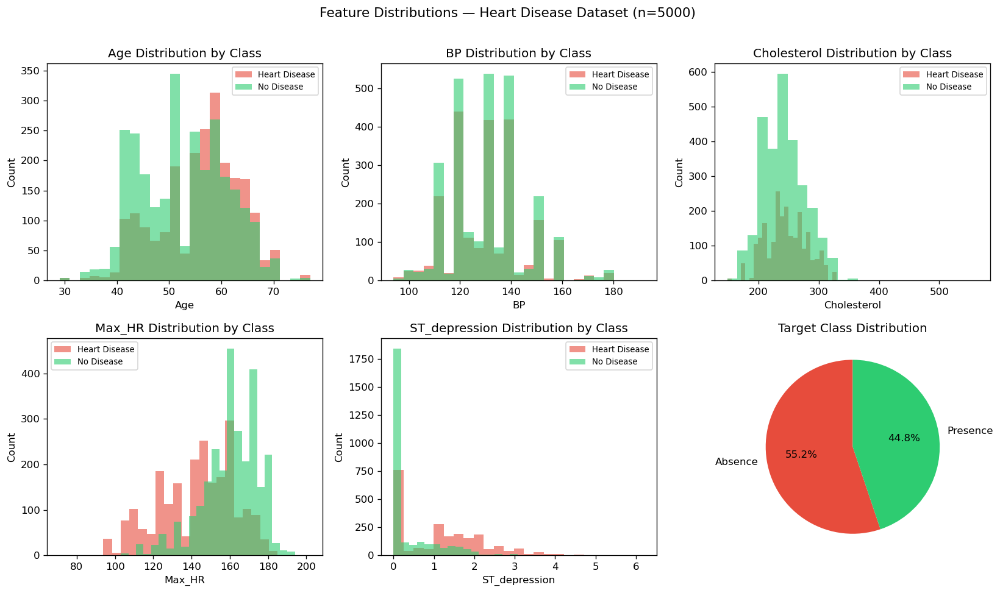
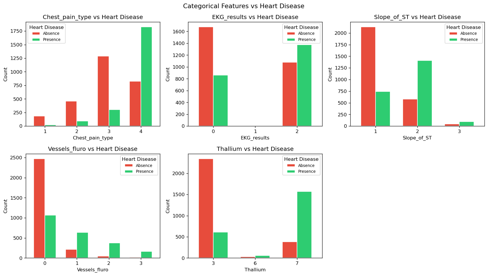
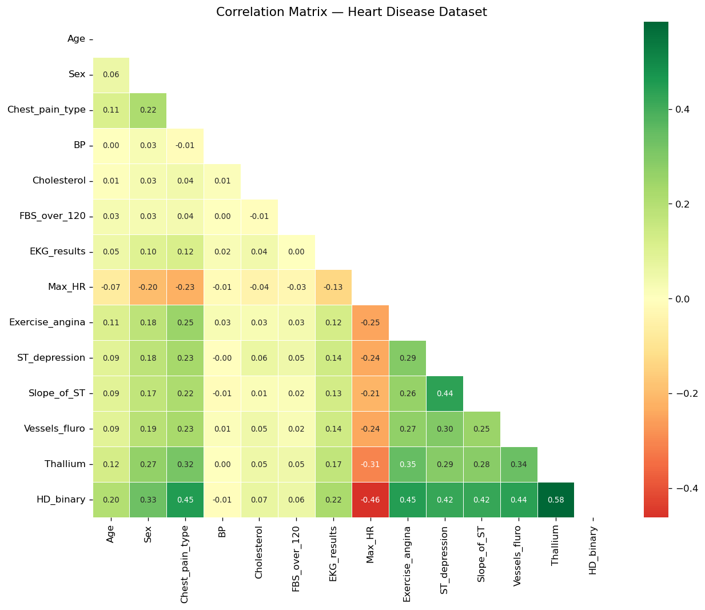
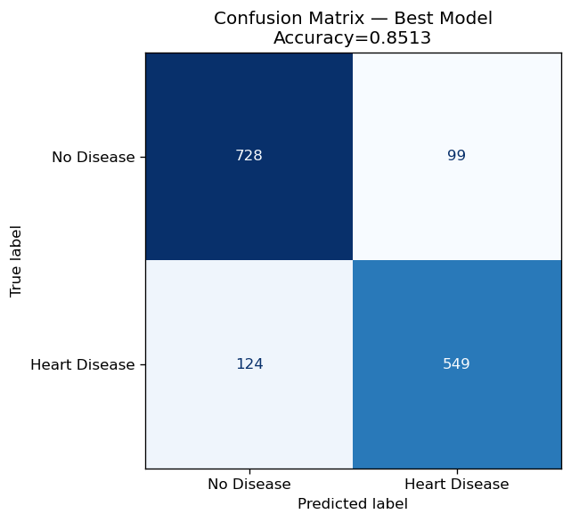
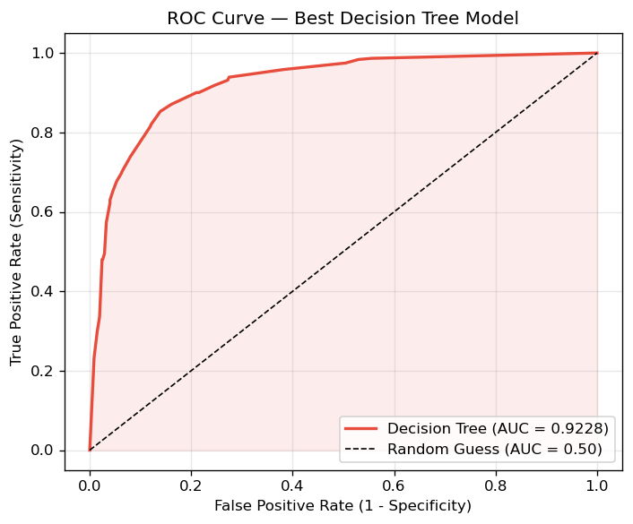
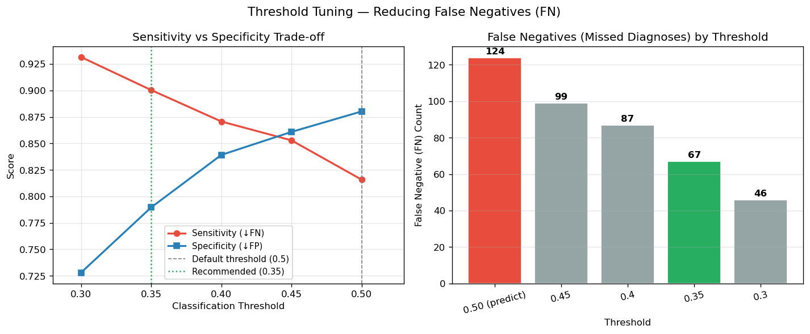
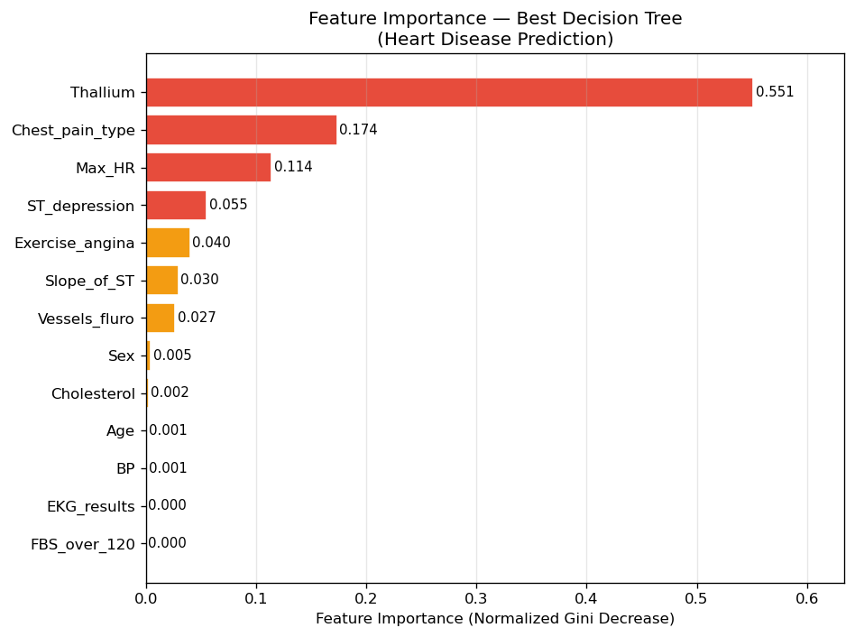
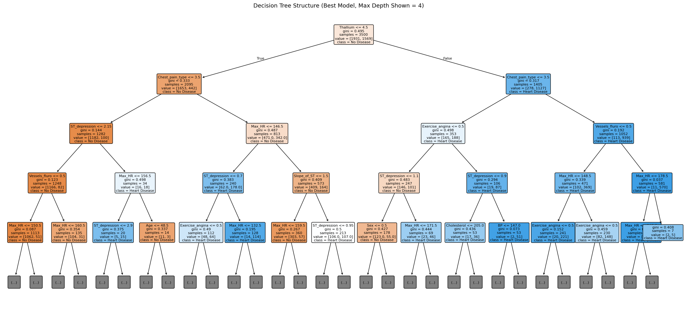
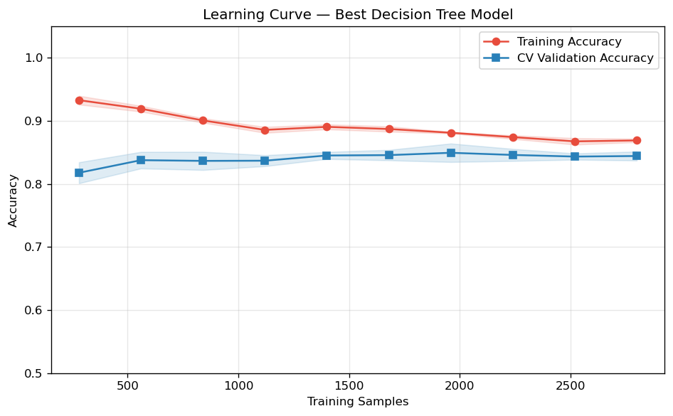

# Unit11 Decision Tree 決策樹分類 — 範例演練 Example01

> **範例主題**：以心臟病臨床資料為例，示範決策樹分類器的完整建模流程，涵蓋探索式資料分析（EDA）、前處理、模型訓練、超參數調整、模型評估與決策規則解讀。

---

## 目錄

1. [資料集介紹](#1-資料集介紹)
2. [決策樹分類理論](#2-決策樹分類理論)
3. [超參數說明](#3-超參數說明)
4. [sklearn 實作介面](#4-sklearn-實作介面)
5. [案例實作](#5-案例實作)
   - 5.1 [資料載入與探索（EDA）](#51-資料載入與探索eda)
   - 5.2 [資料前處理](#52-資料前處理)
   - 5.3 [基準模型建立](#53-基準模型建立)
   - 5.4 [超參數搜尋（GridSearchCV）](#54-超參數搜尋gridsearchcv)
   - 5.5 [最佳模型評估](#55-最佳模型評估)
     - 5.5.1 [分類報告](#551-分類報告)
     - 5.5.2 [混淆矩陣](#552-混淆矩陣)
     - 5.5.3 [ROC 曲線](#553-roc-曲線)
     - 5.5.4 [閾值調整（降低漏診）](#554-閾值調整threshold-tuning-降低漏診fn)
   - 5.6 [特徵重要性分析](#56-特徵重要性分析)
   - 5.7 [決策樹結構視覺化](#57-決策樹結構視覺化)
   - 5.8 [決策規則文字輸出](#58-決策規則文字輸出)
   - 5.9 [新患者預測](#59-新患者預測)
   - 5.10 [學習曲線分析](#510-學習曲線分析)
6. [實驗結果摘要](#6-實驗結果摘要)
7. [決策樹的優點與限制](#7-決策樹的優點與限制)
8. [本章小結](#8-本章小結)

---

## 1. 資料集介紹

### 1.1 來源與授權

| 項目 | 說明 |
|------|------|
| 資料集名稱 | Heart Disease Prediction Dataset |
| 來源平台 | [Kaggle — algozee/heart-decices](https://www.kaggle.com/datasets/algozee/heart-decices/data) |
| 授權條款 | CC BY-SA 4.0 |
| 原始大小 | train.csv：630,000 筆；test.csv：270,000 筆 |
| 本範例使用 | 從 train.csv 以分層抽樣取得 5,000 筆教學資料 |

此資料集包含心臟病診斷的臨床特徵，目標是預測病患是否患有心臟病（二元分類）。

### 1.2 特徵說明

| 欄位名稱（程式） | 原始欄位名 | 說明 | 類型 |
|-----------------|-----------|------|------|
| `Age` | Age | 年齡（歲） | 連續 |
| `Sex` | Sex | 性別（1=男，0=女） | 類別 |
| `Chest_pain_type` | Chest pain type | 胸痛類型（1–4） | 類別（有序） |
| `BP` | BP | 血壓（mmHg） | 連續 |
| `Cholesterol` | Cholesterol | 膽固醇（mg/dL） | 連續 |
| `FBS_over_120` | FBS over 120 | 空腹血糖 > 120 mg/dL（1=是） | 類別 |
| `EKG_results` | EKG results | 心電圖結果（0–2） | 類別（有序） |
| `Max_HR` | Max HR | 最大心率（bpm） | 連續 |
| `Exercise_angina` | Exercise angina | 運動誘發心絞痛（1=有） | 類別 |
| `ST_depression` | ST depression | 運動引發的 ST 壓低（mV） | 連續 |
| `Slope_of_ST` | Slope of ST | ST 段坡度（1–3） | 類別（有序） |
| `Vessels_fluro` | Number of vessels fluro | 螢光造影血管數（0–3） | 離散 |
| `Thallium` | Thallium | 鉈壓力測試結果（3/6/7） | 類別（有序） |
| `Heart_Disease` | Heart Disease | **目標變數**：Presence=1 / Absence=0 | 二元 |

### 1.3 目標變數分佈

本範例抽樣後，目標變數分佈如下（刻意使用近似均衡的樣本）：

| 類別 | 筆數 | 比例 |
|------|------|------|
| No Disease（0） | 2758 | 55.2% |
| Heart Disease（1） | 2242 | 44.8% |
| **合計** | **5000** | **100%** |

---

## 2. 決策樹分類理論

### 2.1 基本概念

決策樹（Decision Tree）是一種樹狀結構的監督式學習演算法。它透過一系列「特徵 ≤ 閾值？」的二元問題，將資料逐步分割到愈來愈純的子集，最終在葉節點（Leaf Node）做出分類預測。

```
根節點（Root Node）
├── 內部節點（Internal Node）：一個分割條件
│   ├── 左子樹（True 分支）
│   └── 右子樹（False 分支）
└── 葉節點（Leaf Node）：最終類別預測
```

### 2.2 不純度指標（Impurity Measure）

#### 2.2.1 Gini 不純度

Gini 指數衡量從某一節點隨機選取兩筆資料，被分到不同類別的機率：

$$
\text{Gini}(t) = 1 - \sum_{k=1}^{K} p_k^2
$$

其中 $p_k$ 為節點 $t$ 中類別 $k$ 的樣本比例。 $K$ 為類別數。

對於二元分類（ $K=2$ ）：

$$
\text{Gini}(t) = 1 - p^2 - (1-p)^2 = 2p(1-p)
$$

- $\text{Gini} = 0$ ：節點完全純淨（所有樣本同一類別）
- $\text{Gini} = 0.5$ ：節點完全不純（兩類別各佔 50%）

#### 2.2.2 資訊熵（Entropy）

$$
H(t) = -\sum_{k=1}^{K} p_k \log_2 p_k
$$

- $H = 0$ ：節點完全純淨
- $H = 1$ （二元分類）：節點完全不純

#### 2.2.3 資訊增益（Information Gain）

分割前後不純度的下降量即為資訊增益，決策樹選擇使資訊增益最大的特徵與閾值進行分割：

$$
\text{IG}(t, s) = \text{Impurity}(t) - \sum_{v \in \{L, R\}} \frac{n_v}{n} \cdot \text{Impurity}(t_v)
$$

其中 $n_v$ 為子節點 $v$ 的樣本數， $n$ 為父節點樣本數。

### 2.3 分類預測

葉節點的預測類別為該節點中**多數類別**（majority vote）。預測機率則為各類別在該葉節點中的樣本比例：

$$
\hat{P}(Y=k \mid \mathbf{x}) = \frac{\text{屬於類別 } k \text{ 的樣本數}}{\text{該葉節點的總樣本數}}
$$

### 2.4 過擬合問題

決策樹若不加限制，會持續分割至每個葉節點只含一個訓練樣本，導致：

- 訓練集 Accuracy = 100%（但測試集表現差）
- 樹極深，可解釋性低

解決方式為**剪枝（Pruning）**，包含：

- **預剪枝（Pre-pruning）**：訓練時設定停止條件（`max_depth`, `min_samples_leaf` 等）
- **後剪枝（Post-pruning）**：訓練後再修剪（`ccp_alpha` 代價複雜度剪枝）

---

## 3. 超參數說明

決策樹有多個重要的超參數，以下介紹本範例使用的主要超參數：

| 超參數 | 預設值 | 說明 | 建議範圍 |
|--------|--------|------|----------|
| `criterion` | `'gini'` | 分割不純度指標：`'gini'` 或 `'entropy'` | `['gini', 'entropy']` |
| `max_depth` | `None`（無限制）| 樹的最大深度，限制可防止過擬合 | `[3, 5, 7, 10]` |
| `min_samples_split` | `2` | 節點再分割所需的最小樣本數 | `[2, 10, 20]` |
| `min_samples_leaf` | `1` | 葉節點最小樣本數，增大可平滑邊界 | `[1, 5, 10]` |
| `max_features` | `None` | 每次分割考慮的最大特徵數 | `None`, `'sqrt'`, `'log2'` |
| `ccp_alpha` | `0.0` | 代價複雜度剪枝參數（後剪枝） | `[0, 0.001, 0.01, 0.1]` |
| `random_state` | `None` | 隨機種子（確保再現性） | 整數，如 `42` |
| `class_weight` | `None` | 類別權重，處理類別不平衡時使用 | `None`, `'balanced'` |

### 3.1 超參數對樹複雜度的影響

```
max_depth 較大    → 樹更深、葉節點更多 → 更複雜 → 訓練Acc高，測試Acc可能下降
min_samples_leaf 較大 → 葉節點需更多樣本 → 樹更淺 → 更泛化
min_samples_split 較大 → 更難繼續分割 → 較少節點 → 較簡單的樹
criterion 'entropy'  → 計算較慢，結果通常與 'gini' 相近
```

### 3.2 超參數搜尋策略

本範例使用 **GridSearchCV**（網格搜尋 + 交叉驗證）對所有超參數組合進行系統性搜尋：

$$
\text{GridSearchCV 共 } |\text{param\_grid}| \times k\text{-fold CV 次數} = 72 \times 5 = 360 \text{ 次訓練}
$$

其中超參數網格為：

$$
\{3, 5, 7, 10\} \times \{2, 10, 20\} \times \{1, 5, 10\} \times \{\text{'gini'}, \text{'entropy'}\} = 4 \times 3 \times 3 \times 2 = 72 \text{ 種組合}
$$

---

## 4. sklearn 實作介面

### 4.1 建立與訓練模型

```python
from sklearn.tree import DecisionTreeClassifier

# 基本建立
clf = DecisionTreeClassifier(
    criterion='gini',        # 不純度指標
    max_depth=5,             # 最大樹深
    min_samples_split=2,     # 節點最小分割樣本數
    min_samples_leaf=5,      # 葉節點最小樣本數
    random_state=42          # 隨機種子
)

# 訓練
clf.fit(X_train, y_train)

# 預測
y_pred = clf.predict(X_test)
y_proba = clf.predict_proba(X_test)  # 各類別機率
```

### 4.2 GridSearchCV 超參數調整

```python
from sklearn.model_selection import GridSearchCV

param_grid = {
    'max_depth': [3, 5, 7, 10],
    'min_samples_split': [2, 10, 20],
    'min_samples_leaf': [1, 5, 10],
    'criterion': ['gini', 'entropy']
}

grid_search = GridSearchCV(
    estimator=DecisionTreeClassifier(random_state=42),
    param_grid=param_grid,
    cv=5,                   # 5-fold 交叉驗證
    scoring='accuracy',     # 評估指標
    n_jobs=-1               # 使用所有 CPU 核心
)

grid_search.fit(X_train, y_train)
best_model = grid_search.best_estimator_
print(grid_search.best_params_)
```

### 4.3 模型評估

```python
from sklearn.metrics import (accuracy_score, classification_report,
                              confusion_matrix, roc_auc_score)

# 基本準確率
acc = accuracy_score(y_test, y_pred)

# 詳細分類報告
print(classification_report(y_test, y_pred,
                             target_names=['No Disease', 'Heart Disease']))

# 混淆矩陣
cm = confusion_matrix(y_test, y_pred)
TN, FP, FN, TP = cm.ravel()
sensitivity = TP / (TP + FN)   # 敏感度（召回率）
specificity = TN / (TN + FP)   # 特異度

# ROC-AUC
auc = roc_auc_score(y_test, y_proba[:, 1])
```

### 4.4 決策樹視覺化

```python
from sklearn.tree import plot_tree, export_text
import matplotlib.pyplot as plt

# 繪圖視覺化
fig, ax = plt.subplots(figsize=(24, 12))
plot_tree(clf,
          max_depth=4,               # 限制顯示深度
          feature_names=feature_cols,
          class_names=['No Disease', 'Heart Disease'],
          filled=True,               # 節點填色
          rounded=True,
          ax=ax)

# 文字規則輸出
rules = export_text(clf,
                    feature_names=feature_cols,
                    max_depth=3)     # 限制規則深度
print(rules)
```

### 4.5 特徵重要性

```python
import pandas as pd

# 取得特徵重要性（基於 Gini 不純度下降量）
importances = clf.feature_importances_

fi_df = pd.DataFrame({
    'Feature': feature_cols,
    'Importance': importances
}).sort_values('Importance', ascending=False)

print(fi_df)
```

### 4.6 模型儲存與載入

```python
import joblib

# 儲存
joblib.dump(clf, 'best_decision_tree.pkl')

# 載入
clf_loaded = joblib.load('best_decision_tree.pkl')
```

---

## 5. 案例實作

本節以心臟病預測資料集為例，逐步展示完整的決策樹分類建模流程。

### 5.1 資料載入與探索（EDA）

#### 5.1.1 環境設定與全域常數

```python
import os
import warnings
import numpy as np
import pandas as pd
import matplotlib.pyplot as plt
import seaborn as sns
from sklearn.tree import DecisionTreeClassifier, plot_tree, export_text
from sklearn.model_selection import train_test_split, GridSearchCV, learning_curve
from sklearn.metrics import (accuracy_score, classification_report,
                              confusion_matrix, roc_auc_score, roc_curve)
import joblib

warnings.filterwarnings('ignore')

# 全域常數
RANDOM_STATE = 42
SAMPLE_SIZE  = 5000     # 教學示範用分層抽樣大小
TEST_SIZE    = 0.30     # 30% 測試集

# 輸出目錄
UNIT_OUTPUT_DIR = 'P3_Unit11_Example01_Heart_Disease'
FIGS_DIR   = f'outputs/{UNIT_OUTPUT_DIR}/figs'
MODELS_DIR = f'outputs/{UNIT_OUTPUT_DIR}/models'
os.makedirs(FIGS_DIR,   exist_ok=True)
os.makedirs(MODELS_DIR, exist_ok=True)
```

#### 5.1.2 資料載入與欄位整理

原始資料欄位名稱含空格，載入後立即重新命名，同時刪除無意義的 `id` 欄位，並對目標變數進行二元化。

```python
# 載入資料
DATA_PATH = 'data/decision_tree/train.csv'
df_raw = pd.read_csv(DATA_PATH)

# 欄位重新命名（消除空格）
rename_dict = {
    'Chest pain type': 'Chest_pain_type',
    'FBS over 120':    'FBS_over_120',
    'EKG results':     'EKG_results',
    'Max HR':          'Max_HR',
    'Exercise angina': 'Exercise_angina',
    'ST depression':   'ST_depression',
    'Slope of ST':     'Slope_of_ST',
    'Number of vessels fluro': 'Vessels_fluro',
    'Heart Disease':   'Heart_Disease'
}
df_raw = df_raw.rename(columns=rename_dict)

# 刪除 id 欄，並對目標變數二元化（Presence→1, Absence→0）
df_raw = df_raw.drop(columns=['id'], errors='ignore')
df_raw['HD_binary'] = df_raw['Heart_Disease'].map({'Presence': 1, 'Absence': 0})

# 分層抽樣 SAMPLE_SIZE 筆
df = df_raw.groupby('HD_binary', group_keys=False).apply(
    lambda x: x.sample(
        n=int(SAMPLE_SIZE * len(x) / len(df_raw)),
        random_state=RANDOM_STATE
    )
).reset_index(drop=True)
```

**執行結果：**

```
原始資料筆數: 630,000
抽樣後筆數: 5,000

特徵欄位數: 13
目標欄位: Heart_Disease → HD_binary（0/1）
```

#### 5.1.3 連續特徵分佈

下圖顯示資料集中 7 個連續特徵（Age、BP、Cholesterol、Max_HR、ST_depression）按心臟病狀態分組的核密度分佈：



**觀察重點：**
- `Max_HR`（最大心率）：心臟病患者的最大心率明顯**低於**無病者，兩組分佈分離明顯，是重要預測特徵。
- `ST_depression`（ST 壓低）：心臟病患者的 ST 壓低值偏高，分佈右偏。
- `Age`（年齡）：心臟病患者年齡稍高，但兩組重疊度高，獨立區分力較弱。
- `BP`、`Cholesterol`：兩組分佈高度重疊，對分類貢獻較小。

#### 5.1.4 類別特徵分佈

下圖以分組長條圖呈現各類別特徵（Sex、Chest_pain_type、FBS_over_120、EKG_results、Exercise_angina、Slope_of_ST、Vessels_fluro、Thallium）在心臟病狀態下的分佈差異：



**觀察重點：**
- `Thallium`（鉈壓力測試）：類別 7（可逆性缺陷）在心臟病患者中比例遠高於無病者。
- `Chest_pain_type`（胸痛類型）：類別 4（非典型胸痛）在心臟病患者中佔比高。
- `Exercise_angina`（運動心絞痛）：有運動心絞痛者心臟病比例顯著較高。
- `Vessels_fluro`（血管數）：血管數越多，心臟病比例越高。

#### 5.1.5 相關性熱圖

下圖為所有特徵（含 `HD_binary`）之間的 Pearson 相關係數矩陣：



**與目標變數 `HD_binary` 的相關性（絕對值排序）：**

| 排名 | 特徵 | 相關係數（絕對值）| 解讀 |
|------|------|------------------|------|
| 1 | Thallium | 0.584 | 最強預測力 |
| 2 | Max_HR | 0.462 | 心率越低，患病機率越高 |
| 3 | Chest_pain_type | 0.452 | 胸痛類型重要 |
| 4 | Exercise_angina | 0.448 | 運動心絞痛強烈相關 |
| 5 | Vessels_fluro | 0.440 | 血管狹窄數量 |
| 6 | Slope_of_ST | 0.424 | ST 坡度相關 |
| 7 | ST_depression | 0.422 | ST 壓低程度 |
| 8 | Sex | 0.335 | 男性患病比例較高 |
| 9 | EKG_results | 0.223 | 心電圖異常 |
| 10 | Age | 0.202 | 年齡影響較小 |
| 11 | Cholesterol | 0.067 | 幾乎無線性相關 |
| 12 | FBS_over_120 | 0.057 | 血糖影響微弱 |
| 13 | BP | 0.005 | 幾乎無相關 |

> **注意**：相關係數只衡量線性關係，非線性特徵（如 `BP`）的實際重要性需透過模型驗證。

---

### 5.2 資料前處理

```python
# 特徵欄位清單（排除原始目標欄）
feature_cols = ['Age', 'Sex', 'Chest_pain_type', 'BP', 'Cholesterol',
                'FBS_over_120', 'EKG_results', 'Max_HR', 'Exercise_angina',
                'ST_depression', 'Slope_of_ST', 'Vessels_fluro', 'Thallium']

X = df[feature_cols].values
y = df['HD_binary'].values

# 分層隨機分割（70% 訓練 / 30% 測試）
X_train, X_test, y_train, y_test = train_test_split(
    X, y,
    test_size=TEST_SIZE,
    random_state=RANDOM_STATE,
    stratify=y              # 確保訓練/測試集類別比例一致
)
```

**分割結果：**

```
特徵矩陣 X: (5000, 13)
目標向量 y: (5000,)

訓練集: 3500 筆  |  測試集: 1500 筆
訓練集正例比例: 44.8%
測試集正例比例: 44.9%
```

> **為何使用 `stratify=y`？**  
> 分層抽樣確保訓練集與測試集中的正負例比例與原始資料一致，避免因隨機分割造成類別分佈偏差，提升評估公正性。

> **決策樹不需要特徵縮放**  
> 不同於 SVM 或 KNN，決策樹的分割條件僅比較特徵與閾值，不受量綱影響。因此**無需**對特徵進行標準化（StandardScaler）或正規化。

---

### 5.3 基準模型建立

#### 5.3.1 Model A：無限制樹（Baseline）

首先建立一棵**不加任何剪枝限制**的決策樹，以觀察過擬合現象：

```python
# Model A：無限制樹
model_A = DecisionTreeClassifier(random_state=RANDOM_STATE)
model_A.fit(X_train, y_train)
```

**執行結果：**

| 指標 | 數值 |
|------|------|
| 樹深度 | 19 |
| 葉節點數 | 475 |
| 訓練集 Accuracy | **1.0000** |
| 測試集 Accuracy | 0.8073 |
| 過擬合差距 | **0.1927** |

訓練集 Accuracy 為 100% 而測試集僅 80.7%，過擬合差距高達 **19.3%**，是典型過擬合案例。樹深達 19 層、475 個葉節點，模型記憶了訓練資料的雜訊。

#### 5.3.2 Model B：手動剪枝（depth=4）

透過設定 `max_depth=4, min_samples_leaf=10` 手動控制樹的複雜度：

```python
# Model B：手動剪枝
model_B = DecisionTreeClassifier(
    max_depth=4,
    min_samples_leaf=10,
    random_state=RANDOM_STATE
)
model_B.fit(X_train, y_train)
```

**執行結果：**

| 指標 | 數值 |
|------|------|
| 樹深度 | 4 |
| 葉節點數 | 16 |
| 訓練集 Accuracy | 0.8500 |
| 測試集 Accuracy | **0.8480** |
| 過擬合差距 | **0.0020** |

剪枝後過擬合差距大幅縮小至僅 0.2%，模型泛化能力顯著提升。

#### 5.3.3 三模型比較預覽

| 模型 | 深度 | 葉數 | 訓練 Acc | 測試 Acc |
|------|------|------|----------|----------|
| Model A（無限制） | 19 | 475 | 1.0000 | 0.8073 |
| Model B（depth=4） | 4 | 16 | 0.8500 | 0.8480 |
| Best（GridSearch） | 5 | 31 | 0.8643 | **0.8513** |

---

### 5.4 超參數搜尋（GridSearchCV）

使用網格搜尋系統性地尋找最佳超參數組合：

```python
param_grid = {
    'max_depth':          [3, 5, 7, 10],
    'min_samples_split':  [2, 10, 20],
    'min_samples_leaf':   [1, 5, 10],
    'criterion':          ['gini', 'entropy']
}
# 共 4 × 3 × 3 × 2 = 72 種組合 × 5-fold = 360 次訓練

grid_search = GridSearchCV(
    estimator=DecisionTreeClassifier(random_state=RANDOM_STATE),
    param_grid=param_grid,
    cv=5,
    scoring='accuracy',
    n_jobs=-1
)
grid_search.fit(X_train, y_train)
```

**最佳超參數：**

```
criterion      : 'gini'
max_depth      : 5
min_samples_leaf: 5
min_samples_split: 2
```

**CV 平均 Accuracy：0.8443**

> **解讀**：深度 5 比 Model B 的深度 4 增加了一層，允許更細緻的分割；`min_samples_leaf=5` 確保葉節點有足夠樣本，防止過擬合。

---

### 5.5 最佳模型評估

#### 5.5.1 分類報告

```
=== 最佳模型（GridSearchCV）完整評估 ===
訓練集 Accuracy: 0.8643
測試集 Accuracy: 0.8513
測試集 ROC-AUC:  0.9228
過擬合差距:      0.0130

                   precision    recall  f1-score   support

   No Disease (0)       0.85      0.88      0.87       827
Heart Disease (1)       0.85      0.82      0.83       673

         accuracy                           0.85      1500
        macro avg       0.85      0.85      0.85      1500
     weighted avg       0.85      0.85      0.85      1500
```

**指標解讀：**

| 指標 | 數值 | 說明 |
|------|------|------|
| Accuracy | 0.8513 | 85.1% 的預測正確 |
| Precision（心臟病） | 0.85 | 預測為心臟病者中，85% 確實患病 |
| Recall（心臟病） | 0.82 | 所有真實患者中，82% 被正確診出 |
| F1-score（心臟病） | 0.83 | Precision 與 Recall 的調和平均 |
| ROC-AUC | **0.9228** | 模型區分兩類別的整體能力，0.92 屬優良等級 |

#### 5.5.2 混淆矩陣

下圖為最佳模型在測試集（1500 筆）上的混淆矩陣：



```
True Negative  (TN): 728  — 正確預測無病
False Positive (FP): 99   — 誤報有病（假陽性）
False Negative (FN): 124  — 漏診有病（假陰性）★ 臨床最重要
True Positive  (TP): 549  — 正確預測有病
```

**衍生指標：**

$$
\text{Sensitivity（敏感度）} = \frac{TP}{TP + FN} = \frac{549}{549 + 124} = 0.8158
$$

$$
\text{Specificity（特異度）} = \frac{TN}{TN + FP} = \frac{728}{728 + 99} = 0.8803
$$

> **臨床解讀**：在醫療診斷中，**假陰性（FN = 124）** 的代價遠高於假陽性，因為漏診心臟病患者可能錯過治療機會。若要提高敏感度，可調整分類閾值（降低正類判斷門檻）。

#### 5.5.3 ROC 曲線

下圖顯示最佳模型的 ROC 曲線，AUC = 0.9228：



**ROC 曲線解讀：**
- 橫軸：假陽性率（FPR = 1 − Specificity）
- 縱軸：真陽性率（TPR = Sensitivity = Recall）
- 曲線愈靠近左上角，模型區分能力愈強
- AUC（曲線下面積）= 0.9228，屬**優良**等級（AUC > 0.9）
- 虛線對角線代表隨機猜測（AUC = 0.5）

#### 5.5.4 閾值調整（Threshold Tuning）— 降低漏診（FN）

決策樹的預設分類閾值為 **0.5**，即預測機率 ≥ 0.5 才判定為心臟病陽性。降低閾值可提高**敏感度（Sensitivity）**，代價是特異度下降（更多假陽性）：

$$
\text{Threshold} \downarrow \;\Rightarrow\; \text{Sensitivity} \uparrow \;(\text{FN} \downarrow) \;,\quad \text{Specificity} \downarrow \;(\text{FP} \uparrow)
$$

下圖左側為不同閾值下 Sensitivity 與 Specificity 的消長關係；右側顯示各閾值對應的 FN 數量：



**各閾值評估結果：**

| 閾值 | Sensitivity | Specificity | Accuracy | FN（漏診） | FP（誤報） |
|------|-------------|-------------|----------|-----------|-----------|
| 0.50（預設） | 0.8158 | 0.8803 | 0.8513 | 124 | 99 |
| 0.45 | 0.8529 | 0.8609 | 0.8573 | 99 | 115 |
| 0.40 | 0.8707 | 0.8392 | 0.8533 | 87 | 133 |
| **0.35（建議）** | **0.9004** | **0.7896** | **0.8393** | **67** | **174** |
| 0.30 | 0.9316 | 0.7279 | 0.8193 | 46 | 225 |

**閾值 0.35 的詳細評估：**

```
                   precision    recall  f1-score   support

   No Disease (0)       0.91      0.79      0.84       827
Heart Disease (1)       0.78      0.90      0.83       673

         accuracy                           0.84      1500
```

**關鍵效益：**

$$
\text{FN 減少：} 124 \rightarrow 67 \;\text{（減少 57 筆漏診，} {-46\%}\text{）}
$$

$$
\text{FP 增加：} 99 \rightarrow 174 \;\text{（增加 75 筆誤報）}
$$

> **選擇建議**：
> - **初篩情境**（不漏掉任何患者）→ 使用閾值 **0.35**，Sensitivity 達 **90%**
> - **確診輔助情境**（減少不必要的後續檢查）→ 使用預設閾值 **0.50**
> - 閾值選擇應根據臨床決策成本（漏診代價 vs. 誤診代價）評估

---

### 5.6 特徵重要性分析

決策樹的特徵重要性基於每個特徵在所有分割點上**加權平均 Gini 不純度下降量**：

$$
\text{Importance}(f) = \frac{\sum_{t: \text{split on } f} n_t \cdot \Delta\text{Gini}(t)}{\sum_{t'} n_{t'} \cdot \Delta\text{Gini}(t')}
$$

其中 $n_t$ 為節點 $t$ 的樣本數。



**特徵重要性排序：**

| 排名 | 特徵 | 重要性 | 臨床意義 |
|------|------|--------|----------|
| 1 | **Thallium** | **0.551** | 鉈核醫學壓力測試，直接反映心肌灌注 |
| 2 | Chest_pain_type | 0.174 | 胸痛類型，不同類型心臟病風險差異大 |
| 3 | Max_HR | 0.114 | 最大心率，心臟儲備功能指標 |
| 4 | ST_depression | 0.055 | 心電圖 ST 段壓低，心肌缺血指標 |
| 5 | Exercise_angina | 0.040 | 運動心絞痛，心肌缺血症狀 |
| 6 | Slope_of_ST | 0.030 | ST 段坡度，與心肌缺血類型相關 |
| 7 | Vessels_fluro | 0.027 | 冠狀動脈造影血管狹窄數 |
| 8 | Sex | 0.005 | 性別，男性風險較高 |
| 9 | Cholesterol | 0.002 | 膽固醇 |
| 10 | Age | 0.001 | 年齡 |
| 11 | BP | 0.001 | 血壓 |
| 12 | FBS_over_120 | 0.000 | 空腹血糖（模型未使用） |
| 13 | EKG_results | 0.000 | 心電圖結果（模型未使用） |

> **關鍵觀察**：`Thallium` 的重要性高達 55.1%，佔絕對主導地位。前 7 個特徵累計重要性 > 99%。`FBS_over_120` 和 `EKG_results` 在此模型中完全未被使用（重要性 = 0），表示它們對決策樹的分割沒有貢獻。

---

### 5.7 決策樹結構視覺化

下圖為最佳模型前 4 層的樹狀結構（實際深度為 5 層，此圖顯示前 4 層以維持可讀性）：



**樹結構解讀：**

根節點（Root Node）的第一個分割條件為：

$$
\text{Thallium} \leq 4.5 \text{ ？}
$$

- 若 **True（Thallium ≤ 4.5）**：3,500 訓練樣本中有 2,095 筆進入左子樹，多數為無病患者（`class = No Disease`）
- 若 **False（Thallium > 4.5）**：1,405 筆進入右子樹，多數為心臟病患者（`class = Heart Disease`）

這與鉈壓力測試的臨床意義完全一致：
- `Thallium = 3`：正常（無缺損）→ 左子樹（風險低）
- `Thallium = 6`：固定缺損 → 中間路徑
- `Thallium = 7`：可逆性缺損（心肌缺血）→ 右子樹（風險高）

---

### 5.8 決策規則文字輸出

使用 `export_text` 輸出人類可讀的決策規則（前 3 層示意）：

```
|--- Thallium <= 4.50
|   |--- Chest_pain_type <= 3.50
|   |   |--- ST_depression <= 2.15
|   |   |   |--- Vessels_fluro <= 0.50
|   |   |   |   |--- class: No Disease
|   |   |   |--- Vessels_fluro > 0.50
|   |   |   |   |--- ...
|   |   |--- ST_depression > 2.15
|   |   |   |--- ...
|   |--- Chest_pain_type > 3.50
|   |   |--- Max_HR <= 146.50
|   |   |   |--- ...
|   |   |--- Max_HR > 146.50
|   |   |   |--- ...
|--- Thallium > 4.50
|   |--- Chest_pain_type <= 3.50
|   |   |--- Exercise_angina <= 0.50
|   |   |   |--- ...
|   |   |--- Exercise_angina > 0.50
|   |   |   |--- ...
|   |--- Chest_pain_type > 3.50
|   |   |--- Vessels_fluro <= 0.50
|   |   |   |--- ...
|   |   |--- Vessels_fluro > 0.50
|   |   |   |--- class: Heart Disease
```

完整規則已儲存至 `outputs/P3_Unit11_Example01_Heart_Disease/tree_rules.txt`。

> **規則的可解釋性優勢**：每個預測路徑都可以用 **if-then** 的形式表達，臨床人員可直接理解「為何模型做出此預測」，這是決策樹最大的優勢之一。

---

### 5.9 新患者預測

使用訓練好的最佳模型對 5 位假想新患者進行心臟病風險預測：

```python
new_patients = pd.DataFrame({
    'Age': [63, 45, 55, 70, 38],
    'Sex': [1, 0, 1, 1, 0],
    'Chest_pain_type': [4, 2, 3, 4, 1],
    'BP': [145, 120, 130, 160, 110],
    'Cholesterol': [233, 180, 250, 300, 150],
    'FBS_over_120': [1, 0, 0, 1, 0],
    'EKG_results': [2, 0, 1, 2, 0],
    'Max_HR': [150, 170, 120, 100, 185],
    'Exercise_angina': [0, 0, 1, 1, 0],
    'ST_depression': [2.3, 0.5, 1.5, 3.5, 0.1],
    'Slope_of_ST': [3, 1, 2, 3, 1],
    'Vessels_fluro': [0, 0, 2, 3, 0],
    'Thallium': [6, 3, 7, 7, 3]
}, index=['P1', 'P2', 'P3', 'P4', 'P5'])

y_pred_new = best_model.predict(new_patients.values)
y_proba_new = best_model.predict_proba(new_patients.values)[:, 1]
```

**預測結果：**

| 患者 | 預測結果 | 患病機率 | 風險等級 | 說明 |
|------|----------|----------|----------|------|
| P1 | Heart Disease | 51.5% | △ 中風險 | Thallium=6，Chest_pain_type=4，有一定風險 |
| P2 | No Disease | 2.5% | ✓ 低風險 | Thallium=3（正常），年輕女性 |
| P3 | Heart Disease | 75.0% | ⚠️ 高風險 | Thallium=7（可逆性缺損），有運動心絞痛 |
| P4 | Heart Disease | 100.0% | ⚠️ 高風險 | Thallium=7，多重危險因子 |
| P5 | No Disease | 2.5% | ✓ 低風險 | Thallium=3，年輕低風險 |

**關鍵因素解析：**
- **P4（100% 風險）**：Thallium=7（可逆性缺損）+ Vessels_fluro=3（3 條血管狹窄）+ Max_HR=100（低）+ ST_depression=3.5（高），多重高危指標疊加。
- **P2 & P5（2.5% 風險）**：Thallium=3（正常灌注），決策樹在根節點即分配為低風險。

> **重要提醒**：本模型僅為教學示範，不應用於實際臨床診斷。實際醫療診斷需由專業醫師綜合判斷。

---

### 5.10 學習曲線分析

學習曲線（Learning Curve）顯示模型效能如何隨訓練樣本數增加而變化，用於診斷**偏差（Bias）**與**方差（Variance）**問題：

```python
from sklearn.model_selection import learning_curve

train_sizes, train_scores, val_scores = learning_curve(
    best_model,
    X_train, y_train,
    train_sizes=np.linspace(0.1, 0.8, 10),
    cv=5,
    scoring='accuracy',
    n_jobs=-1
)
```



**執行結果：**

```
最終訓練 Accuracy: 0.8690 ± 0.0028
最終 CV Accuracy:  0.8443 ± 0.0071
```

**學習曲線解讀：**

| 現象 | 本範例觀察 | 意義 |
|------|-----------|------|
| 訓練曲線起始點（少量資料）| ~0.934 | 少量資料時訓練集完美擬合 |
| 訓練曲線終點 | ~0.869 | 隨樣本增加，訓練Acc下降（正常） |
| CV曲線趨勢 | 從 0.82 上升至穩定約 0.845 | 更多資料有助提升泛化能力 |
| 兩曲線是否收斂 | 部分收斂，仍有約 2.5% 差距 | 輕微過擬合，模型尚有改進空間 |

**診斷結論：**
- 訓練曲線下降 + CV 曲線上升 + 差距縮小 → **方差（Variance）問題**（過擬合），但剪枝後已大幅改善
- CV 曲線趨於平穩 → 增加更多資料的邊際效益遞減
- 若要進一步改善：可考慮 Random Forest 或 XGBoost 等集成方法

---

## 6. 實驗結果摘要

| 項目 | 數值/內容 |
|------|-----------|
| **資料集** | 心臟病預測（n=5,000，13個特徵） |
| **訓練/測試比例** | 70% / 30%（3,500 / 1,500 筆） |
| **最佳超參數** | criterion='gini', max_depth=5, min_samples_leaf=5, min_samples_split=2 |
| **樹深度 / 葉節點數** | 5 / 31 |
| **訓練集 Accuracy** | 0.8643 |
| **測試集 Accuracy** | **0.8513** |
| **ROC-AUC** | **0.9228** |
| **Sensitivity（敏感度）** | 0.8158 |
| **Specificity（特異度）** | 0.8803 |
| **最重要特徵** | Thallium（55.1%）> Chest_pain_type（17.4%）> Max_HR（11.4%）|
| **根節點分割條件** | Thallium ≤ 4.5 |

**三模型比較：**

| 模型 | 深度 | 葉數 | 訓練 Acc | 測試 Acc | 過擬合差距 |
|------|------|------|----------|----------|-----------|
| Model A（無限制） | 19 | 475 | 1.0000 | 0.8073 | 0.1927 |
| Model B（depth=4）| 4 | 16 | 0.8500 | 0.8480 | 0.0020 |
| **Best（GridSearch）** | **5** | **31** | **0.8643** | **0.8513** | **0.0130** |

> GridSearch 找到的最佳模型測試 Accuracy（0.8513）略優於手動剪枝的 Model B（0.8480），同時保持較低的過擬合差距。

---

## 7. 決策樹的優點與限制

### 7.1 優點

| 優點 | 說明 |
|------|------|
| **高度可解釋性** | 決策規則可用 if-then 條件表達，非技術人員也能理解 |
| **不需特徵縮放** | 不受特徵量綱影響，無需標準化或正規化 |
| **處理混合資料** | 同時處理連續與類別特徵，不需額外編碼 |
| **特徵重要性** | 自動輸出特徵重要性，便於特徵選擇 |
| **訓練速度快** | 對中等規模資料集，訓練時間短 |
| **視覺化直觀** | 樹狀圖易於理解和溝通 |

### 7.2 限制

| 限制 | 說明 | 改善方式 |
|------|------|----------|
| **容易過擬合** | 不限制時會記憶訓練雜訊 | 剪枝（`max_depth`, `min_samples_leaf`）|
| **不穩定性** | 訓練資料微小變化會產生非常不同的樹 | Random Forest（整合多棵樹）|
| **軸平行邊界** | 只能做平行於特徵軸的分割，對複雜邊界效果差 | 非線性模型（RBF SVM、Neural Network）|
| **類別不平衡敏感** | 多數類別主導分割決策 | `class_weight='balanced'` |
| **外插能力差** | 對訓練分佈外的資料預測可信度低 | 注意測試集分佈 |

### 7.3 何時選擇決策樹？

```
✓ 需要模型可解釋性（法規要求、醫療決策、報告呈現）
✓ 特徵包含類別變數（無需 one-hot encoding）
✓ 快速建立基準模型（baseline）
✓ 資料量中等（幾千到幾萬筆）
✗ 需要最高預測精度 → 考慮 Random Forest、XGBoost
✗ 資料有強烈類別不平衡 → 需額外處理
✗ 特徵間有複雜非線性交互作用 → 考慮深度學習
```

---

## 8. 本章小結

本範例以心臟病預測資料集為例，完整展示了決策樹分類器的建模流程：

1. **EDA 探索**：透過分佈圖和相關性熱圖，識別 Thallium、Max_HR、Chest_pain_type 等關鍵特徵。

2. **過擬合問題**：Model A（無限制）訓練 Accuracy = 100%，但測試 Accuracy 僅 80.7%，過擬合差距高達 19.3%。

3. **剪枝效果**：Model B（depth=4）將過擬合差距縮小至 0.2%，測試 Accuracy 提升至 84.8%。

4. **GridSearchCV 調優**：系統搜尋 72 種超參數組合，找到最佳配置（depth=5, min_samples_leaf=5），測試 Accuracy 達 85.1%，AUC 達 0.9228。

5. **特徵重要性**：Thallium（鉈壓力測試）以 55.1% 的重要性遠超其他特徵，與臨床知識吻合。

6. **可解釋性**：透過決策樹可視化和規則輸出，清楚呈現每個預測路徑的邏輯條件。

**核心學習要點：**

$$
\text{決策樹核心概念} = \underbrace{\text{Gini/Entropy 分割}}_{\text{如何分割}} + \underbrace{\text{剪枝策略}}_{\text{防止過擬合}} + \underbrace{\text{特徵重要性}}_{\text{模型解釋}}
$$

---

**課程資訊**
- 課程名稱：AI在化工上之應用 (ChemE 3590)
- 課程單元：Unit11 Decision Tree 決策樹分類 — 範例演練 Example01
- 課程製作：逢甲大學 化工系 智慧程序系統工程實驗室
- 授課教師：莊曜禎 助理教授
- 更新日期：2026-05-14

**課程授權 [CC BY-NC-SA 4.0]**
 - 本教材遵循 [創用CC 姓名標示-非商業性-相同方式分享 4.0 國際 (CC BY-NC-SA 4.0)](https://creativecommons.org/licenses/by-nc-sa/4.0/deed.zh) 授權。

**資料來源授權**
 - 本範例使用之資料集：[Heart Disease Prediction Dataset](https://www.kaggle.com/datasets/algozee/heart-decices/data)，授權條款：[CC BY-SA 4.0](https://creativecommons.org/licenses/by-sa/4.0/)。

---
