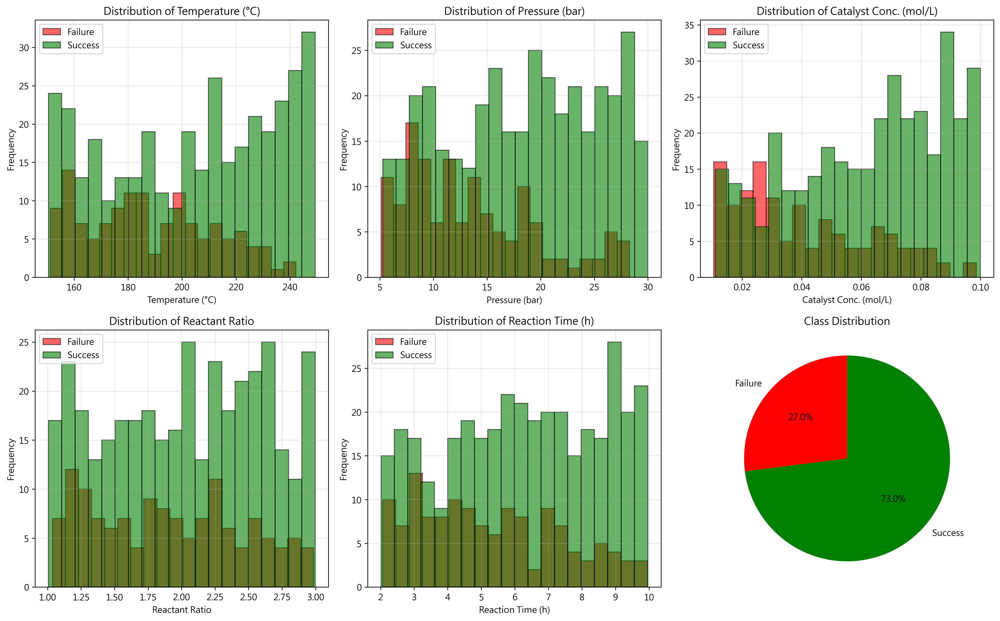
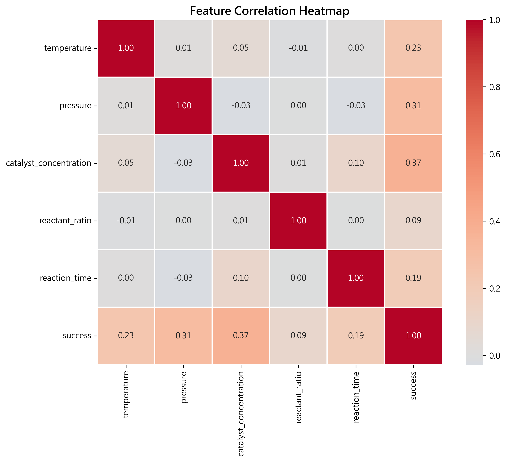
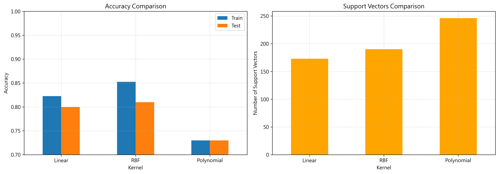
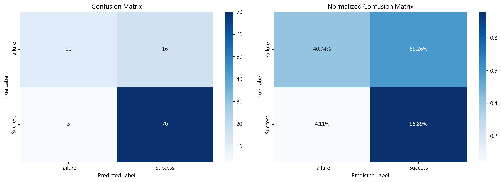
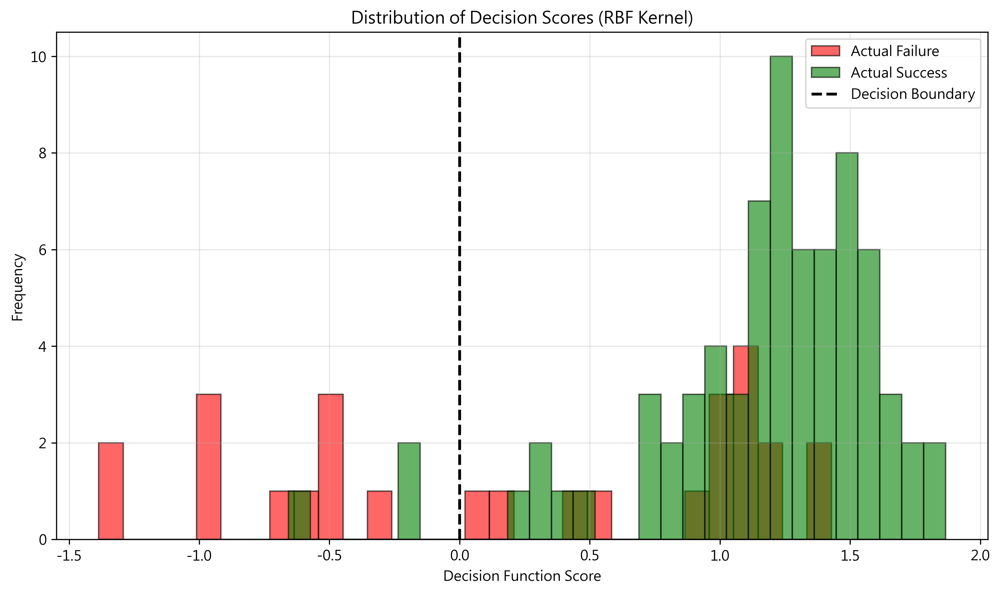
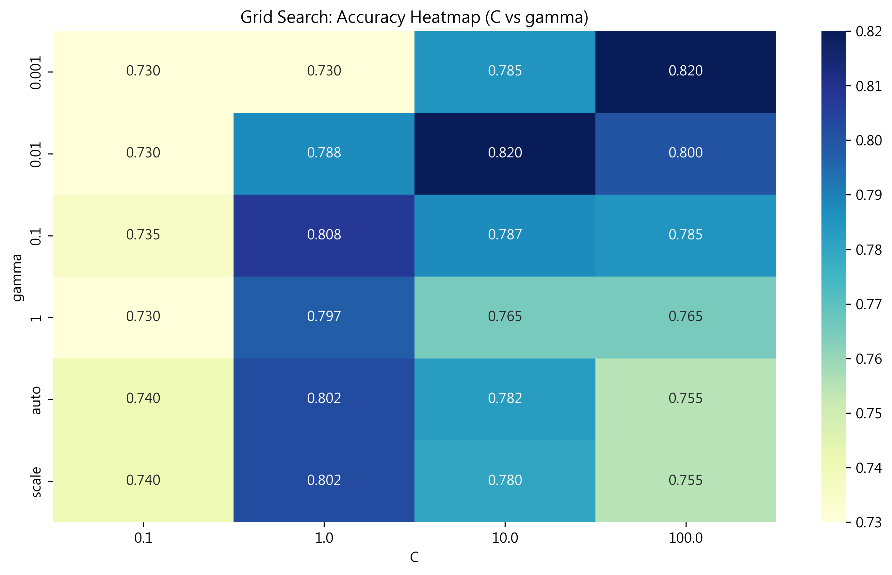

# Unit12 支持向量分類 | Support Vector Classification (SVC)

> **最後更新**：2026-05-21

---

## 學習目標

本節課將深入學習**支持向量分類 (Support Vector Classification, SVC)** 模型，這是機器學習中最強大且應用廣泛的分類方法之一。通過本節課，您將能夠：

- 理解 SVR（回歸）到 SVC（分類）的概念延伸，掌握兩者的共同數學基礎與差異
- 理解支持向量機的核心概念與幾何直觀
- 掌握核函數 (Kernel Function) 的原理與應用
- 學習軟間隔與硬間隔的差異
- 掌握 sklearn 中 `SVC` 的使用方法與參數調整
- 應用 SVC 解決化工領域的分類問題
- 理解模型的優勢、限制與適用場景

---

## 0. SVM 背景介紹

### 0.1 歷史沿革

支持向量機 (Support Vector Machine, SVM) 的理論基礎可追溯至 1960 年代，由蘇聯數學家 **Vladimir Vapnik** 與 Alexey Chervonenkis 提出的統計學習理論 (Statistical Learning Theory) 奠基。

| 年代 | 里程碑 |
|------|--------|
| 1963 | Vapnik & Chervonenkis 提出 VC 維度理論，奠定統計學習理論基礎 |
| 1992 | Boser、Guyon & Vapnik 正式提出支持向量機（線性可分版本） |
| 1995 | Cortes & Vapnik 發表軟間隔 SVM，引入鬆弛變數 $\xi$ 與懲罰參數 $C$ |
| 1996 | Smola & Schölkopf 將 SVM 延伸為支持向量回歸 (SVR) |
| 1998–2005 | 核函數理論成熟，SVM 成為機器學習領域主流方法 |
| 2012 後 | 深度學習崛起，但 SVM 在小樣本、高維數據上仍是首選工具 |

### 0.2 核心哲學：結構風險最小化

傳統機器學習方法（如線性回歸、神經網路）追求**最小化訓練誤差（經驗風險最小化）**，容易過擬合。SVM 的設計哲學不同：它追求**結構風險最小化 (Structural Risk Minimization, SRM)**，即同時最小化訓練誤差與模型複雜度（透過最大化間隔實現），使泛化能力有理論保證。

$$
\text{泛化誤差上界} \leq \text{訓練誤差} + O\!\left(\sqrt{\frac{\text{VC維度}}{n}}\right)
$$

**最大間隔的幾何意義**：兩類別之間的「街道」越寬，模型對微小擾動的容忍度越高，泛化能力越強。

### 0.3 SVM 家族與本課程定位

SVM 是一個**演算法家族**，依學習任務可分為：

```
SVM 家族
├── SVC (Support Vector Classification)   ← 本單元主題
│   ├── 硬間隔 SVM (Hard Margin)          線性可分情況
│   ├── 軟間隔 SVM (Soft Margin)          含噪聲/重疊情況
│   └── 核 SVM (Kernel SVM)              非線性情況
└── SVR (Support Vector Regression)       ← 前一單元
    └── ε-insensitive tube 回歸
```

本課程的學習路徑：**Unit11 SVR → Unit12 SVC**，兩者共用相同的數學核心（對偶問題、核函數、支持向量概念），學習 SVC 可在 SVR 基礎上快速建立理解。

### 0.4 SVM 的主要優勢與限制

| 面向 | 優勢 | 限制 |
|------|------|------|
| **數學保證** | 有泛化能力的理論上界（VC理論） | 理論主要針對二元分類 |
| **樣本效率** | 小樣本表現優異（依賴少數支持向量） | 大樣本（> 10萬）訓練速度慢（$O(n^2)$–$O(n^3)$） |
| **高維空間** | 核技巧隱式處理無限維特徵 | 核矩陣記憶體需求大（$n \times n$） |
| **決策邊界** | 全域最優解（凸優化問題，無局部最小值） | 多分類需分解為多個二元問題 |
| **特徵縮放** | 核函數使對特徵尺度的敏感度可控 | **必須標準化特徵**，否則效果差 |
| **可解釋性** | 支持向量直接指出邊界關鍵樣本 | 核函數空間難以直觀解釋 |
| **化工應用** | 小批次實驗數據、高維光譜數據 | 即時線上預測需預計算或模型壓縮 |

> **💡 化工應用場景提示**：SVM 在**小樣本、高維特徵、非線性邊界**的化工問題中表現尤為突出，例如：光譜品質分類、製程異常偵測、相態識別等。

---

## 1. 從 SVR 到 SVC：同根同源的兩種學習任務

在學習支持向量分類 (SVC) 之前，我們先回顧前一個單元所學的**支持向量回歸 (Support Vector Regression, SVR)**，從兩者的對比中建立完整的支持向量機 (SVM) 知識體系。

### 1.1 SVR 回顧：在連續值中找「管道」

SVR 的目標是找一個函數 $f(\mathbf{x})$ ，使預測值盡量落在以真實值為中心、寬度為 $2\varepsilon$ 的「**不敏感管道 (ε-insensitive tube)**」內。落在管道外的樣本才產生損失。

$$
\min_{\mathbf{w}, b, \xi} \frac{1}{2}\|\mathbf{w}\|^2 + C\sum_{i=1}^{m}(\xi_i^+ + \xi_i^-)
$$

$$
\text{s.t.} \quad y_i - \mathbf{w}^T\mathbf{x}_i - b \leq \varepsilon + \xi_i^+, \quad \mathbf{w}^T\mathbf{x}_i + b - y_i \leq \varepsilon + \xi_i^-, \quad \xi_i^{\pm} \geq 0
$$

SVR 的輸出是**連續數值**，支持向量是那些位於管道邊界上或邊界外的樣本點。

### 1.2 SVC 的概念轉換：從「擬合管道」到「最大化間隔」

SVC 面對的是**分類任務**：輸出不再是數值，而是類別標籤 $y_i \in \{-1, +1\}$ 。

**核心思想的對應關係**：

| 概念 | SVR（回歸） | SVC（分類） |
|------|-------------|-------------|
| **學習目標** | 找到最佳擬合函數（迴歸線/曲面） | 找到最優決策超平面（分界面） |
| **最優化準則** | 讓所有樣本盡量落在 ε-管道「內」 | 讓兩個類別的樣本盡量分隔「遠」（最大化間隔） |
| **損失函數** | ε-insensitive loss：管道內無損失 | Hinge loss：間隔內/外有不同懲罰 |
| **鬆弛變數 ξ** | 管道外樣本的超出量 | 間隔違反量（誤分類樣本的懲罰） |
| **C 參數** | 控制擬合誤差與模型複雜度的平衡 | **完全相同意義**：控制誤分類懲罰強度 |
| **支持向量** | 管道邊界上或外部的樣本 | 間隔邊界上的樣本（決定超平面） |
| **核技巧** | 將低維輸入映射到高維空間 | **完全相同機制**：處理非線性關係 |
| **輸出** | 連續數值 $\hat{y} \in \mathbb{R}$ | 類別標籤 $\hat{y} \in \{-1, +1\}$ |

### 1.3 兩者共用的數學核心

SVR 與 SVC 共享相同的**對偶問題 (Dual Problem)** 框架和**核函數機制**，本質上都在求解以下形式的最佳化問題：

$$
\max_{\alpha} \sum_{i=1}^{m} \alpha_i - \frac{1}{2}\sum_{i=1}^{m}\sum_{j=1}^{m} \alpha_i \alpha_j y_i y_j K(\mathbf{x}_i, \mathbf{x}_j)
$$

$$
\text{s.t.} \quad 0 \leq \alpha_i \leq C, \quad \sum_{i=1}^{m} \alpha_i y_i = 0
$$

預測時，兩者都使用核函數計算輸入與支持向量的相似度：

$$
f(\mathbf{x}) = \sum_{i \in \text{SV}} \alpha_i y_i K(\mathbf{x}_i, \mathbf{x}) + b
$$

- **SVR**：直接輸出 $f(\mathbf{x})$ 作為回歸預測值
- **SVC**：對 $f(\mathbf{x})$ 取符號函數 $\text{sign}(f(\mathbf{x}))$ 作為分類標籤

### 1.4 直觀幾何對比

```
SVR（回歸）                    SVC（分類）
─────────────────────         ─────────────────────
  ◯ ◯ ◯ ●  ●  ● ●             ○ ○ ○    ● ● ●
  ─────────────────  ← f(x)   ─────────────────  ← 決策邊界
  ═════════════════  ← ε-tube  ════ ══ ═════════  ← Margin
  ─────────────────            ─────────────────
  ◯ ◯ ●  ●  ●  ◯ ◯             ○ ○    ● ● ● ●

目標：讓點落「進管道」         目標：讓兩類點分「隔最遠」
超出管道的點 = 支持向量       間隔邊界上的點 = 支持向量
```

### 1.5 學習路徑小結

掌握 SVR 後，學習 SVC 只需要記住以下三個關鍵轉變：

1. **損失改變**：ε-insensitive loss → Hinge loss（由管道容忍改為間隔懲罰）
2. **目標改變**：最小化預測誤差 → 最大化類別間隔
3. **輸出改變**：連續預測值 → 類別標籤（對決策函數取符號）

而 **C 參數**、**核函數選擇**（Linear / RBF / Polynomial）、**支持向量概念**、**特徵縮放的必要性** 在兩者中完全一致，無需重新學習。

> **💡 學習建議**：如果 SVR 的核技巧已經理解，SVC 的核技巧完全相同，可直接跳過核函數原理，專注學習分類特有的間隔最大化概念與不平衡資料處理策略。

---

## 2. 支持向量分類基本概念

### 2.1 什麼是支持向量分類？

**支持向量分類 (Support Vector Classification, SVC)** 是一種強大的監督學習算法，其核心思想是在特徵空間中尋找一個**最優超平面 (Optimal Hyperplane)**，使得不同類別之間的**間隔 (Margin)** 最大化。

### 2.2 核心概念

#### 2.2.1 決策邊界 (Decision Boundary)

在二元分類問題中，SVC 尋找一個超平面來分隔兩個類別：

$$
\mathbf{w}^T \mathbf{x} + b = 0
$$

其中：
- $\mathbf{w}$ : 法向量 (Normal Vector)，決定超平面的方向
- $b$ : 偏置項 (Bias)，決定超平面的位置
- $\mathbf{x}$ : 特徵向量

#### 2.2.2 間隔 (Margin)

**間隔**是指決策邊界到最近的訓練樣本的距離。SVC 的目標是最大化這個間隔。

對於類別 $y_i \in \{-1, +1\}$ ，我們希望：

$$
y_i (\mathbf{w}^T \mathbf{x}_i + b) \geq 1, \quad \forall i
$$

間隔寬度為：

$$
\text{Margin} = \frac{2}{\|\mathbf{w}\|}
$$

#### 2.2.3 支持向量 (Support Vectors)

**支持向量**是那些位於間隔邊界上的訓練樣本，即滿足：

$$
y_i (\mathbf{w}^T \mathbf{x}_i + b) = 1
$$

這些樣本對決策邊界的確定至關重要，其他樣本對模型沒有影響。

### 2.3 硬間隔 vs 軟間隔

#### 硬間隔 SVM (Hard Margin SVM)

要求所有訓練樣本都被正確分類，且在間隔之外：

$$
\min_{\mathbf{w}, b} \frac{1}{2} \|\mathbf{w}\|^2
$$

$$
\text{s.t.} \quad y_i (\mathbf{w}^T \mathbf{x}_i + b) \geq 1, \quad \forall i
$$

**限制**：只適用於線性可分數據，對噪聲和異常值極度敏感。

#### 軟間隔 SVM (Soft Margin SVM)

允許部分樣本違反間隔約束，引入鬆弛變數 $\xi_i$ ：

$$
\min_{\mathbf{w}, b, \xi} \frac{1}{2} \|\mathbf{w}\|^2 + C \sum_{i=1}^{m} \xi_i
$$

$$
\text{s.t.} \quad y_i (\mathbf{w}^T \mathbf{x}_i + b) \geq 1 - \xi_i, \quad \xi_i \geq 0, \quad \forall i
$$

其中：
- $\xi_i$ : 鬆弛變數，表示樣本 $i$ 違反間隔的程度
- $C$ : 懲罰參數，控制間隔最大化與誤分類之間的權衡

**C 參數的作用**：
- **C 很大**：嚴格懲罰違反間隔的樣本，可能過擬合
- **C 很小**：允許更多違反，間隔更大，可能欠擬合

---

## 3. 核函數 (Kernel Functions)

### 3.1 核技巧 (Kernel Trick)

對於非線性可分的數據，SVC 使用**核技巧**將原始特徵空間映射到更高維的特徵空間，使數據在高維空間中變得線性可分。

#### 特徵映射

定義映射函數 $\phi: \mathbb{R}^n \to \mathbb{R}^m$ ( $m \gg n$ )，將低維數據映射到高維空間。

決策函數變為：

$$
f(\mathbf{x}) = \text{sign}(\mathbf{w}^T \phi(\mathbf{x}) + b)
$$

#### 核函數定義

核函數 $K(\mathbf{x}_i, \mathbf{x}_j)$ 直接計算高維空間中的內積，而無需顯式計算映射 $\phi$ ：

$$
K(\mathbf{x}_i, \mathbf{x}_j) = \phi(\mathbf{x}_i)^T \phi(\mathbf{x}_j)
$$

這避免了高維計算的巨大開銷（維度災難）。

### 3.2 常用核函數

#### 3.2.1 線性核 (Linear Kernel)

$$
K(\mathbf{x}_i, \mathbf{x}_j) = \mathbf{x}_i^T \mathbf{x}_j
$$

- 適用於線性可分或近似線性可分的數據
- 計算速度最快
- 等同於不使用核函數

#### 3.2.2 多項式核 (Polynomial Kernel)

$$
K(\mathbf{x}_i, \mathbf{x}_j) = (\gamma \mathbf{x}_i^T \mathbf{x}_j + r)^d
$$

參數：
- $d$ : 多項式階數 (degree)
- $\gamma$ : 縮放係數
- $r$ : 獨立項係數 (coef0)

特點：
- $d=1$ : 等同於線性核
- $d=2$ : 二次決策邊界
- $d$ 越大，模型越複雜，容易過擬合

#### 3.2.3 高斯徑向基核 (RBF Kernel / Gaussian Kernel)

$$
K(\mathbf{x}_i, \mathbf{x}_j) = \exp\left(-\gamma \|\mathbf{x}_i - \mathbf{x}_j\|^2\right)
$$

其中 $\gamma = \frac{1}{2\sigma^2}$ 。

參數：
- $\gamma$ : 決定樣本影響範圍
  - **γ 很大**：影響範圍小，決策邊界複雜，易過擬合
  - **γ 很小**：影響範圍大，決策邊界平滑，可能欠擬合

特點：
- **最常用的核函數**
- 可以處理任意複雜的非線性關係
- 將數據映射到無限維空間

#### 3.2.4 Sigmoid 核 (Sigmoid Kernel)

$$
K(\mathbf{x}_i, \mathbf{x}_j) = \tanh(\gamma \mathbf{x}_i^T \mathbf{x}_j + r)
$$

特點：
- 類似神經網絡的激活函數
- 不一定滿足 Mercer 條件（正定性）
- 實際應用較少

### 3.3 核函數選擇建議

| 數據特性 | 推薦核函數 | 原因 |
|---------|-----------|------|
| 線性可分 | Linear | 計算快速，避免過擬合 |
| 特徵數 >> 樣本數 | Linear | 高維空間已經足夠 |
| 小樣本，非線性 | RBF | 靈活適應複雜邊界 |
| 明確的多項式關係 | Polynomial | 符合數據特性 |
| 不確定 | RBF (先試) | 通用性強，常為最佳選擇 |

---

## 4. sklearn 中的 SVC

### 4.1 基本使用方法

```python
from sklearn.svm import SVC

# 創建模型
model = SVC(kernel='rbf', C=1.0, gamma='scale')

# 訓練模型
model.fit(X_train, y_train)

# 預測類別
y_pred = model.predict(X_test)

# 預測機率（需要設置 probability=True）
model_proba = SVC(kernel='rbf', C=1.0, probability=True)
model_proba.fit(X_train, y_train)
y_proba = model_proba.predict_proba(X_test)
```

### 4.2 重要參數詳解

#### 4.2.1 核函數參數

**`kernel`** (預設=`'rbf'`) — 核函數種類，是最重要的架構選擇

| 值 | 核函數 | 公式 | 適用場景 |
|----|--------|------|---------|
| `'linear'` | 線性核 | $K(\mathbf{x}, \mathbf{x}') = \mathbf{x}^T \mathbf{x}'$ | 線性可分、高維稀疏數據 |
| `'rbf'` | 高斯徑向基核（**預設**） | $K(\mathbf{x}_i, \mathbf{x}_j) = \exp(-\gamma\|\mathbf{x}_i - \mathbf{x}_j\|^2)$ | 非線性、中小樣本（最常用） |
| `'poly'` | 多項式核 | $K(\mathbf{x}_i, \mathbf{x}_j) = (\gamma\mathbf{x}_i^T\mathbf{x}_j + r)^d$ | 有明確多項式結構的數據 |
| `'sigmoid'` | Sigmoid 核 | $K(\mathbf{x}_i, \mathbf{x}_j) = \tanh(\gamma\mathbf{x}_i^T\mathbf{x}_j + r)$ | 較少使用（不保證正定） |

---

**`gamma`** (預設=`'scale'`，適用於 `rbf`、`poly`、`sigmoid`) — 控制單個樣本的「影響半徑」

| 設定 | 意義 | 建議使用時機 |
|------|------|------------|
| `'scale'`（**推薦**） | $\gamma = \dfrac{1}{n_{\text{features}} \times \text{Var}(X)}$ | 特徵已標準化或尺度不一致時 |
| `'auto'` | $\gamma = \dfrac{1}{n_{\text{features}}}$ | 特徵尺度一致且不需自適應時 |
| 數值（如 `0.01`） | 直接指定 γ 值 | 配合 Grid Search 精細調整時 |

- **γ 大** → 影響半徑小 → 決策邊界複雜 → 易**過擬合**
- **γ 小** → 影響半徑大 → 決策邊界平滑 → 可能**欠擬合**

---

**`degree`** (預設=`3`，僅用於 `poly` 核) — 多項式階數；`degree=1` 等同線性核

**`coef0`** (預設=`0.0`，用於 `poly` 和 `sigmoid`) — 核函數中的獨立項係數 $r$

#### 4.2.2 正則化參數

**`C`** (預設=`1.0`) — 誤分類懲罰強度，控制**間隔最大化**與**錯誤容忍**之間的取捨

| | C 大（如 `100`） | C 小（如 `0.01`） |
|---|---|---|
| **對違反間隔的懲罰** | 嚴格 | 寬鬆 |
| **決策邊界** | 複雜、緊貼樣本 | 平滑、間隔寬 |
| **傾向** | 過擬合 | 欠擬合 |
| **支持向量數** | 少 | 多 |

> 與 `LogisticRegression` 的 `C` 意義相同：C 越大，正則化越弱。

#### 4.2.3 多分類策略

**`decision_function_shape`** (預設=`'ovr'`)

| 值 | 全名 | 分類器數量 | 說明 |
|-----|------|-----------|------|
| `'ovr'` | One-vs-Rest | $k$ 個 | 每個類別對其餘所有類別各建一個分類器 |
| `'ovo'` | One-vs-One | $\dfrac{k(k-1)}{2}$ 個 | 每兩個類別之間各建一個分類器；通常精度較高 |

#### 4.2.4 機率預測

**`probability`** (預設=`False`)

| 設定 | 可用方法 | 說明 |
|------|---------|------|
| `False` | `predict()` | 只輸出類別標籤，訓練較快 |
| `True` | `predict_proba()`、`predict_log_proba()` | 使用 Platt Scaling（5-fold 交叉校準）輸出機率；**訓練時間增加** |

#### 4.2.5 其他重要參數

| 參數 | 預設值 | 說明 |
|------|--------|------|
| `class_weight` | `None` | 類別權重。`'balanced'` 自動設為頻率反比；或傳入字典如 `{0: 1, 1: 3}` 處理不平衡資料 |
| `random_state` | `None` | 隨機數種子，確保結果可重現 |
| `max_iter` | `-1` | 最大迭代次數；`-1` 表示無限制 |
| `cache_size` | `200` | 核矩陣緩存大小（MB）；增大可加速大數據集訓練 |
| `verbose` | `False` | 是否輸出訓練過程詳細信息 |

### 4.3 模型屬性

訓練完成後可存取：

```python
# 支持向量
print(f'Support vectors: {model.support_vectors_}')  # shape: (n_support, n_features)

# 支持向量的索引
print(f'Support vector indices: {model.support_}')  # shape: (n_support,)

# 每個類別的支持向量數量
print(f'Number of support vectors per class: {model.n_support_}')

# 對偶係數
print(f'Dual coefficients: {model.dual_coef_}')  # shape: (n_classes-1, n_support)

# 截距項
print(f'Intercept: {model.intercept_}')  # shape: (n_classes * (n_classes-1) / 2,)

# 類別標籤
print(f'Classes: {model.classes_}')
```

### 4.4 預測方法

```python
# 預測類別標籤
y_pred = model.predict(X_test)

# 決策函數值（到決策邊界的距離）
y_decision = model.decision_function(X_test)

# 預測機率（需要 probability=True）
y_proba = model.predict_proba(X_test)  # shape: (n_samples, n_classes)

# 預測對數機率
y_log_proba = model.predict_log_proba(X_test)
```

---

## 5. 化工領域應用場景

### 5.1 產品品質二元分類

**問題**：根據製程參數判斷產品是否合格

**特徵變數**：
- 反應溫度、壓力、時間
- 原料純度、流量
- 催化劑類型與濃度

**目標變數**：
- 合格 (1) / 不合格 (0)

**SVC 優勢**：
- 處理非線性關係（使用 RBF 核）
- 對異常值較為穩健（軟間隔）
- 決策邊界清晰，適合二元判斷

### 5.2 多相態識別

**問題**：識別化工流程中的不同相態（氣相、液相、兩相流等）

**特徵變數**：
- 壓力波動
- 溫度梯度
- 密度測量值
- 流速

**目標變數**：
- 相態類別（氣相 / 液相 / 兩相流 / 三相流）

**SVC 適用性**：
- 非線性核能捕捉複雜相變特徵
- 多分類問題（one-vs-rest 或 one-vs-one）

### 5.3 設備故障診斷

**問題**：根據監測信號判斷設備是否故障

**特徵變數**：
- 振動頻譜特徵
- 溫度變化模式
- 能耗異常指標
- 噪音特徵

**目標變數**：
- 正常 / 故障類型 1 / 故障類型 2 / ...

**SVC 優勢**：
- 支持高維特徵（頻譜數據）
- 小樣本下表現良好
- 決策函數值可作為異常程度指標

### 5.4 反應路徑選擇

**問題**：預測在給定條件下反應會走哪一條路徑

**特徵變數**：
- 反應物濃度比例
- 溫度、壓力、溶劑性質
- 催化劑種類

**目標變數**：
- 主要產物路徑類別

**SVC 適用原因**：
- 化學反應路徑通常呈現非線性決策邊界
- 可處理連續與類別混合特徵

### 5.5 顏色/氣味分類

**問題**：根據光譜或感測器數據對產品顏色或氣味分類

**特徵變數**：
- 光譜吸收峰位置與強度
- 氣體感測器響應值

**目標變數**：
- 顏色等級 / 氣味類別

**SVC 優勢**：
- 光譜數據高維，SVC 處理效果好
- 可用線性核（PCA降維後）或RBF核

---

## 6. 完整實作案例：化學反應條件分類

### 6.1 問題描述

某化工廠需要根據反應條件預測反應能否成功進行到目標產物。我們將使用 SVC 建立分類模型，並比較不同核函數的效果。

**特徵變數**：
- `temperature` (溫度, °C): 反應溫度
- `pressure` (壓力, bar): 反應壓力  
- `catalyst_concentration` (催化劑濃度, mol/L)
- `reactant_ratio` (反應物比例)
- `reaction_time` (反應時間, hours)

**目標變數**：
- `success` (成功, 0/1): 1 表示反應成功，0 表示失敗

### 6.2 數據生成與探索

```python
import numpy as np
import pandas as pd
import matplotlib.pyplot as plt
import seaborn as sns
from sklearn.model_selection import train_test_split, GridSearchCV
from sklearn.preprocessing import StandardScaler
from sklearn.svm import SVC
from sklearn.metrics import (
    classification_report, confusion_matrix,
    accuracy_score
)

# 設定隨機種子
np.random.seed(42)

# 生成模擬數據（具有非線性關係）
n_samples = 500

# 生成特徵
temperature = np.random.uniform(150, 250, n_samples)
pressure = np.random.uniform(5, 30, n_samples)
catalyst_concentration = np.random.uniform(0.01, 0.1, n_samples)
reactant_ratio = np.random.uniform(1.0, 3.0, n_samples)
reaction_time = np.random.uniform(2, 10, n_samples)

# 生成非線性目標變數（更複雜的決策邊界）
# 使用多項式特徵和非線性變換
linear_comb = (
    0.05 * (temperature - 200) +
    0.15 * (pressure - 15) +
    50 * (catalyst_concentration - 0.055) +
    0.8 * (reactant_ratio - 2.0) +
    0.3 * (reaction_time - 6)
)

# 添加非線性項
nonlinear_comb = (
    0.001 * (temperature - 200)**2 +
    0.01 * (pressure - 15)**2 +
    500 * (catalyst_concentration - 0.055)**2 +
    0.1 * (reactant_ratio - 2.0) * (pressure - 15) +  # 交互項
    np.random.normal(0, 2, n_samples)  # 噪音
)

# 組合線性和非線性部分
total_score = linear_comb + nonlinear_comb
probability = 1 / (1 + np.exp(-total_score))
success = (probability > 0.5).astype(int)

# 創建 DataFrame
df = pd.DataFrame({
    'temperature': temperature,
    'pressure': pressure,
    'catalyst_concentration': catalyst_concentration,
    'reactant_ratio': reactant_ratio,
    'reaction_time': reaction_time,
    'success': success
})

print("="*60)
print("數據集概覽")
print("="*60)
print(df.head(10))
print(f"\n數據集形狀: {df.shape}")
print(f"\n類別分佈:")
print(df['success'].value_counts())
print(f"成功率: {df['success'].mean():.2%}")
```

**執行結果**：

```
============================================================
數據集概覽
============================================================
   temperature   pressure  catalyst_concentration  reactant_ratio  \
0   187.454012  22.454043                0.026662        2.038164   
1   245.071431  18.402409                0.058771        1.958364   
2   223.199394  12.738190                0.088565        1.051284   
3   209.865848  25.344875                0.075900        1.682496   
4   165.601864  22.118279                0.082591        1.760391   

   reaction_time  success  
0       4.093645        1  
1       3.975830        1  
2       9.250037        1  
3       3.996370        1  
4       4.175598        1  

數據集形狀: (500, 6)

類別分佈:
success
1    365
0    135
Name: count, dtype: int64
成功率: 73.00%
```

**數據統計分析**：

| 特徵 | 最小值 | 最大值 | 單位 |
|------|--------|--------|------|
| temperature | 150 | 250 | °C |
| pressure | 5 | 30 | bar |
| catalyst_concentration | 0.01 | 0.1 | mol/L |
| reactant_ratio | 1.0 | 3.0 | - |
| reaction_time | 2 | 10 | hours |

**類別分佈特徵**：
- **成功樣本 (1)**：365 個 (73.0%)
- **失敗樣本 (0)**：135 個 (27.0%)
- **類別不平衡比例**：約 2.7:1

這是一個典型的**不平衡分類問題**，失敗樣本數量僅為成功樣本的 1/3。在化工領域，這種情況很常見，因為：
- 成功的反應條件經過優化，出現頻率較高
- 失敗案例較少但更需要被準確識別（避免資源浪費）
- 需要特別注意**Failure 類別的召回率** (Recall)，而非僅關注整體準確率

### 6.3 數據預處理

```python
# 分離特徵和目標變數
X = df.drop('success', axis=1)
y = df['success']

# 分割訓練集和測試集
X_train, X_test, y_train, y_test = train_test_split(
    X, y, test_size=0.2, random_state=42, stratify=y
)

print("="*60)
print("數據分割")
print("="*60)
print(f"訓練集大小: {X_train.shape}")
print(f"測試集大小: {X_test.shape}")
print(f"訓練集成功率: {y_train.mean():.2%}")
print(f"測試集成功率: {y_test.mean():.2%}")

# 特徵標準化（SVC 對特徵尺度敏感）
scaler = StandardScaler()
X_train_scaled = scaler.fit_transform(X_train)
X_test_scaled = scaler.transform(X_test)

# 轉換為 DataFrame
X_train_scaled = pd.DataFrame(X_train_scaled, columns=X.columns)
X_test_scaled = pd.DataFrame(X_test_scaled, columns=X.columns)
```

**執行結果**：

```
============================================================
數據分割
============================================================
訓練集大小: (400, 5)
測試集大小: (100, 5)
訓練集成功率: 73.00%
測試集成功率: 73.00%
```

**數據可視化**：



**圖表解釋**：

1. **特徵分佈 (左側 5 個子圖)**：
   - 所有特徵呈現均勻分佈（Uniform Distribution），符合生成設定
   - **Temperature**：集中在 150-250°C，涵蓋常見的化學反應溫度範圍
   - **Pressure**：5-30 bar，跨越低壓到中壓範圍
   - **Catalyst Concentration**：0.01-0.1 mol/L，低濃度催化劑典型範圍
   - **Reactant Ratio**：1-3 倍，涵蓋化學計量比與過量反應物情況
   - **Reaction Time**：2-10 小時，合理的反應時間窗口

2. **類別比例 (右側圓餅圖)**：
   - **Success (1)**：365 個 = **73.0%**（占多數，直方圖中綠色樣本較多可確認）
   - **Failure (0)**：135 個 = **27.0%**（占少數）
   - 明顯的類別不平衡，需要在模型訓練時特別處理



**相關性分析**：

- **所有特徵之間的相關係數均極低** (|r| < 0.1)
- 表示特徵之間相互獨立，無共線性問題
- 這是理想的特徵集合，每個特徵都提供獨立的資訊
- **化工意義**：溫度、壓力、催化劑濃度、反應物比例、反應時間都是可獨立調控的操作變數
- SVC 在這種低相關性特徵上表現良好，無需進行特徵選擇或降維

### 6.4 模型訓練：線性核

```python
print("\n" + "="*60)
print("線性核 SVC 訓練")
print("="*60)

# 創建線性核 SVC
svc_linear = SVC(
    kernel='linear',
    C=1.0,
    random_state=42
)

# 訓練模型
svc_linear.fit(X_train_scaled, y_train)

# 預測
y_train_pred_linear = svc_linear.predict(X_train_scaled)
y_test_pred_linear = svc_linear.predict(X_test_scaled)

# 評估
train_acc_linear = accuracy_score(y_train, y_train_pred_linear)
test_acc_linear = accuracy_score(y_test, y_test_pred_linear)

print(f"訓練集準確率: {train_acc_linear:.4f}")
print(f"測試集準確率: {test_acc_linear:.4f}")
print(f"支持向量數量: {len(svc_linear.support_)}")
print(f"支持向量比例: {len(svc_linear.support_)/len(X_train):.2%}")
```

**執行結果**：

```
============================================================
線性核 SVC 訓練
============================================================
訓練集準確率: 0.8225
測試集準確率: 0.8000
支持向量數量: 173
支持向量比例: 43.25%
```

**結果分析**：

- **準確率**：測試集 80.0%，訓練集 82.25%，差異小 (2.25%)，無明顯過擬合
- **支持向量數量**：173 個，佔訓練集 43.25%
  - 這個比例相對較高，表示數據不是完全線性可分
  - 許多樣本靠近決策邊界，需要參與定義超平面
- **模型特性**：
  - 線性核適合作為 baseline，計算速度快
  - 80% 準確率表示數據具有一定線性可分性，但仍有改進空間
  - 接下來使用非線性核（RBF）來捕捉更複雜的決策邊界

### 6.5 模型訓練：RBF 核

```python
print("\n" + "="*60)
print("RBF 核 SVC 訓練")
print("="*60)

# 創建 RBF 核 SVC
svc_rbf = SVC(
    kernel='rbf',
    C=1.0,
    gamma='scale',
    random_state=42
)

# 訓練模型
svc_rbf.fit(X_train_scaled, y_train)

# 預測
y_train_pred_rbf = svc_rbf.predict(X_train_scaled)
y_test_pred_rbf = svc_rbf.predict(X_test_scaled)

# 評估
train_acc_rbf = accuracy_score(y_train, y_train_pred_rbf)
test_acc_rbf = accuracy_score(y_test, y_test_pred_rbf)

print(f"訓練集準確率: {train_acc_rbf:.4f}")
print(f"測試集準確率: {test_acc_rbf:.4f}")
print(f"支持向量數量: {len(svc_rbf.support_)}")
print(f"支持向量比例: {len(svc_rbf.support_)/len(X_train):.2%}")
```

**執行結果**：

```
============================================================
RBF 核 SVC 訓練
============================================================
訓練集準確率: 0.8525
測試集準確率: 0.8100
支持向量數量: 190
支持向量比例: 47.50%
```

**結果分析**：

- **準確率提升**：
  - 測試集從 80.0% (線性核) → **81.0% (RBF核)**，提升 1%
  - 訓練集從 82.25% → 85.25%，提升 3%
- **支持向量數量**：190 個 (47.5%)，比線性核多 17 個
  - RBF 核使用更多支持向量來構建複雜的非線性決策邊界
  - 這表示 RBF 核成功捕捉到數據中的非線性模式
- **泛化能力**：訓練集與測試集差異 4.25%，略大於線性核但仍在合理範圍
- **化工意義**：
  - RBF 核能夠模擬化學反應條件之間的非線性交互作用
  - 例如：溫度與壓力的協同效應、催化劑濃度的最優窗口等

### 6.6 模型訓練：多項式核

```python
print("\n" + "="*60)
print("多項式核 (degree=2) SVC 訓練")
print("="*60)

# 創建多項式核 SVC
svc_poly = SVC(
    kernel='poly',
    degree=2,
    C=1.0,
    gamma='scale',
    random_state=42
)

# 訓練模型
svc_poly.fit(X_train_scaled, y_train)

# 預測
y_train_pred_poly = svc_poly.predict(X_train_scaled)
y_test_pred_poly = svc_poly.predict(X_test_scaled)

# 評估
train_acc_poly = accuracy_score(y_train, y_train_pred_poly)
test_acc_poly = accuracy_score(y_test, y_test_pred_poly)

print(f"訓練集準確率: {train_acc_poly:.4f}")
print(f"測試集準確率: {test_acc_poly:.4f}")
print(f"支持向量數量: {len(svc_poly.support_)}")
print(f"支持向量比例: {len(svc_poly.support_)/len(X_train):.2%}")
```

**執行結果**：

```
============================================================
多項式核 (degree=2) SVC 訓練
============================================================
訓練集準確率: 0.7300
測試集準確率: 0.7300
支持向量數量: 246
支持向量比例: 61.50%
```

**結果分析**：

- **準確率**：73.0%，顯著低於線性核 (80%) 和 RBF 核 (81%)
  - 訓練集與測試集完全相同，表示模型可能過於簡單（欠擬合）
  - 二次多項式核無法充分捕捉數據的複雜模式
- **支持向量數量**：246 個 (61.5%)，是三個核中最高的
  - 高達 61.5% 的樣本成為支持向量，表示模型難以找到清晰的決策邊界
  - 模型在努力擬合數據但效果不佳
- **為何表現不佳？**
  - 數據的非線性模式可能不符合二次多項式形式
  - RBF 核的靈活性更適合捕捉任意非線性關係
  - 多項式核對特徵尺度更敏感，可能需要更細緻的標準化
- **實務建議**：在化工應用中，如無特定理由（如已知物理模型為多項式形式），**優先選擇 RBF 核**

### 6.7 模型比較

```python
# 額外訓練 RBF 類別平衡模型（處理不平衡問題）
svc_rbf_balanced = SVC(
    kernel='rbf',
    C=1.0,
    gamma='scale',
    class_weight='balanced',
    random_state=42
)
svc_rbf_balanced.fit(X_train_scaled, y_train)
y_test_pred_rbf_balanced = svc_rbf_balanced.predict(X_test_scaled)
test_acc_rbf_balanced = accuracy_score(y_test, y_test_pred_rbf_balanced)

# 彙整四種模型的表現
results = pd.DataFrame({
    'Model': ['Linear', 'RBF', 'RBF (Balanced)', 'Polynomial'],
    'Test Accuracy': [test_acc_linear, test_acc_rbf, test_acc_rbf_balanced, test_acc_poly],
    'Support Vectors': [
        len(svc_linear.support_),
        len(svc_rbf.support_),
        len(svc_rbf_balanced.support_),
        len(svc_poly.support_)
    ]
})

print("\n" + "="*60)
print("模型性能比較（含類別權重平衡）")
print("="*60)
print(results)

# Failure 類別召回率比較
cm_rbf = confusion_matrix(y_test, y_test_pred_rbf)
cm_rbf_bal = confusion_matrix(y_test, y_test_pred_rbf_balanced)
recall_rbf = cm_rbf[0, 0] / cm_rbf[0, :].sum()
recall_rbf_bal = cm_rbf_bal[0, 0] / cm_rbf_bal[0, :].sum()
print(f"\n【Failure 類別召回率比較】")
print(f"RBF (原始):   {recall_rbf:.2%}")
print(f"RBF (平衡):   {recall_rbf_bal:.2%}")
print(f"改善幅度:     {(recall_rbf_bal - recall_rbf):.2%}")

# 可視化比較（三核函數，含訓練/測試準確率）
results_viz = pd.DataFrame({
    'Kernel': ['Linear', 'RBF', 'Polynomial'],
    'Train Accuracy': [train_acc_linear, train_acc_rbf, train_acc_poly],
    'Test Accuracy': [test_acc_linear, test_acc_rbf, test_acc_poly],
    'Support Vectors': [
        len(svc_linear.support_),
        len(svc_rbf.support_),
        len(svc_poly.support_)
    ]
})

fig, axes = plt.subplots(1, 2, figsize=(14, 5))

# 準確率比較（訓練集與測試集）
results_viz.plot(x='Kernel', y=['Train Accuracy', 'Test Accuracy'],
             kind='bar', ax=axes[0], rot=0)
axes[0].set_ylabel('Accuracy')
axes[0].set_title('Accuracy Comparison')
axes[0].legend(['Train', 'Test'])
axes[0].set_ylim([0.7, 1.0])
axes[0].grid(alpha=0.3)

# 支持向量數量比較
results_viz.plot(x='Kernel', y='Support Vectors', kind='bar', ax=axes[1], 
             rot=0, legend=False, color='orange')
axes[1].set_ylabel('Number of Support Vectors')
axes[1].set_title('Support Vectors Comparison')
axes[1].grid(alpha=0.3)

plt.tight_layout()
plt.savefig(FIG_DIR / 'kernel_comparison.png', dpi=300, bbox_inches='tight')
plt.show()
```

**執行結果**：

```
============================================================
模型性能比較（含類別權重平衡）
============================================================
            Model  Test Accuracy  Support Vectors
0          Linear           0.80              173
1             RBF           0.81              190
2  RBF (Balanced)           0.79              209
3      Polynomial           0.73              246

【Failure 類別召回率比較】
RBF (原始):   40.74%
RBF (平衡):   59.26%
改善幅度:     18.52%
```

**關鍵發現**：

1. **準確率排名**：
   - **RBF 核表現最佳** (81.0%)
   - 線性核次之 (80.0%)
   - RBF Balanced 略低 (79.0%)
   - 多項式核最差 (73.0%)

2. **類別不平衡處理的重要性**：
   - 使用 `class_weight='balanced'` 後，**Failure 類別召回率**從 40.74% → **59.26%**
   - **提升 18.52 個百分點**，接近 50% 的相對改善
   - 僅犧牲 2% 整體準確率 (81% → 79%)

3. **支持向量數量變化**：
   - 線性核：173 (43.25%)
   - RBF 核：190 (47.50%)
   - RBF Balanced：209 (52.25%)
   - 多項式核：246 (61.50%)
   - 越複雜的模型需要越多支持向量來定義決策邊界



**圖表解釋**：

- **左圖 - 準確率比較**：
  - **RBF 核表現最佳**：訓練集 85.25%、測試集 81.0%
  - 線性核次之：訓練集 82.25%、測試集 80.0%；差距僅 2.25%，泛化良好
  - 多項式核訓練集與測試集均 73.0%，欠擬合，不適合本數據集
  - 所有模型測試集與訓練集準確率差距均在合理範圍內

- **右圖 - 支持向量數量**：
  - 支持向量數量從少到多：Linear (173) < RBF (190) < Polynomial (246)
  - 支持向量越多表示決策邊界越複雜或數據更難分離
  - **最佳平衡**：RBF 核使用中等數量的支持向量 (47.5%) 達到最高準確率

**化工領域實務建議**：

1. **模型選擇**：
   - 在追求整體準確率時，選擇 **RBF 核** (81%)
   - 在需要避免漏檢 Failure 案例時，選擇 **RBF Balanced** (Failure 召回率 59.26%)

2. **成本考量**：
   - 如果反應失敗（FN）的成本遠高於誤報（FP）的損失，優先使用 Balanced 模型
   - 如果誤判成功為失敗的成本很高，使用標準 RBF 模型

3. **增加 Failure 召回率的方法**：
   - 使用 `class_weight='balanced'` 參數
   - 調整決策閾值（如果使用機率預測）
   - 收集更多 Failure 樣本進行訓練

### 6.8 詳細評估（使用最佳模型 - RBF 核）

```python
print("\n" + "="*60)
print("RBF 核 SVC 詳細評估")
print("="*60)

# 分類報告
print("\n測試集分類報告:")
print(classification_report(y_test, y_test_pred_rbf, 
                           target_names=['Failure', 'Success']))

# 混淆矩陣
cm = confusion_matrix(y_test, y_test_pred_rbf)
print("\n混淆矩陣:")
print(cm)

# 可視化混淆矩陣
fig, axes = plt.subplots(1, 2, figsize=(14, 5))

sns.heatmap(cm, annot=True, fmt='d', cmap='Blues', ax=axes[0],
            xticklabels=['Failure', 'Success'],
            yticklabels=['Failure', 'Success'])
axes[0].set_xlabel('Predicted Label')
axes[0].set_ylabel('True Label')
axes[0].set_title('Confusion Matrix')

cm_normalized = cm.astype('float') / cm.sum(axis=1)[:, np.newaxis]
sns.heatmap(cm_normalized, annot=True, fmt='.2%', cmap='Blues', ax=axes[1],
            xticklabels=['Failure', 'Success'],
            yticklabels=['Failure', 'Success'])
axes[1].set_xlabel('Predicted Label')
axes[1].set_ylabel('True Label')
axes[1].set_title('Normalized Confusion Matrix')

plt.tight_layout()
plt.savefig(FIG_DIR / 'confusion_matrix.png', dpi=300, bbox_inches='tight')
plt.show()
```

**執行結果**：

```
============================================================
RBF 核 SVC 詳細評估
============================================================

測試集分類報告:
              precision    recall  f1-score   support

     Failure       0.79      0.41      0.54        27
     Success       0.81      0.96      0.88        73

    accuracy                           0.81       100
   macro avg       0.80      0.68      0.71       100
weighted avg       0.81      0.81      0.79       100


混淆矩陣:
[[11 16]
 [ 3 70]]
```



**詳細分析**：

1. **混淆矩陣讀法** (左圖 - 原始數量)：

   > **正類定義**：以 **Failure (=0)** 為正類（即「需要偵測的事件」），符合化工工程以失敗偵測為目的的慣例。

   ```
   預測結果          Failure    Success
   實際狀況
   Failure (27)      11 (TP)    16 (FN)
   Success (73)       3 (FP)    70 (TN)
   ```
   - **True Positive (TP)**: 11 - 正確偵測到失敗條件
   - **False Negative (FN)**: 16 - 漏檢失敗（實際失敗被預測為成功，型 II 錯誤）← **化工上最危險**
   - **False Positive (FP)**: 3 - 誤報（實際成功被預測為失敗，型 I 錯誤）
   - **True Negative (TN)**: 70 - 正確預測為成功

2. **性能指標詳細解釋**：

   **Failure 類別** (少數類，更重要)：
   - **Precision (Failure)**: 0.79 (79%)
     - 在預測為 Failure 的 14 個樣本中，有 11 個是正確的 (11/(11+3))
     - 高精確度表示模型對 Failure 的判斷很謹慎，不會亂報警
   - **Recall (Failure)**: 0.41 (41%)
     - 在 27 個實際 Failure 中，只有 11 個被正確檢出 (11/27)
     - 低召回率表示 **有 59% 的 Failure 案例被漏檢**，這在化工應用中很危險
   - **F1-score (Failure)**: 0.54 - Precision 和 Recall 的調和平均

   **Success 類別** (多數類)：
   - **Precision (Success)**: 0.81 (81%)
   - **Recall (Success)**: 0.96 (96%) - 幾乎所有成功案例都被檢出
   - **F1-score (Success)**: 0.88 - 表現優異

3. **混淆矩陣比例** (右圖 - 百分比)：
   - Failure 召回率：40.74% (11/27)
   - Success 召回率：95.89% (70/73)
   - 明顯的不平衡：模型偏好預測 Success

**化工實務影響**：

1. **FN (False Negative) = 16 個**：
   - **意義**：實際會失敗的反應條件被預測為成功（漏檢失敗）
   - **成本**：
     - 浪費原料、能源、人力進行實際生產
     - 可能造成設備損壞或安全問題
     - 影響後續的生產計劃
   - **建議**：使用 `class_weight='balanced'` 或提高決策閾值以降低 FN

2. **FP (False Positive) = 3 個**：
   - **意義**：實際會成功的反應條件被預測為失敗（誤報）
   - **成本**：
     - 放棄優良的反應條件，遺失生產機會
     - 產能下降、收益減少
   - **相對影響**：通常比 FN 小，因為只是不使用某些條件，不會造成直接損失

3. **決策建議**：
   - 如果 **FN 成本 >> FP 成本**：優先提升 Recall，接受較低的 Precision
   - 如果 **FP 成本 >> FN 成本**：優先提升 Precision，接受較低的 Recall
   - 在大多數化工場景中，**Recall 更重要**（避免安全風險、設備損壞）

### 6.9 決策函數可視化

```python
# 獲取決策函數值
decision_scores = svc_rbf.decision_function(X_test_scaled)

# 可視化決策分數分佈
plt.figure(figsize=(10, 6))

plt.hist(decision_scores[y_test==0], bins=30, alpha=0.6, 
         label='Actual Failure', color='red', edgecolor='black')
plt.hist(decision_scores[y_test==1], bins=30, alpha=0.6, 
         label='Actual Success', color='green', edgecolor='black')

plt.axvline(x=0, color='black', linestyle='--', linewidth=2, 
            label='Decision Boundary')
plt.xlabel('Decision Function Score')
plt.ylabel('Frequency')
plt.title('Distribution of Decision Scores (RBF Kernel)')
plt.legend()
plt.grid(alpha=0.3)
plt.tight_layout()
plt.savefig(FIG_DIR / 'decision_scores.png', dpi=300, bbox_inches='tight')
plt.show()
```



**決策函數分析**：

1. **分數分佈特徵**：
   - **Failure (紅色)**: 主要分佈在負分區域，但有明顯重疊到正分區
   - **Success (綠色)**: 集中在正分區域，只有少量延伸到負分區
   - **決策邊界** (黑色虛線): x = 0

2. **模型信心度讀法**：
   - **分數 > 1**: 模型很確信是 Success
   - **0 < 分數 < 1**: 傾向 Success，但信心度不高
   - **-1 < 分數 < 0**: 傾向 Failure，但信心度不高
   - **分數 < -1**: 模型很確信是 Failure

3. **重疊區域分析** (約 -1 到 +1 範圍)：
   - 兩類別有明顯重疊，表示存在難以分類的邊界案例
   - 這些案例是模型不確定性的主要來源
   - 對應到化學反應：某些條件介於成功與失敗的臨界點

4. **實務應用建議**：
   - **高信心度區域** (|score| > 1)：可以直接使用模型預測
   - **低信心度區域** (|score| < 1)：建議進行實驗驗證或專家審查
   - **決策閾值調整**：可以透過調整決策閾值來平衡 Precision 和 Recall

---

### 6.10 機率預測與閾值調整

在實務應用中，有時我們需要獲取模型的**機率預測**而非僅僅是類別標籤。SVC 預設不輸出機率，但可以透過設置 `probability=True` 來啟用機率估計（使用 Platt Scaling 方法）。

#### 機率預測

```python
# 訓練支持機率預測的 SVC（使用 Grid Search 最佳參數）
svc_proba = SVC(
    kernel='rbf',
    C=10,
    gamma=0.01,
    probability=True,  # 啟用機率預測
    random_state=42
)

svc_proba.fit(X_train_scaled, y_train)

# 獲取機率預測
y_proba = svc_proba.predict_proba(X_test_scaled)
print("機率預測範例（前5個樣本）:")
print("樣本  | P(Failure) | P(Success)")
print("-" * 35)
for i in range(5):
    print(f"{i+1:3d}   | {y_proba[i,0]:.4f}     | {y_proba[i,1]:.4f}")
```

#### 閾值調整實驗

預設情況下，SVC 使用 0.5 作為決策閾值。在類別不平衡或成本不對稱的情況下，我們可以調整閾值來優化特定指標。

```python
print("\n" + "="*60)
print("機率預測與閾值調整")
print("="*60)

# 測試不同閾值
thresholds = [0.3, 0.5, 0.7]

print("\n不同閾值下的 Failure 召回率:\n")
for threshold in thresholds:
    # 根據機率和閾值進行預測
    y_pred_threshold = (y_proba[:, 1] >= threshold).astype(int)
    
    # 計算混淆矩陣
    cm_threshold = confusion_matrix(y_test, y_pred_threshold)
    
    # 計算召回率
    accuracy = accuracy_score(y_test, y_pred_threshold)
    failure_recall = cm_threshold[0,0] / cm_threshold[0,:].sum() if cm_threshold[0,:].sum() > 0 else 0
    success_recall = cm_threshold[1,1] / cm_threshold[1,:].sum() if cm_threshold[1,:].sum() > 0 else 0
    
    print(f"閾值 {threshold}:")
    print(f"  整體準確率:     {accuracy:.2%}")
    print(f"  Failure 召回率: {failure_recall:.2%}")
    print(f"  Success 召回率: {success_recall:.2%}\n")
```

**執行結果**：

```
============================================================
機率預測與閾值調整
============================================================

不同閾值下的 Failure 召回率:

閾值 0.3:
  整體準確率:     77.00%
  Failure 召回率: 18.52%
  Success 召回率: 98.63%

閾值 0.5:
  整體準確率:     81.00%
  Failure 召回率: 44.44%
  Success 召回率: 94.52%

閾值 0.7:
  整體準確率:     80.00%
  Failure 召回率: 62.96%
  Success 召回率: 86.30%
```

**閾值調整分析**：

> 📝 **注意**：此處使用 `svc_proba`（超參數為 C=10, gamma=0.01，啟用 Platt Scaling 機率校準），與 Section 5.8 的 `svc_rbf`（C=1.0, gamma='scale'，未啟用機率）為不同模型。`svc_proba` 採用 Grid Search 最佳參數以提供更精確的機率估計，且 Platt Scaling 有額外的機率校準步驟，因此閾值 0.5 下的 Failure 召回率為 44.44%（vs `svc_rbf` 的 40.74%）。

1. **閾值 = 0.3** (降低閾值，更容易預測為 Success)：
   - **效果**：Success 召回率極高 (98.63%)，但 Failure 召回率極低 (18.52%)
   - **意義**：幾乎所有樣本都被預測為 Success
   - **適用場景**：當誤判 Success 為 Failure 的成本極高時使用

2. **閾值 = 0.5** (預設值)：
   - **效果**：平衡的性能，整體準確率最高 (81%)
   - **Failure 召回率**：44.44%，仍然偏低
   - **適用場景**：標準應用，無特殊成本考量

3. **閾值 = 0.7** (提高閾值，更容易預測為 Failure)：
   - **效果**：Failure 召回率顯著提升 (62.96%)
   - **代價**：Success 召回率下降 (86.30%)，整體準確率略降 (80%)
   - **適用場景**：當漏檢 Failure 的成本很高時使用（化工安全應用）

**化工實務建議**：

1. **安全優先場景** (閾值 = 0.7 或更高)：
   - 反應失敗可能導致設備損壞、安全事故
   - 接受較低的整體準確率，優先避免漏檢失敗案例
   - 寧可多做實驗驗證，也不要冒險執行可能失敗的條件

2. **效率優先場景** (閾值 = 0.3 或更低)：
   - 反應失敗的成本相對較低，可快速重試
   - 優先確保成功案例不被錯過
   - 適合高通量篩選、初步探索階段

3. **平衡場景** (閾值 = 0.5)：
   - 失敗和誤判的成本相當
   - 追求整體準確率最大化
   - 適合成熟製程的優化改進

4. **閾值選擇策略**：
   ```python
   # 基於成本的閾值選擇
   cost_FN = 10000  # 漏檢 Failure 的成本（設備損壞）
   cost_FP = 1000   # 誤判 Success 的成本（機會成本）
   
   # 如果 cost_FN >> cost_FP，提高閾值（如 0.7）
   # 如果 cost_FP >> cost_FN，降低閾值（如 0.3）
   # 如果 cost_FN ≈ cost_FP，使用預設閾值（0.5）
   ```

5. **與 class_weight='balanced' 的比較**：
   - **閾值調整**：在預測階段調整，靈活但需要機率預測（增加訓練時間）
   - **class_weight**：在訓練階段調整，模型直接學習不平衡，但不可後續調整
   - **建議**：先使用 `class_weight='balanced'` 訓練，再根據實際需求微調閾值

### 6.11 超參數調整

```python
print("\n" + "="*60)
print("超參數調整 (Grid Search)")
print("="*60)

# 定義參數網格
param_grid = {
    'C': [0.1, 1, 10, 100],
    'gamma': ['scale', 'auto', 0.001, 0.01, 0.1, 1],
    'kernel': ['rbf']
}

# 創建 Grid Search
grid_search = GridSearchCV(
    SVC(random_state=42),
    param_grid,
    cv=5,
    scoring='accuracy',
    n_jobs=-1,
    verbose=1
)

# 執行 Grid Search
grid_search.fit(X_train_scaled, y_train)

# 最佳參數
print(f"\n最佳參數: {grid_search.best_params_}")
print(f"最佳交叉驗證準確率: {grid_search.best_score_:.4f}")

# 使用最佳模型評估
best_model = grid_search.best_estimator_
y_test_pred_best = best_model.predict(X_test_scaled)

test_accuracy_best = accuracy_score(y_test, y_test_pred_best)
print(f"\n最佳模型在測試集上的表現:")
print(f"準確率: {test_accuracy_best:.4f}")

# 比較 C 和 gamma 的影響
cv_results = pd.DataFrame(grid_search.cv_results_)
pivot_table = cv_results.pivot_table(
    values='mean_test_score',
    index='param_gamma',
    columns='param_C'
)

plt.figure(figsize=(10, 6))
sns.heatmap(pivot_table, annot=True, fmt='.3f', cmap='YlGnBu')
plt.title('Grid Search: Accuracy Heatmap (C vs gamma)')
plt.xlabel('C')
plt.ylabel('gamma')
plt.tight_layout()
plt.savefig(FIG_DIR / 'grid_search_heatmap.png', dpi=300, bbox_inches='tight')
plt.show()
```

**執行結果**：

```
============================================================
超參數調整 (Grid Search)
============================================================
Fitting 5 folds for each of 24 candidates, totalling 120 fits

最佳參數: {'C': 10, 'gamma': 0.01, 'kernel': 'rbf'}
最佳交叉驗證準確率: 0.8200

最佳模型在測試集上的表現:
準確率: 0.8100
```



**超參數分析**：

1. **最佳參數組合**：
   - **C = 10**: 中等懲罰強度，平衡間隔最大化與誤分類
   - **gamma = 0.01**: 中等影響範圍，避免過於局部或過於全域
   - **交叉驗證準確率**: 82.0%
   - **測試集準確率**: 81.0%
   - CV 與測試集接近，表示模型泛化能力良好

2. **熱圖讀法** (C vs gamma)：
   - **顏色深 (藍色)**：性能較好 (0.80-0.82)
   - **顏色淺 (黃色)**：性能較差 (0.73-0.76)
   - **最佳區域**：(C=1-10, gamma=0.01) 或 (C=100, gamma=0.001)，準確率均達 0.820
   - **相對低效區域**：左半側 (C=0.1) 或右下角 (C=100, gamma=1)，表示欠擬合或過擬合
   - **欠擬合區域**：最左列 (C=0.1，各 gamma 均約 0.730-0.740)

3. **C 參數影響**：
   - **C = 0.1**: 性能較差 (0.730-0.740)，模型過於簡單
   - **C = 1**: 性能良好 (0.79-0.81)，是預設值
   - **C = 10**: 最佳性能 (0.81-0.82)
   - **C = 100**: 性能差異大(0.755-0.820)，配合 gamma=0.001 可達最佳；配合大 gamma 或 scale/auto 時可能過擬合
   - **結論**：本數據集需要中等懲罰強度 (C=10)

4. **gamma 參數影響**：
   - **gamma = 'scale' / 'auto'**: 性能中等 (0.78-0.80)
   - **gamma = 0.001**: 性能差異大 (0.730-0.820)，需配合大 C 値（C=100）才能表現良好；當 C 小時決策邊界過於平滑而欠擬合
   - **gamma = 0.01**: 最佳性能 (0.81-0.82)
   - **gamma = 0.1**: 性能良好 (0.79-0.81)
   - **gamma = 1.0**: 性能下降 (0.74-0.78)，影響範圍過小，過擬合
   - **結論**：gamma=0.01 提供最佳的局部-全域平衡

5. **參數交互作用**：
   - **C 與 gamma 之間存在交互作用**：
     - 高 C + 高 gamma → 過擬合
     - 低 C + 低 gamma → 欠擬合
     - 中 C + 中 gamma → 最佳表現
   - 需要同時調整兩個參數以達到最佳平衡

6. **實務建議**：
   - **粗調策略**：先在大範圍內快速搜索 (C: [0.1, 1, 10, 100], gamma: ['scale', 0.001, 0.01, 0.1, 1])
   - **細調策略**：在最佳區域附近精細搜索 (C: [5, 10, 20], gamma: [0.005, 0.01, 0.02])
   - **時間考量**：Grid Search 需要 120 次訓練 (24 組合 × 5 folds)，大數據集可使用 RandomizedSearchCV
   - **化工應用**：建立參數資料庫，記錄不同化學系統的最佳參數，加速未來建模

---

## 7. SVC 的優勢與限制

### 7.1 優勢

1. **強大的非線性能力**
   - 通過核函數處理複雜的非線性關係
   - RBF 核可以逼近任意複雜的決策邊界

2. **高維空間表現優異**
   - 在特徵數 >> 樣本數的情況下仍然有效
   - 適合處理高維數據（如光譜、影像特徵）

3. **對異常值相對穩健**
   - 軟間隔允許部分樣本違反間隔約束
   - 只有支持向量影響決策邊界

4. **理論基礎完善**
   - 基於統計學習理論（VC維、結構風險最小化）
   - 凸優化問題，保證找到全局最優解

5. **記憶高效**
   - 只需儲存支持向量（通常遠少於訓練樣本）

### 7.2 限制

1. **計算成本高**
   - 訓練時間複雜度： $O(n^2)$ 到 $O(n^3)$
   - 大數據集（n > 10,000）訓練緩慢
   - 解決方案：使用 `LinearSVC` 或 SGD 優化

2. **參數調整敏感**
   - C 和 gamma 需要仔細調整
   - 網格搜索耗時（尤其大數據集）
   - 需要領域知識選擇合適的核函數

3. **機率輸出不直接**
   - 預設不輸出機率，需要 `probability=True`
   - 機率估計使用交叉驗證校準，增加計算成本
   - 機率準確性不如直接輸出機率的模型（如邏輯迴歸）

4. **對特徵尺度敏感**
   - 必須進行特徵標準化
   - 未標準化會導致某些特徵主導決策

5. **解釋性相對較弱**
   - 難以像線性模型那樣直接解釋特徵重要性
   - 支持向量的意義不如決策樹清晰

6. **多分類效率較低**
   - One-vs-One 策略需要 $\frac{k(k-1)}{2}$ 個分類器
   - k 類別較多時計算量大

### 7.3 適用場景

**建議使用 SVC 的情況**：
- 數據具有明顯的非線性關係
- 特徵數量多但樣本數適中（100 ~ 10,000）
- 需要高準確率的二元或小規模多分類問題
- 對模型可解釋性要求不高
- 有足夠的時間進行參數調整

**考慮其他模型的情況**：
- 超大數據集（n > 100,000）→ 使用 SGDClassifier、邏輯迴歸
- 需要機率輸出且實時預測 → 邏輯迴歸、隨機森林
- 需要模型可解釋性 → 決策樹、邏輯迴歸
- 計算資源有限 → 線性模型、樸素貝葉斯

---

## 8. 實務建議

### 8.1 特徵工程

```python
# 1. 特徵標準化（必須）
from sklearn.preprocessing import StandardScaler
scaler = StandardScaler()
X_scaled = scaler.fit_transform(X)

# 2. 移除低方差特徵
from sklearn.feature_selection import VarianceThreshold
selector = VarianceThreshold(threshold=0.01)
X_selected = selector.fit_transform(X_scaled)

# 3. 降維（高維數據）
from sklearn.decomposition import PCA
pca = PCA(n_components=0.95)  # 保留95%方差
X_pca = pca.fit_transform(X_scaled)
```

### 8.2 核函數選擇策略

```python
# 策略1：先嘗試線性核
svc_linear = SVC(kernel='linear')
svc_linear.fit(X_train, y_train)
score_linear = svc_linear.score(X_test, y_test)

# 策略2：如果線性核效果不佳，嘗試 RBF 核
if score_linear < 0.80:
    svc_rbf = SVC(kernel='rbf', gamma='scale')
    svc_rbf.fit(X_train, y_train)
    score_rbf = svc_rbf.score(X_test, y_test)
    print(f"Linear: {score_linear:.3f}, RBF: {score_rbf:.3f}")
```

### 8.3 參數調整建議

```python
# 粗調：大範圍快速搜索
param_grid_coarse = {
    'C': [0.1, 1, 10, 100],
    'gamma': ['scale', 0.001, 0.01, 0.1, 1]
}

# 細調：縮小範圍精細搜索
param_grid_fine = {
    'C': [0.5, 1, 2, 5],
    'gamma': [0.005, 0.01, 0.02, 0.05]
}

# 使用 RandomizedSearchCV 加速
from sklearn.model_selection import RandomizedSearchCV
random_search = RandomizedSearchCV(
    SVC(),
    param_distributions={
        'C': np.logspace(-2, 3, 20),
        'gamma': np.logspace(-4, 1, 20)
    },
    n_iter=50,  # 隨機嘗試50組參數
    cv=5,
    random_state=42
)
```

### 8.4 類別不平衡處理

```python
# 方法1：設置 class_weight
svc_balanced = SVC(kernel='rbf', class_weight='balanced')

# 方法2：手動設置權重
class_weights = {0: 1, 1: 3}  # 類別1的權重是類別0的3倍
svc_weighted = SVC(kernel='rbf', class_weight=class_weights)

# 方法3：重採樣（配合 imbalanced-learn）
from imblearn.over_sampling import SMOTE
smote = SMOTE(random_state=42)
X_resampled, y_resampled = smote.fit_resample(X_train, y_train)
```

### 8.5 加速訓練技巧

```python
# 1. 使用 LinearSVC (大數據集)
from sklearn.svm import LinearSVC
linear_svc = LinearSVC(max_iter=10000)

# 2. 減少樣本數量（子採樣）
from sklearn.model_selection import StratifiedShuffleSplit
splitter = StratifiedShuffleSplit(n_splits=1, train_size=0.1, random_state=42)
for train_idx, _ in splitter.split(X, y):
    X_subset = X[train_idx]
    y_subset = y[train_idx]

# 3. 增加緩存大小
svc = SVC(kernel='rbf', cache_size=500)  # 500 MB

# 4. 並行化（對於 one-vs-rest 多分類）
from sklearn.multiclass import OneVsRestClassifier
ovr = OneVsRestClassifier(SVC(kernel='rbf'), n_jobs=-1)
```

---

## 9. SVC vs 邏輯迴歸比較

| 特性 | SVC | 邏輯迴歸 |
|-----|-----|---------|
| **決策邊界** | 線性或非線性（核函數） | 僅線性 |
| **訓練時間** | $O(n^2) \sim O(n^3)$ | $O(n \times m)$ |
| **適合數據量** | 小到中型 (< 10,000) | 小到大型 |
| **機率輸出** | 間接（需要校準） | 直接輸出 |
| **可解釋性** | 弱（非線性核） | 強（係數意義明確） |
| **特徵縮放** | 必須標準化 | 建議標準化 |
| **正則化** | C 參數（軟間隔） | L1/L2 正則化 |
| **高維數據** | 表現優秀 | 表現良好 |
| **過擬合控制** | 調整 C 和 gamma | 調整正則化參數 |
| **在線學習** | 不支持 | 支持（SGD） |

**選擇建議**：
- **SVC**：數據有非線性模式，樣本數適中，追求高準確率
- **邏輯迴歸**：需要機率輸出，大數據集，需要模型可解釋性

---

## 10. 總結

本節課我們深入學習了**支持向量分類 (SVC)**：

### 核心概念回顧

1. **間隔最大化**：
   - SVC 尋找最大間隔的超平面分隔類別
   - 支持向量決定決策邊界

2. **核函數技巧**：
   - 線性核、RBF 核、多項式核、Sigmoid 核
   - 將低維非線性問題轉換為高維線性問題

3. **軟間隔**：
   - C 參數控制間隔與誤分類的權衡
   - 允許部分樣本違反間隔約束

4. **sklearn 實現**：
   - `SVC` 類提供完整功能
   - 支持多種核函數和參數調整

5. **化工應用**：
   - 產品品質分類
   - 相態識別
   - 設備故障診斷
   - 反應路徑選擇

### 關鍵要點

✅ **優勢**：強大的非線性能力、高維表現優異、理論基礎完善  
⚠️ **限制**：計算成本高、參數調整敏感、大數據集緩慢  
🎯 **適用**：非線性問題、中小型數據集、高準確率需求

### 下一步學習

完成 SVC 的學習後，建議繼續學習：

- **Unit12_Decision_Tree_Classifier**：可解釋的非線性分類
- **Unit12_Random_Forest_Classifier**：集成學習提升性能
- **Unit12_Gradient_Boosting_Classifier**：強大的梯度提升方法

---

**課程資訊**
- 課程名稱：AI在化工上之應用
- 課程單元：Unit12 Support Vector Classification 支持向量分類
- 課程製作：逢甲大學 化工系 智慧程序系統工程實驗室
- 授課教師：莊曜禎 助理教授
- 更新日期：2026-05-21

**課程授權 [CC BY-NC-SA 4.0]**
 - 本教材遵循 [創用CC 姓名標示-非商業性-相同方式分享 4.0 國際 (CC BY-NC-SA 4.0)](https://creativecommons.org/licenses/by-nc-sa/4.0/deed.zh) 授權。

---
